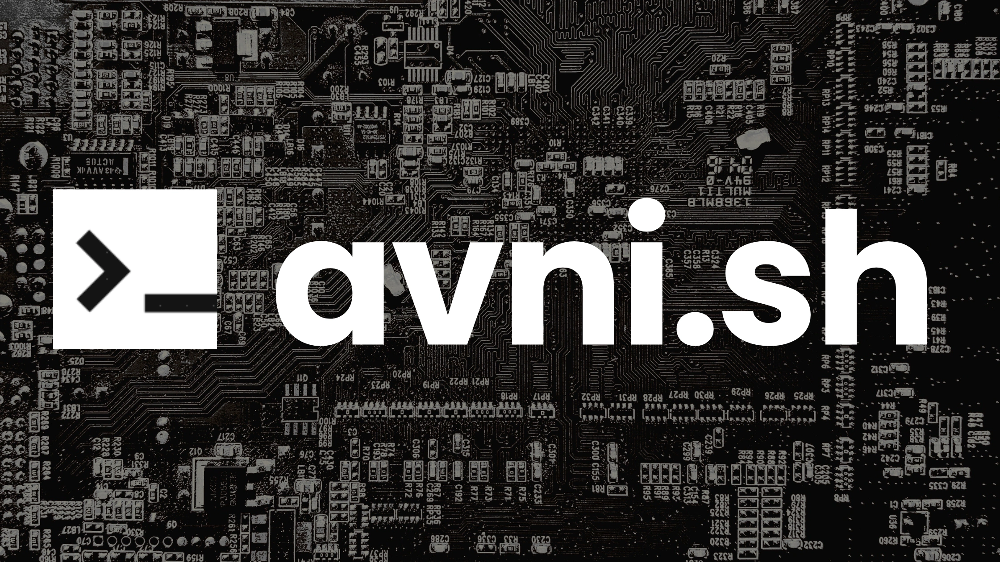

[](https://www.avni.sh/)

## Hi I'm Avnish.  
* Building software at Autodesk in Singapore.  
* Passionate about simplifying concepts from computer science and math.  
* Check my <a target=_blank href="https://www.avni.sh/resume/latest/Resume_Avnish_Pal.pdf">resume</a> to learn more about my professional experience.  
* Subscribe to my <a target=_blank href="https://www.avni.sh/index.xml">RSS feed</a> to be notified when I publish new articles.  

## <a target=_blank href="https://www.avni.sh/contents">Index of Blog Contents</a>

## Technologies Used
- [Hugo Static Site Generator](https://gohugo.io/)
- [PaperMod Theme](https://github.com/adityatelange/hugo-PaperMod)

## Local Deployment (with Docker)

### After cloning
```bash
git submodule update --init --recursive
```

### Updating theme
```bash
git submodule update --remote --merge
```

### Dev Environment (with Drafts and Future Posts)
1. Change directory to `/deploy/dev`
2. Deploy container
```bash
docker compose up -d
```

### Prod Environment
1. Change directory to `/deploy/prod`
2. Deploy container
```bash
docker compose up -d
```
