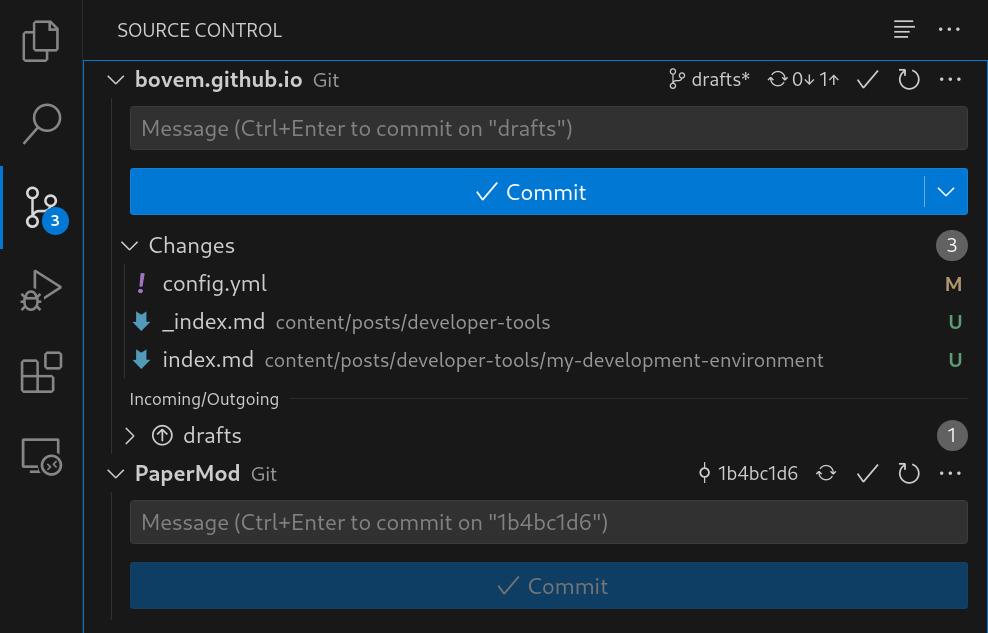
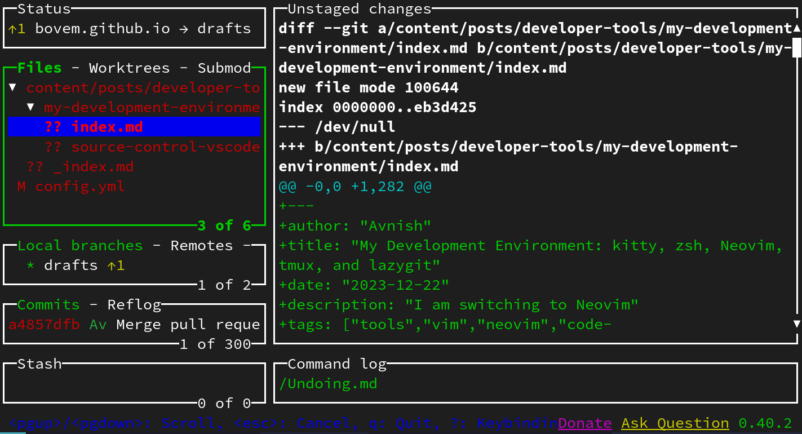
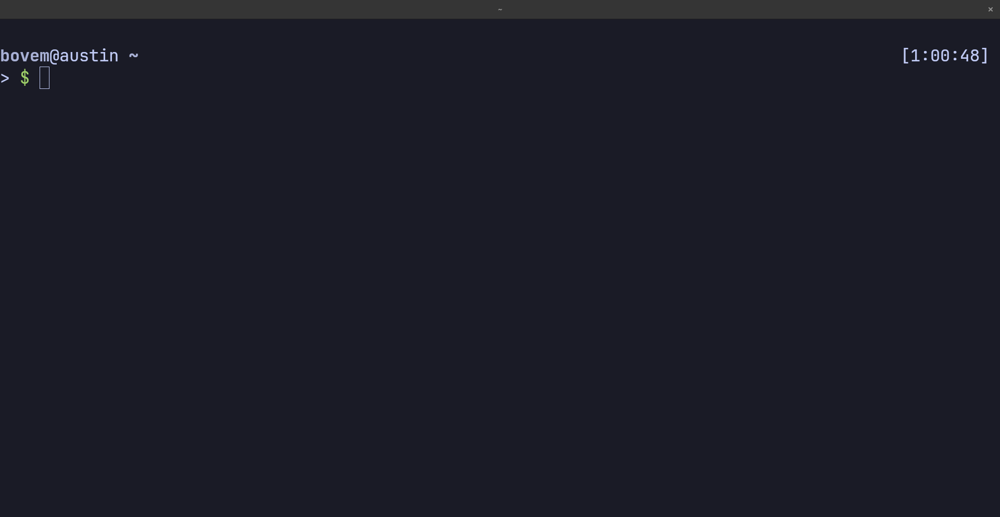
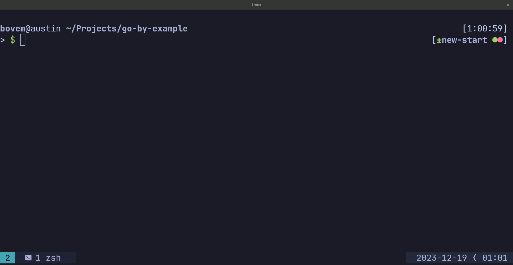
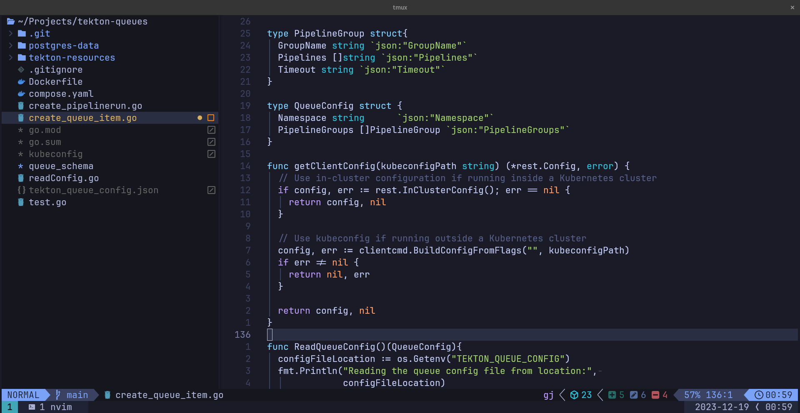
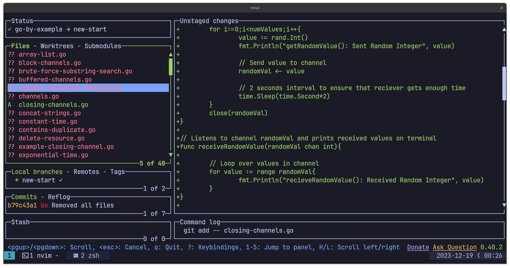

Until now I've been using <a href="https://code.visualstudio.com/" target="_blank">Visual Studio Code</a> as my primary code editor because I try different Linux distributions on my laptop and VSCode is available by default in almost every application manager. When I open a new project, the VSCode suggests relevant extensions based on the tech stack.

After hearing the praises for Neovim from <a href="https://www.youtube.com/@ThePrimeTimeagen" target="_blank">Primeagen</a> and <a href="https://www.youtube.com/@teej_dv" target="_blank">TJ DeVries</a> I decided to give it a go along with other command line utilities like `tmux` and `lazygit` to test if they optimize my development workflow.

I use vim motions in all workflows related to text whether it is writing code in VSCode (using <a href="https://github.com/VSCodeVim/Vim" target="_blank">VIM Plugin</a>) or my journal in <a href="https://obsidian.md/" target="_blank">Obsidian</a>. I also use `vim` occasionally to perform quick edits on configuration files while I've SSH into a remote machine.

I have configured key bindings to navigate inside VSCode and throughout my system. Thus, adapting to a terminal and key binding-focused workflow won’t be difficult.

# Terminal: Kitty
<p align="center"></p>
<p align="center"><small><i>Source: <a href="https://sw.kovidgoyal.net">sw.kovidgoyal.net</a></i></small></p>

I have provisioned a Fedora 38 virtual machine on my <a href="/posts/homelab/building-your-own-homelab/" target="_blank">homelab</a> as a persistent development environment. On it, I use <a href="https://sw.kovidgoyal.net/kitty/" target="_blank">kitty</a> as my terminal emulator because it is lightweight and it could be configured by a single file `~/.config/kitty/kitty.conf`.

## Installation
`kitty` is available as a `dnf` package by default in Fedora.
```bash
sudo dnf install kitty
```

## Configuration
I have made the following changes to the default kitty configuration (<a href="https://github.com/bovem/dotfiles/blob/main/.config/kitty/kitty.conf" target="_blank">`kitty.conf`</a>)
* Changed font family to <a href="https://www.jetbrains.com/lp/mono/" target="_blank">JetBrains Mono</a>.
```
font_family        JetBrainsMonoNF-Regular
bold_font          JetBrainsMonoNF-Bold
```
* Font size changed to 16
```
font_size 16.0
```
* Changed cursor for aesthetics
```
cursor_shape beam
cursor_beam_thickness 10.0
cursor_blink_interval -1
```
* Changed mouse cursor hiding time to 2 seconds
```
mouse_hide_wait 2.0
```
* Enabled URL detection so that I visit them directly from my terminal
```
detect_urls yes
```
* Configuring copy on selection to send it directly to the clipboard. It's useful when I have to quickly share a command's output with someone else.
```
copy_on_select clipboard
```

If you want to test your kitty configuration changes then it might be useful to change the default key binding for reloading configuration to be something more accessible like `Ctrl+f5`.
```
map ctrl+f5   load_config_file
```

# Shell: ZSH
<p align="center"></p>
<p align="center"><small><i>Source: <a href="https://github.com/Zsh-art/logo">Zsh-art/logo</a></i></small></p>

I use <a href="https://www.zsh.org/" target="_blank">zsh</a> along with <a href="https://ohmyz.sh/" target="_blank">oh-my-zsh</a> because of its aesthetics and the git information displayed on its prompt.

## Installation
1. Installing `zsh`
```bash
sudo dnf install zsh
```
2. Changing default shell to `zsh`
```bash
chsh -s $(which zsh)
```
3. Logout and log back in with the same user
4. Installing Oh-My-Zsh
```bash
sh -c "$(curl -fsSL https://raw.github.com/ohmyzsh/ohmyzsh/master/tools/install.sh)"
```
5. Add path to your `oh-my-zsh` configuration in `~/.zshrc`
```
export ZSH=$HOME/.oh-my-zsh
```
## Configuration
I have performed the following edits on my <a href="https://github.com/bovem/dotfiles/blob/main/.zshrc" target="_blank">`~/.zshrc`</a> file

* Changed the `zsh` theme to `bureau` in the `~/.zshrc` file
```
ZSH_THEME="bureau"
```
* Installed the `zsh-autosuggestions` plugin
```bash
git clone https://github.com/zsh-users/zsh-autosuggestions ${ZSH_CUSTOM:-~/.oh-my-zsh/custom}/plugins/zsh-autosuggestions
```
* Installed the `zsh-syntax-highlighting` plugin
```bash
git clone https://github.com/zsh-users/zsh-syntax-highlighting ${ZSH_CUSTOM:-~/.oh-my-zsh/custom}/plugins/zsh-syntax-highlighting
```
* Enabled plugins in `~/.zshrc`
```zshrc
plugins=(
    git
    zsh-autosuggestions
    zsh-syntax-highlighting
    docker
)
```

You can load your `zsh` configuration using the `source` command.
```bash
source ~/.zshrc
```

# Terminal Multiplexer (`tmux`)
<p align="center"></p>
<p align="center"><small><i>Source: <a href="https://github.com/tmux/tmux/wiki">tmux wiki</a></i></small></p>

<a href="https://github.com/tmux/tmux/wiki" target="_blank">`tmux`</a> allows me to run multiple terminal sessions that could be detached (sent to background) and reattached upon requirement. I use it to maintain persistent terminal sessions across multiple SSH clients.

## Installation
```bash
sudo dnf install tmux
```

## Configuration
Here are some changes I've made to <a href="https://github.com/bovem/dotfiles/blob/main/.config/tmux/tmux.conf" target="_blank">`~/.config/tmux/tmux.conf`</a>.

* Changed the prefix key combination from `Ctrl+B` to `Ctrl+Space` because it is more ergonomic for me.
```
unbind C-b
set -g prefix C-Space
bind C-Space send-prefix
```
* Enabled mouse support because I want more control over window resizing.
```
set -g mouse on
```
* Set base index for windows to 1
```
set -g base-index 1
set -g pane-base-index 1
set-window-option -g pane-base-index 1
set-option -g renumber-windows 1
```
* Added some custom key bindings for creating and switching between windows
```
bind -n C-y previous-window
bind -n C-o next-window
bind | split-window -h -c "#{pane_current_path}" 
bind _ split-window -v -c "#{pane_current_path}" 
```
* To install plugins for `tmux` I have installed <a href="https://github.com/tmux-plugins/tpm" target="_blank">tmux plugin manager</a> or `tpm`
```
set -g @plugin 'tmux-plugins/tpm'
```
and added this line at the end of `tmux.conf`
```
run '~/.tmux/plugins/tpm/tpm'
```

Here are some of the plugins I've installed for `tmux`
* <a href="https://github.com/tmux-plugins/tmux-sensible" target="_blank">tmux-sensible</a>: Helps me set custom key bindings for my workflow
* <a href="https://github.com/christoomey/vim-tmux-navigator" target="_blank">vim-tmux-navigator</a>: Enables window navigation using vim keys (`h,j,k,l`)
* <a href="https://github.com/tmux-plugins/tmux-resurrect" target="_blank">tmux-resurrect</a>: Using this I can save and restore my tmux sessions across reboots. I might switch to <a href="https://github.com/jimeh/tmuxifier" target="_blank">tmuxifier</a> to define my tmux sessions in a file rather than saving and reloading them.
* <a href="https://github.com/tmux-plugins/tmux-yank" target="_blank">tmux-yank</a>: To copy text from tmux directly to the system's clipboard.

To load your tmux configuration changes you can use the `source` command
```bash
source ~/.config/tmux/tmux.conf
```
and to install plugins you have to use keybinding `Ctrl+Space,i`.

# Code Editor: Neovim (LazyVim)
<p align="center"></p>
<p align="center"><small><i>Source: <a href="https://github.com/neovim/neovim.github.io">neovim.github.io</a></i></small></p>

<a href="https://neovim.io/" target="_blank">Neovim</a> is a fork of VIM that could be used as a base to develop a *Personalized Development Environment (PDE)*. It has multiple distributions but the one I'm using is <a href="https://www.lazyvim.org/" target="_blank">LazyVim</a>, a minimalist configuration for Neovim. It's a distribution alternative to <a href="https://github.com/nvim-lua/kickstart.nvim" target="_blank">kickstart.nvim</a> configuration.

## Installation
```bash
sudo dnf install neovim
```
## Configuration
To install LazyVim follow the guide at <a href="https://www.lazyvim.org/installation" target="_blank">lazyvim.org</a>. I've made the following changes to LazyVim's default configuration

* Toggled visibility of hidden files and folders in neo-tree (<a href="https://github.com/bovem/dotfiles/blob/main/.config/nvim/lua/plugins/neotree.lua" target="_blank">`~/.config/nvim/lua/plugins/neotree.lua`</a>)
```lua
return {
  "nvim-neo-tree/neo-tree.nvim",
  opts = {
    filesystem = {
      filtered_items = {
        visible = true,
        hide_dotfiles = false,
        hide_gitignored = true,
      },
    },
  },
}
```

* Configured `vim-tmux-navigator` key bindings (<a href="https://github.com/bovem/dotfiles/blob/main/.config/nvim/lua/plugins/vim-navigator.lua" target="_blank">`~/.config/nvim/lua/plugins/vim-navigator.lua`</a>)

```lua
return {
  "christoomey/vim-tmux-navigator",
  keys = {
    { "<C-\\>", "<cmd>TmuxNavigatePrevious<cr>", desc = "Go to the previous pane" },
    { "<C-h>", "<cmd>TmuxNavigateLeft<cr>", desc = "Got to the left pane" },
    { "<C-j>", "<cmd>TmuxNavigateDown<cr>", desc = "Got to the down pane" },
    { "<C-k>", "<cmd>TmuxNavigateUp<cr>", desc = "Got to the up pane" },
    { "<C-l>", "<cmd>TmuxNavigateRight<cr>", desc = "Got to the right pane" },
  },
}
```
# Git Client: lazygit
<p align="center"></p>
<p align="center"><small><i>Source: <a href="https://github.com/jesseduffield/lazygit">jesseduffield/lazygit</a></i></small></p>

I like the Source control pane in the VScode and it has been my go-to client for all git operations. Going through my changes in the source control window allows me to review them before I commit to my repository. I opted for `lazygit` as its alternative.

<p align="center"></p>
<p align="center"><small>Source Control Pane in VSCode Sidebar</small></p>

In its primary window, the `lazygit` has an overview of changes performed after the last commit. It could be accessed directly from the Neovim using the key binding `Space,g,g`. 

<p align="center"></p>
<p align="center"><small>Lazygit Window</small></p>

I can perform git operations using a single button inside the lazygit window
* Stage all files: `a`
* Stage current file: `Space`
* Commit all staged changes: `c`
* Pull changes to remote: `p`
* Push changes to remote: `P`

## Installation
To install `lazygit` in Fedora I had to add its Copr repository
```bash
sudo dnf copr enable atim/lazygit -y
sudo dnf install lazygit
```

# Theme: Tokyo Night
On kitty, Neovim, and tmux I am using the Tokyo Night theme. The theme configuration for all of them is available at <a href="https://github.com/folke/tokyonight.nvim" target="_blank">folke/tokyonight.nvim</a>.

<p align="center"></p>
<p align="center"><small>Terminal</small></p>

<p align="center"></p>
<p align="center"><small>Terminal Multiplexer (tmux)</small></p>

<p align="center"></p>
<p align="center"><small>Text Editor</small></p>

<p align="center"></p>
<p align="center"><small>UI for Source Control</small></p>

All of my configuration files are available at <a href="https://github.com/bovem/dotfiles">bovem/dotfiles</a>.

<hr>
Thank you for taking the time to read this blog post! If you found this content valuable and would like to stay updated with my latest posts consider subscribing to my <a href="https://www.avni.sh/index.xml" target="_blank">RSS Feed</a>.

# Resources
<a href="https://code.visualstudio.com/" target="_blank">Visual Studio Code</a>  
<a href="https://github.com/VSCodeVim/Vim" target="_blank">VIM Plugin for VSCode</a>  
<a href="https://obsidian.md/" target="_blank">Obsidian</a>  
<a href="https://sw.kovidgoyal.net/kitty/" target="_blank">kitty terminal emulator</a>  
<a href="https://www.zsh.org/" target="_blank">zsh</a>  
<a href="https://ohmyz.sh/" target="_blank">oh-my-zsh</a>  
<a href="https://www.jetbrains.com/lp/mono/" target="_blank">JetBrains Mono</a>  
<a href="https://github.com/tmux/tmux/wiki" target="_blank">tmux</a>  
<a href="https://github.com/tmux-plugins/tpm" target="_blank">tmux plugin manager</a>  
<a href="https://github.com/tmux-plugins/tmux-sensible" target="_blank">tmux-sensible</a>  
<a href="https://github.com/christoomey/vim-tmux-navigator" target="_blank">vim-tmux-navigator</a>  
<a href="https://github.com/tmux-plugins/tmux-resurrect" target="_blank">tmux-resurrect</a>  
<a href="https://github.com/jimeh/tmuxifier" target="_blank">tmuxifier</a>  
<a href="https://github.com/tmux-plugins/tmux-yank" target="_blank">tmux-yank</a>  
<a href="https://neovim.io/" target="_blank">Neovim</a>  
<a href="https://www.lazyvim.org/installation" target="_blank">Lazyvim Installation Guide</a>  
<a href="https://github.com/folke/tokyonight.nvim" target="_blank">folke/tokyonight.nvim</a>
