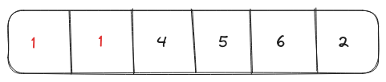
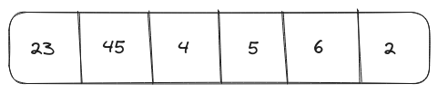

# Problem Statement
We have to implement a function `containsDuplicate()` that takes an integer array as input and returns `true` if an element occurs more than once and `false` otherwise.

# Brute Force Solution
The simplest solution for this problem would be two nested loops, where the first loop will select an element and the second loop will select another element from the array and compare them. On the first occurrence of a duplicate element, the function will exit while returning `true`.

## Psuedo Code for the Brute Force Solution
```text
loop index1 in array
    loop index2 in array
        if index1!=index2 and array[index1]==array[index2]
            return true
return false
```
## Time Complexity Analysis
### Best Case Scenario
The best-case scenario for the brute-force solution would be when the first and second elements are duplicated. In this scenario, the outer and inner loop will execute only once so the time complexity will be $O(1)$.

<p align="center"></p>

### Worst Case Scenario
If all the elements in the array are unique then the brute-force algorithm will take $O(n^2)$ time for completion, where $n$ is the size of the array.

<p align="center"></p>

## Space Complexity Analysis
Since the brute-force solution does not use any data structures other than the input array, its space complexity will be $O(1)$.

## Code for the Brute Force Solution
```Go
package main

import "fmt"

func containsDuplicate(nums []int)(bool){
    for i:=0;i<len(nums);i++{
        for j:=0;j<len(nums);j++{
            // Checking if the element selected by index j
            // is not the same as the outer loop
			
            // If the value of both elements is the same
            // then exit the function with the value true 
            if i!=j && nums[i]==nums[j]{
                return true
            }
        }
    }
    return false
}

func main(){
  inputArray := []int{1, 2, 4, 5, 6, 1}
  fmt.Println("Array:", inputArray,
              "containsDuplicate: ", containsDuplicate(inputArray))

  inputArray = []int{1, 2, 3, 4}
  fmt.Println("Array:", inputArray,
              "containsDuplicate: ", containsDuplicate(inputArray))
}

// Output
// Array: [1 2 4 5 6 1] containsDuplicate:  true
// Array: [1 2 3 4] containsDuplicate:  false
```

# Optimized Solution
Instead of iterating the array for each element selected by the outer loop, we can store all the elements inside a <a href="/posts/dsa/arrays-strings-hashmaps/#hashmaps" target="_blank">HashMap</a>. If the element is already present in HashMap, then we have encountered a duplicate and we can exit the function with the value `true`.

## Psuedo Code for the Optimized Solution
```text
hashmap = {}
loop value in array
    if hashmap.get(value)
        return true
    else
        hashmap[value] = 1
return false
```

## Time Complexity Analysis
### Best Case Scenario
The best case scenario for the optimized solution is the same as the brute-force solution i.e. first and second elements are duplicated resulting in constant ($O(1)$) runtime.

### Worst Case Scenario
If the input array contains unique elements, then the optimized solution will iterate over the complete array adding each element to HashMap but the time complexity of completing this would still be $O(n)$ which is much better than brute force solution ($O(n^2)$).

## Space Complexity Analysis
The hashmap in the optimized solution will use extra $O(n)$ memory space.

## Code for the Optimized Solution
```Go
package main

import "fmt"

func containsDuplicate(nums []int)(bool){
    hashmap := make(map[int]int)

    for i:=0;i<len(nums);i++{
        // Check if a value at key exists in the hashmap
        value, key_exists := hashmap[nums[i]]

        if key_exists{
            // If the value exists then exit the function
            return true
        } else {
            // If the value does not exist
            // add it to the hashmap
            hashmap[nums[i]] = value
        }
    }
    return false
}

func main(){
  inputArray := []int{1, 2, 4, 5, 6, 1}
  fmt.Println("Array:", inputArray,
              "containsDuplicate: ", containsDuplicate(inputArray))

  inputArray = []int{1, 2, 3, 4}
  fmt.Println("Array:", inputArray,
              "containsDuplicate: ", containsDuplicate(inputArray))
}

// Output
// Array: [1 2 4 5 6 1] containsDuplicate:  true
// Array: [1 2 3 4] containsDuplicate:  false
```

<hr>
Thank you for taking the time to read this blog post! If you found this content valuable and would like to stay updated with my latest posts consider subscribing to my <a href="https://www.avni.sh/index.xml" target="_blank">RSS Feed</a>.    

# Resources
<a href="https://leetcode.com/problems/contains-duplicate/" target="_blank">217. Contains Duplicate</a>  
<a href="https://www.youtube.com/watch?v=3OamzN90kPg" target="_blank">Contains Duplicate - Leetcode 217 - Python</a>  
