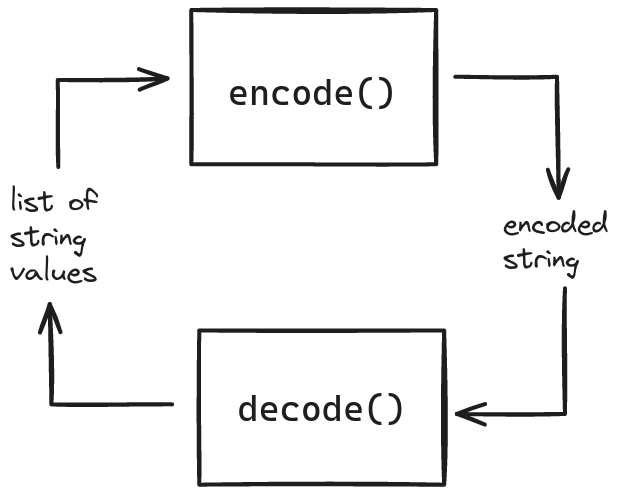
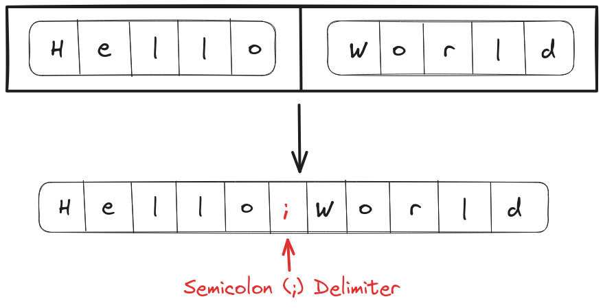
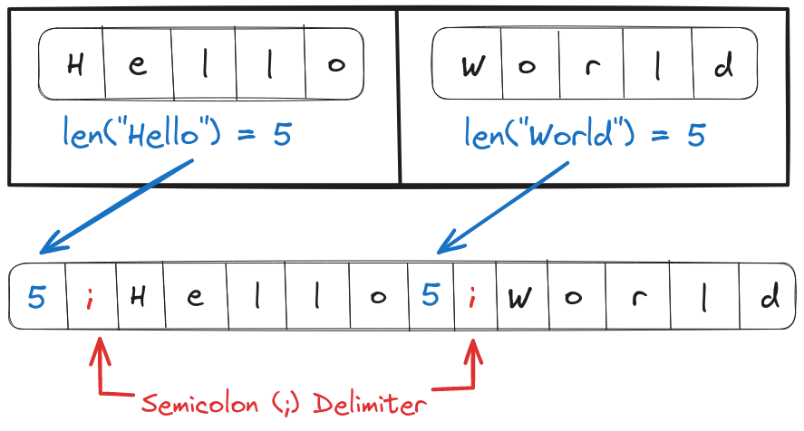

# Problem Statement
We have to implement an `encode` function that takes a list of string values as input and returns a single encoded string that could be transmitted over a network. On the other side of the network, the `decode` function will take the encoded string as input and return the original list of string values as output.

<p align="center"></p>

A delimiter could be used to differentiate between words. For example, `["Hello", "World"]` could be encoded with comma delimiter (`,`) to `"Hello,World"`.

# Brute Force Solution
In the brute-force approach to solving this problem, we can execute a loop over the input list appending each string with some special character as a delimiter. 

<p align="center"></p>

If the special character is a part of the string itself (for example `"Hello,"`) then we can add an escape character before it, such that it is easier to differentiate from the delimiter during decoding.

## Psuedo-code for the Brute Force Solution
```text
func encode(array)
  delimiter = ","
  encodedString = ""
	
  loop index on array
    string = array[index]
    new_string = ""
		
    loop index2 on string

      if string[index2] is delimiter or "\"
        new_string.append("\")

      new_string.append(string[index2])

    if encodedString is not empty
      encodedString.append(delimiter)
			
    encodedString.append(new_string)
	
  return encodedString

func decode(encodedString)
  delimiter=","
  decodedList = []
  string = ""
	
  loop index on encodedString

    if encodedString[index] is "\"
      string.append(encodedString[index+1])
      index++

    else if encodedString[index] is delimiter
      decodedList.append(string)
      string = ""

    else
      string.append(encodedString[index])

  decodedList.append(string)

  return decodedList
```
## Best Case Scenario
The best-case input for the brute force solution would be a string full of delimiters since the decoding process will finish earlier (the `index` is incremented by 2 while encountering the escape character `\`). 

The time complexity of encoding and decoding in the best-case scenario would be $O(k \times n)$ where $k$ is the average size of the string and $n$ is the size of the input array.

## Worst Case Scenario
For the worst-case time complexity of the brute-force solution, the input should not contain the delimiter or escape characters. The time complexity of encoding and decoding would still be $O(k \times n)$.

## Code for Brute Force Solution
```Go
package main

import "fmt"

func encode(inputArray []string)(string){
    delimiter := ","
    encodedString := ""

    for index:=0;index<len(inputArray);index++{
        str := string(inputArray[index])
        updatedStr := ""
        
        for index2:=0;index2<len(str);index2++{
            char := string(str[index2])

            // If the delimiter or "\" is within the string
            // add an extra escape character (\))
            if char==delimiter || char=="\\"{
                updatedStr += "\\"
            }

            updatedStr += char
        }
        
        if len(encodedString)!=0{
            encodedString += delimiter
        }
        encodedString += updatedStr
    }
    
    return encodedString
}

func decode(encodedString string)([]string){
    delimiter := ","
    decodedList := []string{}
    str := ""

    for index:=0;index<len(encodedString);index++{
        char := string(encodedString[index])
        if char == "\\"{

            // If we encounter an escape character in the encoded string
            // Add the next character to the string
            // and increment the index by 1
            str += string(encodedString[index+1])
            index += 1

        } else if char==delimiter{

            // If we encounter the delimiter
            // Add the current string to decodedList
            // and reset its values
            decodedList = append(decodedList, str)
            str = ""

        } else {

            // Add the string to decodedList
            str += char

        }
    }

    decodedList = append(decodedList, str)
    
    return decodedList
}

func main(){
    inputArray := []string{"Hello", "World"}
    encodedString := encode(inputArray)
    fmt.Println("Input Array", inputArray)
    fmt.Println("Encoded String:", encodedString)
    fmt.Println("Decoded String:", decode(encodedString))

    inputArray = []string{"Hel,lo", "World"}
    encodedString = encode(inputArray)
    fmt.Println("Input Array", inputArray)
    fmt.Println("Encoded String:", encodedString)
    fmt.Println("Decoded String:", decode(encodedString))
    
    inputArray = []string{"Hel\\,\\lo", "World"}
    encodedString = encode(inputArray)
    fmt.Println("Input Array", inputArray)
    fmt.Println("Encoded String:", encodedString)
    fmt.Println("Decoded String:", decode(encodedString))
}

// Output
// Input Array [Hello World]
// Encoded String: Hello,World
// Decoded String: [Hello World]
// Input Array [Hel,lo World]
// Encoded String: Hel\,lo,World
// Decoded String: [Hel,lo World]
// Input Array [Hel\,\lo World]
// Encoded String: Hel\\\,\\lo,World
// Decoded String: [Hel\,\lo World]
```
# Optimized Solution
We can improve the time complexity of the brute-force solution if we can somehow omit the loop over each string.

If the length of the string could be used as a delimiter then we can avoid iteration over individual strings because the length function `len(string)` has $O(1)$ time complexity. But, this presents two more challenges
- if the length of a string is greater than 9 (double digits)
- if the string contains numbers, they could be confused with the length of the strings

<p align="center"></p>

To improve on this we can use a special character with the length of the string as delimiters, for example, `["Hello", "World"]` could be encoded to `5;Hello5;World`.

## Psuedo code for the Optimized Solution
```text
func encode(array)
  delimiter = ","
  encodedString = ""
  loop each element in array
    encodedString.append(len(element), delimiter, element)

  return encodedString

func decode(encodedString)
  delimiter = ","
  decodedList = []

  index = 0
  while index<len(encodedString)
    index2 = index
    while encodedString[index2] is not delimiter
      index2++

    stringLen = toInt(encodedString[index:index2])

    string_start = index2+1
    string_end = index2+stringLen+1
    string = encodedString[string_start:string_end]
    decodedList.append(string)

    index += string_end

  return decodedList
```
## Best Case Scenario
The best-case input for the optimized solution will contain strings with length < 9. 

The time complexity of the encoding loop will be $O(n)$ because it will iterate over all the elements in the array. 

For the decoding loop, the time complexity appears to be $O(kn)$ but we are incrementing the `index` by the length of string value ($k$) on every iteration. Thus, the time complexity of decoding is also $O({kn \over k}) = O(n)$.

## Worst Case Scenario
The worst-case time complexity of encoding is the same as the best-case i.e. $O(n)$.

The time complexity of the decoding function will depend on the number of digits (in the length of the largest string). For example: If the length of the largest individual string is `199990` then the time complexity of decoding the string will be $O(6 \times n)$ (because `199990` has 6 digits).

## Code for Optimized Solution
```Go
package main

import (
    "fmt"
    "strconv"
)

func encode(inputArray []string)(string){
    encodedString := ""
    for index:=0;index<len(inputArray);index++{
        
        // For each string append
        // the string length
        encodedString += strconv.Itoa(len(inputArray[index]))

        // "#" delimiter
        encodedString += "#"

        // the string itself
        encodedString += inputArray[index]
    }
    return encodedString
}

func decode(encodedString string)([]string){
    decodedList := []string{}
    index := 0
    for ;index<len(encodedString);{
        index2:=index
        for ;string(encodedString[index2])!="#";{
            // Exit loop upon encountering the delimiter
            index2+=1
        }

        // The length of individual string would be parsed
        lenString, _ := strconv.Atoi(encodedString[index:index2])

        // Extract the string from the encodedString
        str := string(encodedString[index2+1:index2+lenString+1])

        // Append the string to decodedList 
        decodedList = append(decodedList, str)

        // Increment index, moving it to the next string length
        index += index2+lenString+1
    }
    
    return decodedList
}

func main(){
    inputArray := []string{"Hello", "World"}
    encodedString := encode(inputArray)
    fmt.Println("Input Array", inputArray)
    fmt.Println("Encoded String:", encodedString)
    fmt.Println("Decoded String:", decode(encodedString))

    inputArray = []string{"Hel,lo", "World"}
    encodedString = encode(inputArray)
    fmt.Println("Input Array", inputArray)
    fmt.Println("Encoded String:", encodedString)
    fmt.Println("Decoded String:", decode(encodedString))
    
    inputArray = []string{"Hel\\,\\lo", "World"}
    encodedString = encode(inputArray)
    fmt.Println("Input Array", inputArray)
    fmt.Println("Encoded String:", encodedString)
    fmt.Println("Decoded String:", decode(encodedString))
}

// Output
// Input Array [Hello World]
// Encoded String: 5#Hello5#World
// Decoded String: [Hello World]
// Input Array [Hel,lo World]
// Encoded String: 6#Hel,lo5#World
// Decoded String: [Hel,lo World]
// Input Array [Hel\,\lo World]
// Encoded String: 8#Hel\,\lo5#World
// Decoded String: [Hel\,\lo World]
```

<hr>

Thank you for taking the time to read this blog post! If you found this content valuable and would like to stay updated with my latest posts consider subscribing to my <a href="https://www.bovem.in/index.xml" target="_blank">RSS Feed</a>.

# Resources
<a href="https://www.lintcode.com/problem/659/" target="_blank">659 · Encode and Decode Strings</a>  
<a href="https://www.youtube.com/watch?v=B1k_sxOSgv8" target="_blank">Encode and Decode Strings - Leetcode 271 - Python</a>
