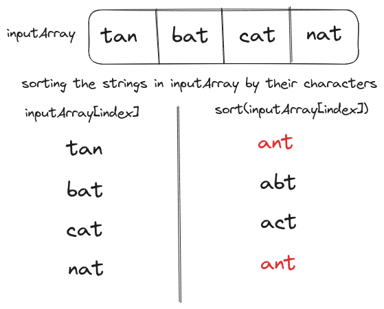
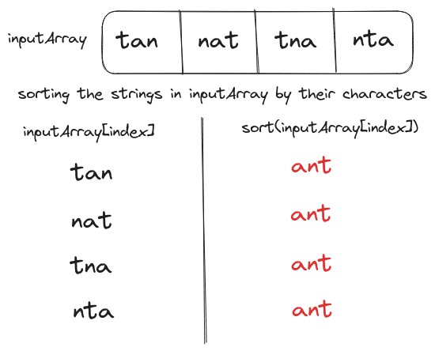
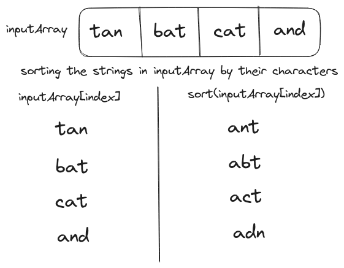

# Problem Statement
We have to implement a `groupAnagram` function that takes an array of strings as input and returns a new array with <a href="/posts/dsa/identifying-anagrams/" target="_blank">anagrams</a> grouped.

<p align="center"></p>

The input string array is assumed to be composed entirely of lowercase English characters.

# Brute Force Solution
If two strings are anagrams then their sorted order will be the same. Thus, anagrams could be grouped under their sorted order.

<p align="center"></p>

The brute-force implementation of `groupAnagram` uses a hashmap for grouping. In this hashmap the sorted string will be the key and the original strings will be the values (stored in an array). At the end of the function, we can iterate over the hashmap and create an array of grouped anagrams.

## Psuedo-code for the Brute Force Solution
```text
hashmap = HashMap()
loop index in stringArray
  stringValue = stringArray[index]
  sortedString = string(sort(stringValue))
  if hashmap[sortedString]
    hashmap[sortedString].append(stringValue)
  else
    hashmap[sortedString] = [stringValue]

returnedList = []
loop key, value in hashmap
  returnedList.append(value)

return returnedList
```

## Best Case Scenario
The time taken to sort individual strings is assumed to be $O(k \log(k))$ (the time complexity of the best sorting algorithm) where $k$ is the size of the string. Since we have to perform this operation on every element the sorting operation will be repeated $n$ time, where $n$ is the size of the array, resulting in $O(n \times k \log(k))$ time.

<p align="center"></p>

The best-case input will contain just a single set of anagrams i.e. the hashmap will contain just one key. The loop over hashmap values will be executed only once. Thus, the total time complexity of grouping anagrams will be $O(n \times k \log(k))$.

## Worst Case Scenario
<p align="center"></p>

The worst-case input array will contain zero anagrams and the hashmap will contain a key for each array element i.e. $n$ keys. Thus, the total time complexity of the function in the worst-case scenario will be $O(n + n \times k \log(k))$, which could be simplified to $O(n \times k \log(k))$. 

## Code for Brute Force Solution
```Go
package main

import (
    "fmt"
    "sort"
    "strings"
)

func sortString(inputString string)(string){
    listInputString := strings.Split(inputString, "")
    sort.Strings(listInputString)
    return strings.Join(listInputString, "")
}

func groupAnagrams(inputArray []string)([][]string){
    hashmap := make(map[string][]string)
    
    // Loop over the inputArray and sort every string element
    for index:=0;index<len(inputArray);index++{
        
        // The time complexity of the sorting operation
        // is assumed to be O(nlog(n))
        // where n is the size of the string
        sortedString := sortString(inputArray[index])
        
        // Group elements by their sorted order 
        _, key_exists := hashmap[sortedString]
        if key_exists{
            hashmap[sortedString] = append(hashmap[sortedString], 
                                           inputArray[index])
        } else {
            hashmap[sortedString] = []string{inputArray[index]}
        }
    }
    
    var groupedAnagrams [][]string
    
    // Loop over hashmap and create a grouped anagrams list
    for _, value := range hashmap{
        groupedAnagrams = append(groupedAnagrams, value)
    }
    
    return groupedAnagrams
}

func main(){
    anagramList := []string{"cat", "bat", "tan", "nat"}
    fmt.Println("Grouping anagrams in list:", anagramList)
    fmt.Println(groupAnagrams(anagramList))
}

// Output
// Grouping anagrams in list: [cat bat tan nat]
// [[cat] [bat] [tan nat]]
```

# Optimized Solution
The time complexity of sorting a single string is $O(k \log(k))$. Instead of sorting, we can load the string into a `countHashmap` (maps characters to their count) and reduce the time complexity to $O(k)$.

<p align="center"></p>

The `countHashMap` will be initialized with lowercase English characters (`a-z`) mapped to `0` (default count). The `load` function will iterate over the characters in the input string and increment their count, for example, `countHashMap.load("mat")` will increment the value of `m`, `a`, and `t` keys to `1`.

As we have to use `countHashMap` as a key to another hashmap, we can simplify its data to a single string of non-zero count characters and their value, for example, `baseball => {a:2, b:2, c:0, d:0, e:1, ..., l:2, ..., s:1, ..., z:0} => a2b2e1l2s1`

## Psuedo code for the Optimized Solution
```text
anagramHashmap = HashMap()
loop index in stringArray
  countHashmap = HashMap[a-z, 0-0]
  countHashmap.load(stringArray[index])

  if anagramHashmap[countHashMap]
    anagramHashmap[countHashMap].append(stringArray[index])
  else
    anagramHashmap[countHashMap] = [stringArray[index]]

returnedList = []
for key, value in anagramHashmap
  returnedList.append(value)

return returnedList
```

## Best Case Scenario
The best-case input will contain only one set of anagrams. Thus the total time complexity of the function will be $O(n \times k)$.

## Worst Case Scenario
For the worst-case input (none of the strings are anagrams) the loop over `anagramHashMap` will take $O(n)$ time. Hence, the time complexity of the function will be $O(n \times k)$ (generalized from $O(n + n \times k)$).

## Code for Optimized Solution
First, we have to implement a `generateCountHashMap` function that will return a hashmap with keys ranging from `a` to `z` mapped to their initial count i.e. `0`.

```Go
func generateCountHashMap()(map[string]int){
    countHashMap := make(map[string]int)

    // The time complexity of this function will
    // be constant (O(1)) since the loop will 
    // execute only 26 times on every function call
    for r:='a';r<='z';r++{
        countHashMap[string(r)] = 0
    }
    return countHashMap
}
```

To simplify the presentation of data in `countHashMap` we have to convert it into an equivalent string using the `loadStringValue` function.

```Go
func loadStringValue(countHashMap map[string]int, 
                     inputString string)(string){

    // Assuming the size of inputString is k
    // the time complexity of executing this loop
    // will be O(k)
    for i:=0;i<len(inputString);i++{
        countHashMap[string(inputString[i])] += 1
    }
    
    var returnString []string

    // This loop has constant time complexity (O(1))
    for r:='a';r<='z';r++{
        // Add non-zero count characters and their value
        // to the returnString
        if countHashMap[string(r)]>0{
            returnString = append(returnString, 
                                  string(r), 
                                  strconv.Itoa(countHashMap[string(r)]))
        }
    }
    
    return strings.Join(returnString, "")
}
```

Finally, we use `generateCountHashMap` and `loadStringValue` to implement the `groupAnagrams` function.

```Go
func groupAnagrams(inputArray []string)([][]string){
  anagramHashMap := make(map[string][]string)

  for index:=0;index<len(inputArray);index++{
    stringValue := inputArray[index]

    // Constant time complexity
    countHashMap := generateCountHashMap()

    // The time complexity of this operation will be
    // O(k) where k is the size of stringValue
    countHashMapStr := loadStringValue(countHashMap, stringValue)

    _, key_exists := anagramHashMap[countHashMapStr]

    // Group elements by countHashMapStr
    if key_exists{
      anagramHashMap[countHashMapStr] = append(
                        anagramHashMap[countHashMapStr], 
                        stringValue)
    } else {
      anagramHashMap[countHashMapStr] = []string{stringValue}
    }
  }
    
  var groupedAnagrams [][]string
  for _, value := range anagramHashMap{
      groupedAnagrams = append(groupedAnagrams, value)
  }
    
  return groupedAnagrams
}
```
### Complete Code
```Go
package main

import (
    "fmt"
    "strings"
    "strconv"
)

func generateCountHashMap()(map[string]int){
    countHashMap := make(map[string]int)

    // The time complexity of this function will
    // be constant (O(1)) since the loop will 
    // execute only 26 times on every function call
    for r:='a';r<='z';r++{
        countHashMap[string(r)] = 0
    }
    return countHashMap
}

func loadStringValue(countHashMap map[string]int, 
                     inputString string)(string){

    // Assuming the size of inputString is k
    // the time complexity of executing this loop
    // will be O(k)
    for i:=0;i<len(inputString);i++{
        countHashMap[string(inputString[i])] += 1
    }
    
    var returnString []string

    // This loop has constant time complexity (O(1))
    for r:='a';r<='z';r++{
        // Add non-zero count characters and their value
        // to the returnString
        if countHashMap[string(r)]>0{
            returnString = append(returnString, 
                                  string(r), 
                                  strconv.Itoa(countHashMap[string(r)]))
        }
    }
    
    return strings.Join(returnString, "")
}

func groupAnagrams(inputArray []string)([][]string){
  anagramHashMap := make(map[string][]string)
  
  for index:=0;index<len(inputArray);index++{
    stringValue := inputArray[index]

    // Constant time complexity
    countHashMap := generateCountHashMap()

    // The time complexity of this operation will be
    // O(k) where k is the size of stringValue
    countHashMapStr := loadStringValue(countHashMap, stringValue)

    _, key_exists := anagramHashMap[countHashMapStr]

    // Group elements by countHashMapStr
    if key_exists{
      anagramHashMap[countHashMapStr] = append(
                        anagramHashMap[countHashMapStr], 
                        stringValue)
    } else {
      anagramHashMap[countHashMapStr] = []string{stringValue}
    }
  }
    
  var groupedAnagrams [][]string
  for _, value := range anagramHashMap{
      groupedAnagrams = append(groupedAnagrams, value)
  }
    
  return groupedAnagrams
}

func main(){
    anagramList := []string{"cat", "bat", "tan", "nat"}
    fmt.Println("Grouping anagrams in list:", anagramList)
    fmt.Println(groupAnagrams(anagramList))
}

// Output
// Grouping anagrams in list: [cat bat tan nat]
// [[tan nat] [cat] [bat]]
```

<hr>

Thank you for taking the time to read this blog post! If you found this content valuable and would like to stay updated with my latest posts consider subscribing to my <a href="https://www.bovem.in/index.xml" target="_blank">RSS Feed</a>.

# Resources
<a href="https://leetcode.com/problems/group-anagrams/description/" target="_blank">49. Group Anagrams</a>  
<a href="https://www.youtube.com/watch?v=vzdNOK2oB2E" target="_blank">Group Anagrams - Categorize Strings by Count - Leetcode 49</a>