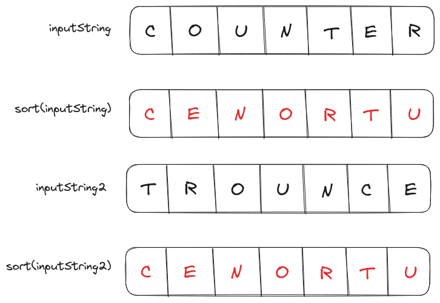
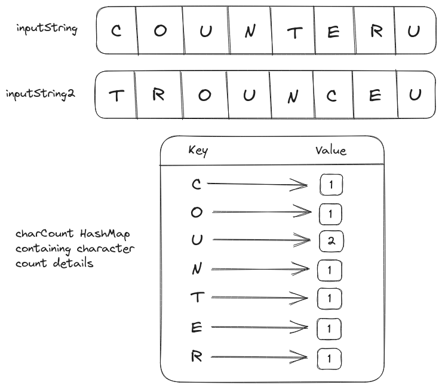

# Problem Statement
We have to implement an `isAnagram()` function that takes two strings as input and returns `true` if they both are *anagrams* and false otherwise.

Multiple words could be **anagrams** of each other if they contain the same characters with the same frequency of occurrence.

For word `counter`:
- `trounce` is an anagram.
- `trouncee` isn't an anagram, because the character `e` appears twice in `trouncee`.
- `tounce` isn't an anagram, because the character `r` is missing.

The inputs for the `isAnagram()` function are assumed to be composed of lowercase English characters including whitespace (`" "`).

# Brute Force Solution
The first solution that comes to mind for this problem would be sorting both strings (using the ASCII value of characters) and then comparing the sorted strings by characters.

<p align="center"></p>

We can preemptively exit the function if both strings are of different lengths as they can't be anagrams.

## Psuedo-code for the Brute Force Solution
```text
if length(string1) != length(string2)
	return false
	
string1 = sort(string1)
string2 = sort(string2)

loop index in string1
	if string1[index] != string2[index]
		return false

return true
```
## Time Complexity Analysis
### Best Case Scenario
The best time complexity of a sorting function is $O(n \log(n))$, so the total time complexity of sorting operations is $O(s \log(s)) + O(t \log(t))$ where $s$ and $t$ are the sizes of strings. Since both strings are of the same length (for anagrams) we can generalize time complexity to $O(s \log(s))$.

If the inputs are of different lengths (non-anagrams) then the time complexity of the complete function will be: $O(1)$ as the function will exit preemptively.

Even though we have to compare characters in a loop ($O(s)$) the sorting time will scale relatively slower. Thus, the total time complexity of the best-case scenario will be $O(s \log(s))$.

### Worst Case Scenario
The worst-case scenario for a brute force solution will compare all the characters in sorted strings to find that they aren't anagrams. Its total time complexity will be $2*O(s \log(s)) + O(s)$ but we can generalize it to $O(s \log(s))$.

## Space Complexity Analysis
The sorting of input strings is performed in-place. Thus, there is no requirement for additional memory space by the brute-force solution and its space complexity will be $O(1)$.

## Code for the Brute Force Solution
```Go
package main

import (
  "fmt"
  "sort"
  "strings"
)

func sortString(inputString string)(string){
  // The time complexity of this function
  // is assumed to be O(nlog(n))
  // where n is the size of inputString
  
  str := strings.Split(inputString, "")
  sort.Strings(str)
  return strings.Join(str, "")
}

func isAnagram(string1 string, string2 string)(bool){
  if len(string1) != len(string2){
	  return false
  }
  
  string1 = sortString(string1)
  string2 = sortString(string2)

  // This loop will have O(n) time complexity
  // where n is the size of string1/string2
  for i:=0;i<len(string1);i++{
      if string1[i] != string2[i]{
        return false
      }
  }

  return true
}

func main(){
  string1 := "counter"
  string2 := "trounce"
  fmt.Println(string1, "is an Anagram of", 
              string2, ":", isAnagram(string1, string2))

  string2 = "trouncee"
  fmt.Println(string1, "is an Anagram of",
              string2, ":", isAnagram(string1, string2))

  string2 = "trounc"
  fmt.Println(string1, "is an Anagram of", 
              string2, ":", isAnagram(string1, string2))
}

// Output
// counter is an Anagram of trounce : true
// counter is an Anagram of trouncee : false
// counter is an Anagram of trounc : false
```

# Optimized Solution
In the brute force solution, the most expensive operation in terms of time complexity is sorting. 

To improve on this we can create a hashmap that stores the count of characters appearing in the first string, then we can iterate over the second string and reduce the count for each character in the same hashmap or delete the key. If the hashmap is empty after the loop has ended, then the strings are anagrams.

<p align="center"></p>

## Psuedo code for the Optimized Solution
```text
counter = hashmap()

loop char in string1
    if char in counter
        counter[char] += 1
    else
        counter[char] = 1

loop char in string2
    if char in counter
        if counter[char] == 1
            counter.delete(char)
        else
            counter[char] -= 1
    else
        return false

if counter.empty() == true
	return true
else
	return false
```

## Time Complexity Analysis
### Best Case Scenario
In the best-case scenario for an optimized solution both strings will be anagram and the time complexity will be $O(s)$ (generalized from $O(s) + O(s)$).

### Worst Case Scenario
The time complexity of the worst-case scenario will be the same as the best-case scenario i.e. $O(s)$ but the input strings won't be anagrams.

## Space Complexity Analysis
The `counter` hashmap will take additional $O(n)$ memory space.

## Code for the Optimized Solution
```Go
package main

import "fmt"

func isAnagram(inputString1 string, inputString2 string)(bool){
  if len(inputString1) != len(inputString2){
    return false
  }

  counter := make(map[string]int)

  // Both loops will take O(n) time for completion individually
  // where n is the size of inputString1/inputString2

  for i:=0;i<len(inputString1);i++{
    char := string(inputString1[i])
    _, key_exists := counter[char]
    if key_exists{
      counter[char] += 1
    } else {
      counter[char] = 1
    }
  }

  for j:=0;j<len(inputString2);j++{
    char := string(inputString2[j])
    _, key_exists := counter[char]
    if key_exists{
      if counter[char] == 1{
        delete(counter, char)
      } else{
        counter[char] -= 1
      }
    } else {
      return false
    }
  }
  
  return (len(counter)==0)
}

func main(){
  string1 := "counter"
  string2 := "trounce"
  fmt.Println(string1, "is an Anagram of", 
              string2, ":", isAnagram(string1, string2))

  string2 = "trouncee"
  fmt.Println(string1, "is an Anagram of",
              string2, ":", isAnagram(string1, string2))

  string2 = "trounc"
  fmt.Println(string1, "is an Anagram of", 
              string2, ":", isAnagram(string1, string2))
}

// Output
// counter is an Anagram of trounce : true
// counter is an Anagram of trouncee : false
// counter is an Anagram of trounc : false
```

<hr>
Thank you for taking the time to read this blog post! If you found this content valuable and would like to stay updated with my latest posts consider subscribing to my <a href="https://www.avni.sh/index.xml" target="_blank">RSS Feed</a>.    

# Resources
<a href="https://leetcode.com/problems/valid-anagram/" target="_blank">242. Valid Anagram</a>  
<a href="https://www.youtube.com/watch?v=9UtInBqnCgA" target="_blank">Valid Anagram - Leetcode 242 - Python</a>  
