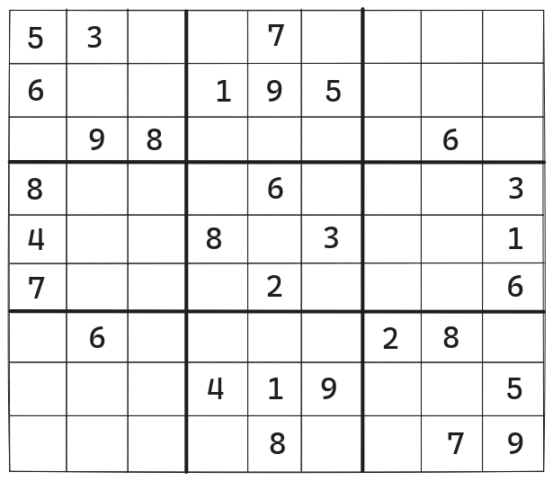
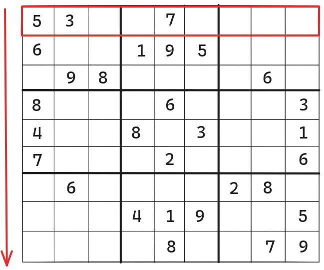
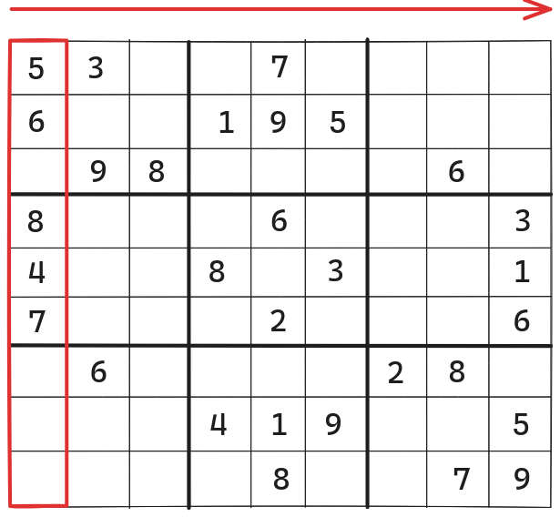
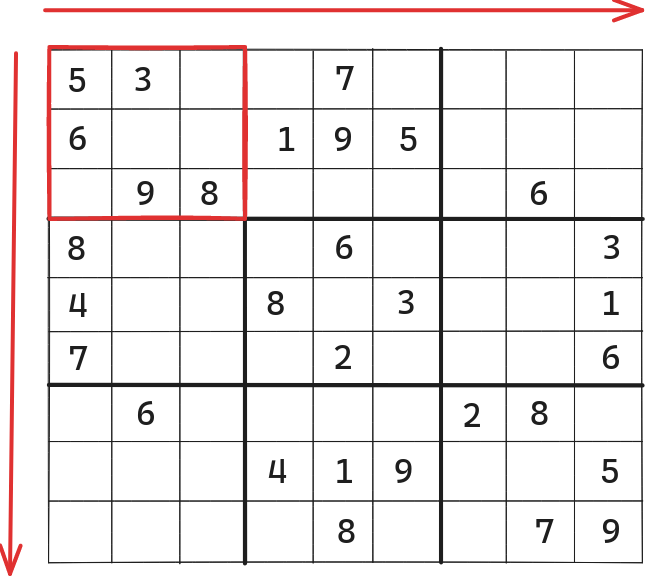

# Problem Statement
We have to implement an `isValidSudoku` function that takes a 9x9 matrix (representing a <a href="https://sudoku.com/how-to-play/sudoku-rules-for-complete-beginners/" target="_blank">Sudoku</a> grid) as input and returns `true` if the grid is valid and `false` otherwise.

<p align="center"></p>
<p align="center"><small><i>Sudoku Grid</i></small></p>

A Sudoku grid is valid if
- Every row contains digits from 1 to 9 without repetition.
<p align="center"></p>
<p align="center"><small><i>Rows in a Sudoku Grid</i></small></p>

- Every column contains digits from 1 to 9 without repetition.
<p align="center"></p>
<p align="center"><small><i>Columns in a Sudoku Grid</i></small></p>

- Every 3x3 sub-matrix contains digits from 1 to 9 without repetition.
<p align="center"></p>
<p align="center"><small><i>Sub-Matrices in a Sudoku Grid</i></small></p>

The input Sudoku table could be incomplete where "`.`" will  represent an empty cell.

# Optimal Solution
The time complexity of validating a single row or column for repetition using a hashmap (like in <a href="/posts/dsa/contains-duplicate/" target="_blank">containsDuplicate</a>) will be $O(9)$. Repeating this process for every row and column in the input matrix will result in total time complexity of $9 \times O(9) + 9 \times O(9)$.

To validate all 3x3 sub-matrices we have to iterate over every 3rd row and column of the Sudoku grid. On each iteration, we will start from the top-left corner of the 3x3 grid and reach the bottom-right corner using nested loops. The total time complexity of validating each 3x3 submatrix will be $9 \times O(3) \times O(3)$.

Since the total time complexity of this solution will be constant for all inputs (because the Sudoku grid has a constant size of 9x9) this is the optimal solution.

## Psuedo code for the Optimal Solution
```text
loop row_index from 0 to 9
  row_hashmap = Hashmap()
  sudoku_row = sudoku_grid[row_index]
  loop column_index from 0 to 9
    if row_hashmap[sudoku_row[column_index]]
      return false
    else
      row_hashmap[sudoku_row[column_index]] = 1

loop column_index from 0 to 9
  column_hashmap = Hashmap()
  loop row_index from 0 to 9
    value = sudoku_grid[row_index][column_index]
    if column_hashmap[value]
      return false
    else 
      column_hashmap[value] = 1

loop row_index from 0 to 6 with step 3
  loop column_index from 0 to 6 with step 3
    sub_matrix_hashmap = Hashmap()
    loop sm_row_index from 0 to 2
      loop sm_column_index from 0 to 2
        r_value = row_index+sm_row_index
        c_value = column_index+sm_column_index
        if sub_matrix_hashmap[r_value][c_value]
          return false
        else
          sub_matrix_hashmap[r_value][c_value] = 1
	
```
## Best Case Scenario
The best-case input for the optimal solution will be a completed Sudoku grid. The time taken to return the result will be $9 \times O(9) + 9 \times O(9) + O(81)$ which could be simplified to $O(1)$. 

## Worst Case Scenario
In the worst-case scenario, the input will be an invalid Sudoku grid. The time taken to produce the result will be the same as the best-case scenario i.e. O(1).

## Code for Optimal Solution
First, we will implement the `validCellValue` function to check if the value in a cell is within 1 to 9.
```Go
func validCellValue(inputValue byte)(bool){
    // Converting byte value to integer
    // to validate if inputValue lies between 1-len(board)
    
    intInputValue, _ := strconv.Atoi(string(inputValue))
    if ((intInputValue<10) && (intInputValue>0)){
        return true
    }
    return false
}
```

To validate each row we can create a function called `checkRowValidity`.
```Go
func checkRowValidity(board [][]byte)(bool){
    // Iterating over each row
    // The length of the board could be hard coded to 9
    for rowIndex:=0;rowIndex<len(board);rowIndex++{
        
        // The rowHashMap would be used to check for
        // repeating values in the row
        rowHashMap:=make(map[byte]int)
        
        // Iterating over each column in the row
        for colIndex:=0;colIndex<len(board);colIndex++{
            cellValue := board[rowIndex][colIndex]
            
            // If the value of the cell isn't blank i.e. "."
            if(string(cellValue) != "."){
                
                // If the cell value is within 1-9
                if(validCellValue(cellValue)){
                    
                    // Check for value in rowHashMap
                    _, key_exists := rowHashMap[cellValue]
                    if key_exists{
                        
                        // Exit the function if we
                        // encountered a repeating value
                        // in the current row
                        return false
                    } else {
                        
                        // If value isn't present
                        // then add it the the hashmap
                        rowHashMap[cellValue] = 1
                    }
                } else {
                    
                    // Exit the function if we
                    // encountered a value that's not
                    // within range 1-9
                    return false
                }
            }
        }
    }
    
    return true
}
```

We can implement a similar function `checkColumnValidity` to validate columns.
```Go
func checkColValidity(board [][]byte)(bool){
    // Iterating over each column
    for colIndex:=0;colIndex<len(board);colIndex++{

        // The colHashMap would be used to check for
        // repeating values in the column
        colHashMap:=make(map[byte]int)

        // Iterating over each row in the column
        for rowIndex:=0;rowIndex<len(board);rowIndex++{
            cellValue := board[rowIndex][colIndex]

            // If the value of the cell isn't blank i.e. "."
            if(string(cellValue)!="."){

                // If the cell value is within 1-9
                if(validCellValue(cellValue)){

                    // Check for value in colHashMap
                    _, key_exists := colHashMap[cellValue]
                    if key_exists{

                        // Exit the function if we
                        // encountered a repeating value
                        // in the current column
                        return false
                    } else {

                        // If value isn't present
                        // then add it the the hashmap
                        colHashMap[cellValue] = 1
                    }
                } else {

                    // Exit the function if we
                    // encountered a value that's not
                    // within range 1-9
                    return false
                }
            }
        }
    }
    
    return true
}

```

For validating every 3x3 sub-matrix we can implement `checkSubMatrixValidity`.
```Go
func checkSubMatrixValidity(board [][]byte)(bool){
    // Iterating over every 3rd row
    for rowIndex:=0;rowIndex<len(board);rowIndex+=3{
        
        // Iterating over every 3rd column
        for colIndex:=0;colIndex<len(board);colIndex+=3{
            
            // The subMatrixHashMap would be used to check for
            // repeating values in the 3x3 sub-matrix
            subMatrixHashMap := make(map[byte]int)
            
            // Iterate over every row in the sub-matrix
            for i:=0;i<3;i++{

                // Iterate over every column in the sub-matrix
                for j:=0;j<3;j++{
                    cellValue := board[rowIndex+i][colIndex+j]
                    
                    // If the value of the cell isn't blank i.e. "."
                    if(string(cellValue)!="."){

                        // If the cell value is within 1-9
                        if(validCellValue(cellValue)){
                            
                            // Check for value in subMatrixHashMap
                            _, key_exists := subMatrixHashMap[cellValue]
                            if key_exists{

                                // Exit the function if we
                                // encountered a repeating value
                                // in the current sub-matrix
                                return false
                            } else {

                                // If value isn't present
                                // then add it the the hashmap
                                subMatrixHashMap[cellValue] = 1 
                            }
                        } else {

                            // Exit the function if we
                            // encountered a value that's not
                            // within range 1-9
                            return false
                        }
                    }
                }
            }
        }
    }
    
    return true
}
```

The `isvalidSudoku` function will validate the `board` by calling `checkRowValidity`, `checkColumnValidity`, and `checkSubMatrixValidity` and if all three functions return `true` then the input Sudoku board is valid.
```Go
func isValidSudoku(board [][]byte)(bool){
    if(checkRowValidity(board) && 
        checkColValidity(board) && 
        checkSubMatrixValidity(board)){
        return true
    }
    return false
}

```
### Complete Code for Optimal Solution
```Go
package main

import (
    "fmt"
    "strconv"
)

func validCellValue(inputValue byte)(bool){
    // Converting byte value to integer
    // to validate if inputValue lies between 1-len(board)
    
    intInputValue, _ := strconv.Atoi(string(inputValue))
    if ((intInputValue<10) && (intInputValue>0)){
        return true
    }
    return false
}

func checkRowValidity(board [][]byte)(bool){
    // Iterating over each row
    // The length of board the could be hard coded to 9
    for rowIndex:=0;rowIndex<len(board);rowIndex++{
        
        // The rowHashMap would be used to check for
        // repeating values in the row
        rowHashMap:=make(map[byte]int)
        
        // Iterating over each column in the row
        for colIndex:=0;colIndex<len(board);colIndex++{
            cellValue := board[rowIndex][colIndex]
            
            // If the value of the cell isn't blank i.e. "."
            if(string(cellValue) != "."){
                
                // If the cell value is within 1-9
                if(validCellValue(cellValue)){
                    
                    // Check for value in rowHashMap
                    _, key_exists := rowHashMap[cellValue]
                    if key_exists{
                        
                        // Exit the function if we
                        // encountered a repeating value
                        // in the current row
                        return false
                    } else {
                        
                        // If value isn't present
                        // then add it the the hashmap
                        rowHashMap[cellValue] = 1
                    }
                } else {
                    
                    // Exit the function if we
                    // encountered a value that's not
                    // within range 1-9
                    return false
                }
            }
        }
    }
    
    return true
}

func checkColValidity(board [][]byte)(bool){
    // Iterating over each column
    for colIndex:=0;colIndex<len(board);colIndex++{

        // The colHashMap would be used to check for
        // repeating values in the column
        colHashMap:=make(map[byte]int)

        // Iterating over each row in the column
        for rowIndex:=0;rowIndex<len(board);rowIndex++{
            cellValue := board[rowIndex][colIndex]

            // If the value of the cell isn't blank i.e. "."
            if(string(cellValue)!="."){

                // If the cell value is within 1-9
                if(validCellValue(cellValue)){

                    // Check for value in colHashMap
                    _, key_exists := colHashMap[cellValue]
                    if key_exists{

                        // Exit the function if we
                        // encountered a repeating value
                        // in the current column
                        return false
                    } else {

                        // If value isn't present
                        // then add it the the hashmap
                        colHashMap[cellValue] = 1
                    }
                } else {

                    // Exit the function if we
                    // encountered a value that's not
                    // within range 1-9
                    return false
                }
            }
        }
    }
    
    return true
}

func checkSubMatrixValidity(board [][]byte)(bool){
    // Iterating over every 3rd row
    for rowIndex:=0;rowIndex<len(board);rowIndex+=3{
        
        // Iterating over every 3rd column
        for colIndex:=0;colIndex<len(board);colIndex+=3{
            
            // The subMatrixHashMap would be used to check for
            // repeating values in the 3x3 sub-matrix
            subMatrixHashMap := make(map[byte]int)
            
            // Iterate over every row in the sub-matrix
            for i:=0;i<3;i++{

                // Iterate over every column in the sub-matrix
                for j:=0;j<3;j++{
                    cellValue := board[rowIndex+i][colIndex+j]
                    
                    // If the value of the cell isn't blank i.e. "."
                    if(string(cellValue)!="."){

                        // If the cell value is within 1-9
                        if(validCellValue(cellValue)){
                            
                            // Check for value in subMatrixHashMap
                            _, key_exists := subMatrixHashMap[cellValue]
                            if key_exists{

                                // Exit the function if we
                                // encountered a repeating value
                                // in the current sub-matrix
                                return false
                            } else {

                                // If value isn't present
                                // then add it the the hashmap
                                subMatrixHashMap[cellValue] = 1 
                            }
                        } else {

                            // Exit the function if we
                            // encountered a value that's not
                            // within range 1-9
                            return false
                        }
                    }
                }
            }
        }
    }
    
    return true
}

func isValidSudoku(board [][]byte)(bool){
    if(checkRowValidity(board) && 
        checkColValidity(board) && 
        checkSubMatrixValidity(board)){
        return true
    }
    return false
}

func main(){
    // A valid sudoku grid
    // inputBoard := [][]string{
    //     {"5", "3", ".", ".", "7", ".", ".", ".", "."},
    //     {"6", ".", ".", "1", "9", "5", ".", ".", "."},
    //     {".", "9", "8", ".", ".", ".", ".", "6", "."},
    //     {"8", ".", ".", ".", "6", ".", ".", ".", "3"},
    //     {"4", ".", ".", "8", ".", "3", ".", ".", "1"},
    //     {"7", ".", ".", ".", "2", ".", ".", ".", "6"},
    //     {".", "6", ".", ".", ".", ".", "2", "8", "."},
    //     {".", ".", ".", "4", "1", "9", ".", ".", "5"},
    //     {".", ".", ".", ".", "8", ".", ".", "7", "9"},
    // }
    inputBoard := [][]byte{
        {53,51,46,46,55,46,46,46,46}, 
        {54,46,46,49,57,53,46,46,46}, 
        {46,57,56,46,46,46,46,54,46},
        {56,46,46,46,54,46,46,46,51}, 
        {52,46,46,56,46,51,46,46,49}, 
        {55,46,46,46,50,46,46,46,54},
        {46,54,46,46,46,46,50,56,46},
        {46,46,46,52,49,57,46,46,53},
        {46,46,46,46,56,46,46,55,57}}
    fmt.Println("Validitity of sudoku grid:", isValidSudoku(inputBoard))

    // An invalid sudoku grid (Repeating 8s in first column)
    // inputBoard := [][]string{
    //     {"8", "3", ".", ".", "7", ".", ".", ".", "."},
    //     {"6", ".", ".", "1", "9", "5", ".", ".", "."},
    //     {".", "9", "8", ".", ".", ".", ".", "6", "."},
    //     {"8", ".", ".", ".", "6", ".", ".", ".", "3"},
    //     {"4", ".", ".", "8", ".", "3", ".", ".", "1"},
    //     {"7", ".", ".", ".", "2", ".", ".", ".", "6"},
    //     {".", "6", ".", ".", ".", ".", "2", "8", "."},
    //     {".", ".", ".", "4", "1", "9", ".", ".", "5"},
    //     {".", ".", ".", ".", "8", ".", ".", "7", "9"},
    // }
    inputBoard = [][]byte{
        {56,51,46,46,55,46,46,46,46}, 
        {54,46,46,49,57,53,46,46,46}, 
        {46,57,56,46,46,46,46,54,46},
        {56,46,46,46,54,46,46,46,51}, 
        {52,46,46,56,46,51,46,46,49}, 
        {55,46,46,46,50,46,46,46,54},
        {46,54,46,46,46,46,50,56,46},
        {46,46,46,52,49,57,46,46,53},
        {46,46,46,46,56,46,46,55,57}}
    fmt.Println("Validitity of sudoku grid:", isValidSudoku(inputBoard))

    // An invalid sudoku grid (Repeating 8s in the first 3x3 submatrix)
    // inputBoard := [][]string{
    //     {"5", "3", ".", ".", "7", ".", ".", ".", "."},
    //     {"6", "8", ".", "1", "9", "5", ".", ".", "."},
    //     {".", "9", "8", ".", ".", ".", ".", "6", "."},
    //     {"8", ".", ".", ".", "6", ".", ".", ".", "3"},
    //     {"4", ".", ".", "8", ".", "3", ".", ".", "1"},
    //     {"7", ".", ".", ".", "2", ".", ".", ".", "6"},
    //     {".", "6", ".", ".", ".", ".", "2", "8", "."},
    //     {".", ".", ".", "4", "1", "9", ".", ".", "5"},
    //     {".", ".", ".", ".", "8", ".", ".", "7", "9"},
    // }
    inputBoard = [][]byte{
        {53,51,46,46,55,46,46,46,46}, 
        {54,56,46,49,57,53,46,46,46}, 
        {46,57,56,46,46,46,46,54,46},
        {56,46,46,46,54,46,46,46,51}, 
        {52,46,46,56,46,51,46,46,49}, 
        {55,46,46,46,50,46,46,46,54},
        {46,54,46,46,46,46,50,56,46},
        {46,46,46,52,49,57,46,46,53},
        {46,46,46,46,56,46,46,55,57}}
    fmt.Println("Validitity of sudoku grid:", isValidSudoku(inputBoard))
}

// Output
// Validitity of sudoku grid: true
// Validitity of sudoku grid: false
// Validitity of sudoku grid: false
```

<hr>

Thank you for taking the time to read this blog post! If you found this content valuable and would like to stay updated with my latest posts consider subscribing to my <a href="https://www.bovem.in/index.xml" target="_blank">RSS Feed</a>.

# Resources
<a href="https://sudoku.com/how-to-play/sudoku-rules-for-complete-beginners/" target="_blank">How to Play Sudoku?</a>  
<a href="https://leetcode.com/problems/valid-sudoku/" target="_blank">36. Valid Sudoku</a>  
<a href="https://www.youtube.com/watch?v=TjFXEUCMqI8" target="_blank">Valid Sudoku - Amazon Interview Question - Leetcode 36 - Python</a>

