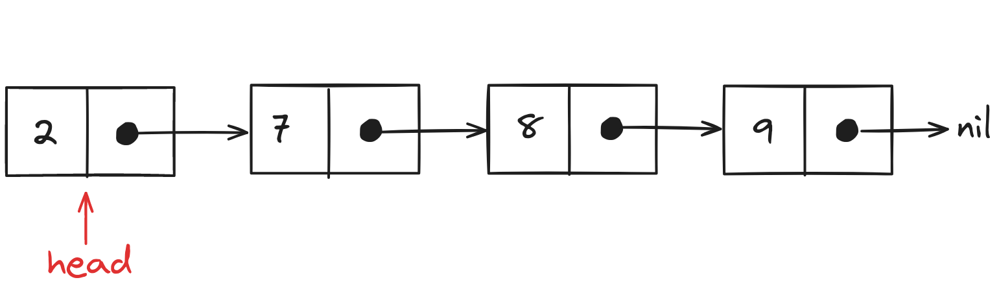
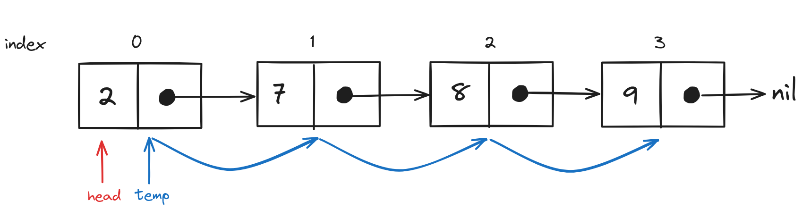
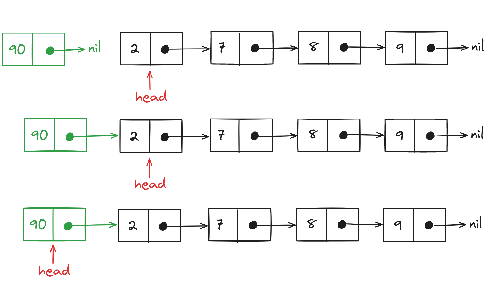
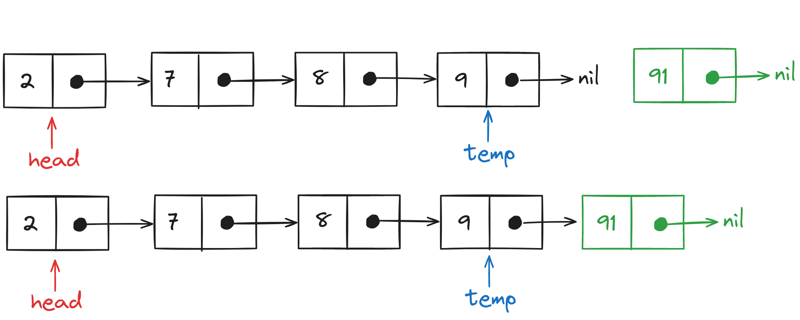
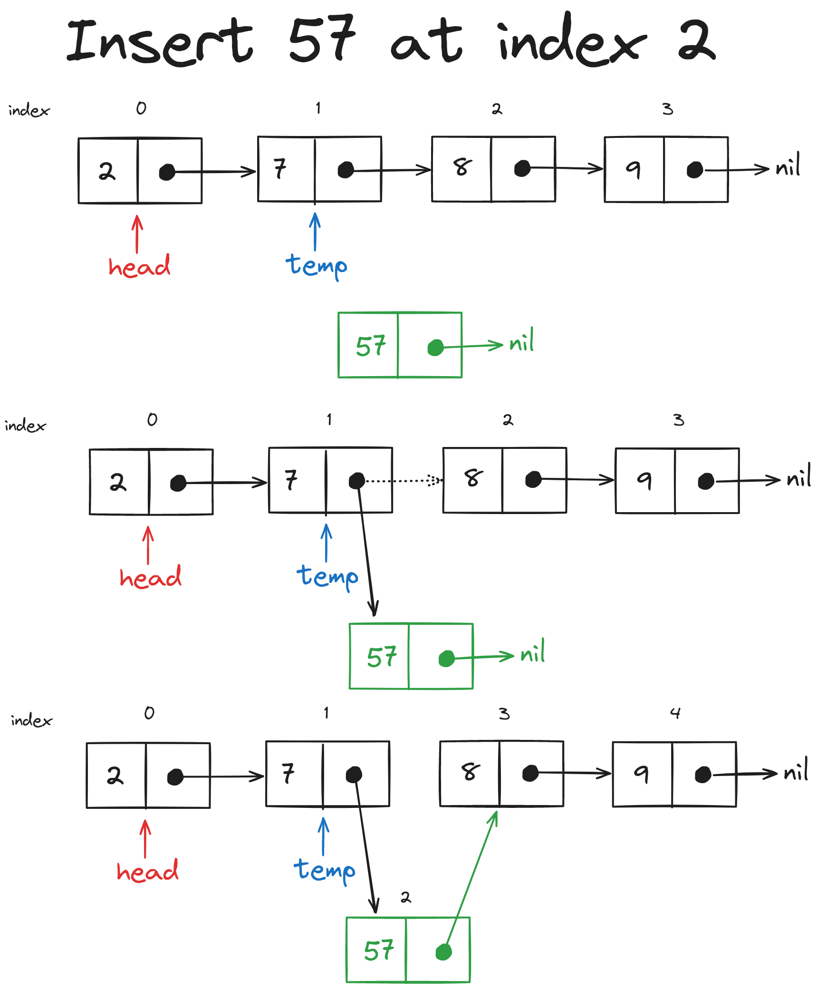
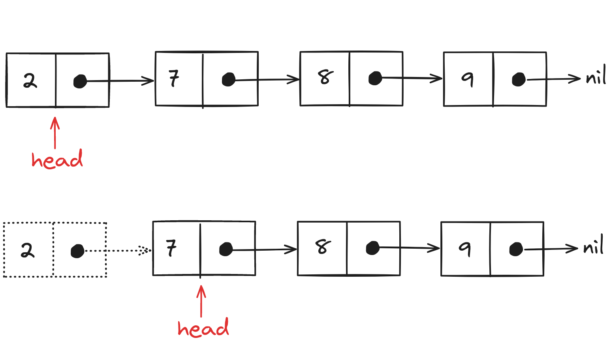
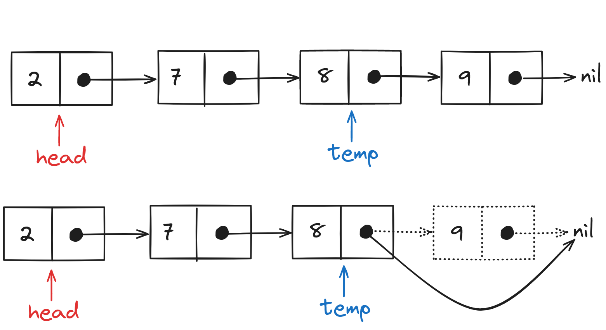
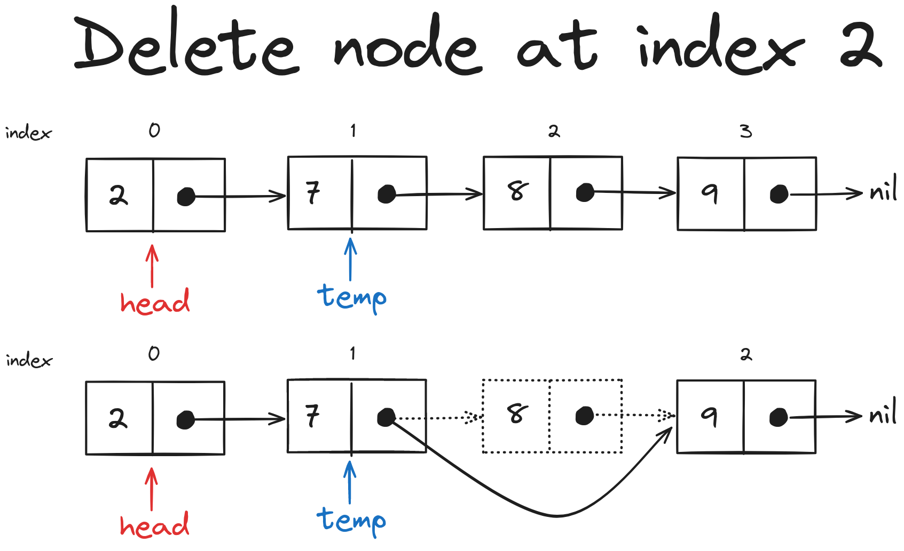
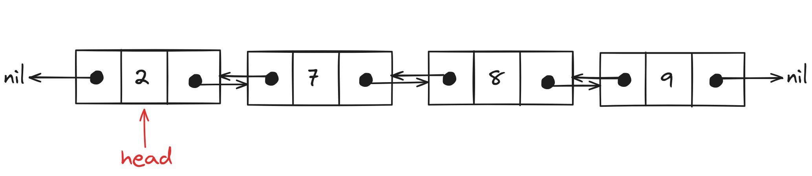
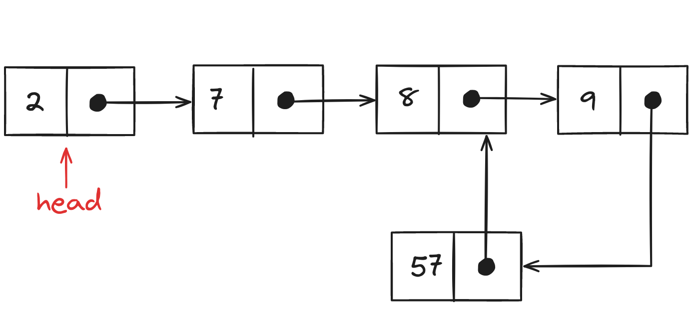

The linked list data structure is used to store sequential data using *nodes*. A **node** contains a value and the memory address of the next node.

<p align="center"></p>

Memory for a new node is allocated dynamically i.e. nodes are stored in the next available memory location. Unlike <a href="/posts/dsa/arrays-strings-hashmaps/#arrays" target="_blank">arrays</a> where contiguous blocks of memory are allocated during declaration.

The first element in a linked list is marked by its *head* pointer.

Here is an implementation of Linked List in <a href="/posts/go/go-programming-language/" target="_blank">Go</a>

```Go
type Node struct{
  // Integer value
  value int
    
  // Pointer to the next node
  next *Node
}

type LinkedList struct{
  // Pointer to the head node
  head *Node
}
```

# Linked List Operations
## Accessing a Value
In arrays, we can access an element using its index. For linked lists we have to iterate over all the previous elements to reach the element specified by the index, so to access the 7th element in a linked list we have to iterate over the first 6 elements.

<p align="center"></p>

This operation has linear time complexity ($O(n)$) in the worst-case scenario (accessing the last element).

```Go
package main

import "fmt"

type Node struct{
  value int
  next *Node
}

type LinkedList struct{
  head *Node
}

func main(){
    // Creating a LinkedList and its head node
    var linkedList LinkedList
    linkedList.head = &(Node{value:2, next:nil})
    
    // Accessing the head of LinkedList
    fmt.Println("Head node of the linked list:", *(linkedList.head))
    
    // Adding a new nodes after head
    linkedList.head.next = &(Node{value:7, next:nil})
    linkedList.head.next.next = &(Node{value:8, next:nil})
    linkedList.head.next.next.next = &(Node{value:9, next:nil})
    
    // Accessing the node at a specific location
    index := 3
    
    // Iterator variable to store the current node
    var temp *Node
    
    // Starting from head
    temp = linkedList.head
    
    // Until the value of the index is 0
    // increment the temp to the next node
    for ;index>0;index--{
        temp = temp.next
    }
    
    // Display the value at the index
    fmt.Println("Value at index", index, "is:", temp.value)
}
```
## Inserting an Element
Before we insert an element in a linked list, we have to allocate memory for the new node.

### Inserting an Element (at the beginning)
The first element in a linked list is decided by the value of the *head* pointer. So we can reassign the `head` to point to a new node containing the value to be inserted.

<p align="center"></p>

Since we are only modifying the head of the linked list, this is a constant time complexity ($O(1)$) operation.

```Go
package main

import "fmt"

type Node struct{
  value int
  next *Node
}

type LinkedList struct{
  head *Node
}

func (ll *LinkedList) insertAtBeginning(input int){
    // Create a new node with the input value
    newNode := &(Node{value: input, next:nil})
    
    // Set the current head of the linked list 
    // as the next node
    newNode.next = (ll.head)
    
    // Point the head to newNode
    ll.head = newNode
}

func main(){
    var linkedList LinkedList
    linkedList.head = &(Node{value:2, next:nil})
    linkedList.head.next = &(Node{value:7, next:nil})
    linkedList.head.next.next = &(Node{value:8, next:nil})
    linkedList.head.next.next.next = &(Node{value:9, next:nil})
    
    fmt.Println("Head node of the linked list:", *(linkedList.head))
    fmt.Println("2nd node of the linked list:", *(linkedList.head.next))
    fmt.Println("3rd node of the linked list:", *(linkedList.head.next.next))
    
    linkedList.insertAtBeginning(90)
    fmt.Println("After inserting a new element at the start of the Linked List")
    fmt.Println("Head node of the linked list:", *(linkedList.head))
    fmt.Println("2nd node of the linked list:", *(linkedList.head.next))
    fmt.Println("3rd node of the linked list:", *(linkedList.head.next.next))
}

// Output
// Head node of the linked list: {2 0xc00009e240}
// 2nd node of the linked list: {7 0xc00009e250}
// 3rd node of the linked list: {8 0xc00009e260}
// After inserting a new element at the start of the Linked List
// Head node of the linked list: {90 0xc00009e230}
// 2nd node of the linked list: {2 0xc00009e240}
// 3rd node of the linked list: {7 0xc00009e250}
```

### Inserting an Element (at the end)
To insert an element at the end of a linked list we first have to find the last element. For that, we have to iterate over the complete list, which will take $O(n)$ time.

<p align="center"></p>

```Go
package main

import "fmt"

type Node struct{
  value int
  next *Node
}

type LinkedList struct{
  head *Node
}

func (ll *LinkedList) insertAtEnd(input int){
    // Assigning a temp pointer to the head of the linked list
    temp := ll.head
    
    // Until we reach the node with no next value
    for ;temp.next!=nil;{
        
        // Increment temp to the next node in the linked list
        temp=temp.next
    }
    
    // Add a new node to the linked list
    temp.next = &Node{value: input, next:nil}
}

func main(){
    var linkedList LinkedList
    linkedList.head = &(Node{value:2, next:nil})
    linkedList.head.next = &(Node{value:7, next:nil})
    
    fmt.Println("Head node:", *(linkedList.head))
    fmt.Println("2nd node:", *(linkedList.head.next))
    
    linkedList.insertAtEnd(90)
    fmt.Println("After inserting a new element at the end of the Linked List")
    fmt.Println("Head node:", *(linkedList.head))
    fmt.Println("2nd node:", *(linkedList.head.next))
    fmt.Println("3rd node:", *(linkedList.head.next.next))
    
    linkedList.insertAtEnd(91)
    fmt.Println("4th node:", *(linkedList.head.next.next.next))
}

// Output
// Head node: {2 0xc000014270}
// 2nd node: {7 <nil>}
// After inserting a new element at the end of the Linked List
// Head node: {2 0xc000014270}
// 2nd node: {7 0xc0000142a0}
// 3rd node: {90 <nil>}
// 4th node: {91 <nil>}
```

If we modify the `LinkedList` data structure to add a `tail` pointer (to store the address of the last node), the time taken to complete this operation will be reduced to $O(1)$.

### Inserting an Element (at a specific location)
To insert an element at a specific location in a linked list, we can use the same approach as `insertAtEnd` but we have to stop the loop just before we reach the specified location.

<p align="center"></p>

```Go
package main

import "fmt"

type Node struct{
  value int
  next *Node
}

type LinkedList struct{
  head *Node
}

func (ll *LinkedList) insertAtIndex(input int, index int){
    // Creating a new node with the input value
    newNode := &(Node{value:input, next:nil})
    
    if index==0{
        // Same as inserting a new node at the beginning
        newNode.next = ll.head
        ll.head = newNode
        
    } else {
        // Starting temp iterator from the head of the linked list
        temp := ll.head
        
        // While temp is not at the end 
        // AND i is smaller than the index
        // Increment the temp to the next node
        for i:=1;i<index && temp.next!=nil;i++{
            temp = temp.next
        }
        
        // Insert newNode in between temp and temp.next
        // temp -> newNode -> temp.next
        newNode.next = temp.next
        temp.next = newNode
    }
}

func main(){
    var linkedList LinkedList
    linkedList.head = &(Node{value:2, next:nil})
    linkedList.head.next = &(Node{value:7, next:nil})
    
    fmt.Println("Head node:", *(linkedList.head))
    fmt.Println("2nd node:", *(linkedList.head.next))
    
    linkedList.insertAtIndex(90, 0)
    fmt.Println("After inserting a new element at 0th index")
    fmt.Println("Head node:", *(linkedList.head))
    
    linkedList.insertAtIndex(91, 1)
    fmt.Println("After inserting a new element at 1st index")
    fmt.Println("Head node:", *(linkedList.head))
    fmt.Println("2nd node:", *(linkedList.head.next))
    fmt.Println("3rd node:", *(linkedList.head.next.next))
    fmt.Println("4th node:", *(linkedList.head.next.next.next))
}

// Output
// Head node: {2 0xc000014280}
// 2nd node: {7 <nil>}
// After inserting a new element at 0th index
// Head node: {90 0xc000014270}
// After inserting a new element at 1st index
// Head node: {90 0xc0000142d0}
// 2nd node: {91 0xc000014270}
// 3rd node: {2 0xc000014280}
// 4th node: {7 <nil>}
```

The worst-case time complexity of this operation is $O(n)$.

## Deleting an Element
We can remove an element from the linked list if we just reassign the pointers storing its location.

### Deleting an Element (from the beginning)
To delete an element from the beginning we can just change the address stored in the `head` pointer to the next node. 

<p align="center"></p>

The time taken to complete this operation is independent of the size of the linked list, thus the time complexity will be $O(1)$.

```Go
package main

import "fmt"

type Node struct {
  value int
  next *Node
}

type LinkedList struct {
  head *Node
}

func (ll *LinkedList) deleteFromStart(){
    // Linked List's head will now point to the next node
    ll.head = ll.head.next
}

func main(){
    var linkedList LinkedList
    linkedList.head = &(Node{value: 2, next:nil})
    linkedList.head.next = &(Node{value:3, next:nil})
    
    fmt.Println("Head node:", *linkedList.head)
    fmt.Println("Second node:", *linkedList.head.next)
    
    linkedList.deleteFromStart()
    fmt.Println("After deleting element from the start")
    fmt.Println("Head node:", *linkedList.head)
}

// Output
// Head node: {2 0xc00009e230}
// Second node: {3 <nil>}
// After deleting element from the start
// Head node: {3 <nil>}
```
### Deleting an Element (from the end)
To delete an element from the end of a linked list we have to iterate over all the preceding elements. This will result in the worst-case time complexity of $O(n)$.

<p align="center"></p>

```Go
package main

import "fmt"

type Node struct {
    value int
    next *Node
}

type LinkedList struct {
    head *Node
}

func (ll *LinkedList) deleteFromEnd(){
    temp := ll.head
    
    if temp.next == nil {
        
        // If the linked list contains only one element
        // Set the value of the head to nil
        ll.head = nil
        
    } else {
        
        // Iterate over the linked list until you reach
        // the second last element
        for ;temp.next.next!=nil;{
            temp = temp.next
        }
        
        // Set the next value of the second last element to nil
        temp.next = nil
    }
}

func main(){
    var linkedList LinkedList
    linkedList.head = &(Node{value: 2, next:nil})
    linkedList.head.next = &(Node{value:3, next:nil})
    
    fmt.Println("Head node:", linkedList.head)
    fmt.Println("Second node:", linkedList.head.next)
    
    linkedList.deleteFromEnd()
    fmt.Println("After deleting element from the end")
    fmt.Println("Head node:", linkedList.head)
    fmt.Println("Second node:", linkedList.head.next)
}

// Output
// Head node: &{2 0xc000014280}
// Second node: &{3 <nil>}
// After deleting element from the end
// Head node: &{2 <nil>}
// Second node: <nil>
```

### Deleting an Element (from a specific location)
Similar to `insertAtIndex` we will iterate over the linked list and stop just before the specified location to change the references for its `next` pointer. 

<p align="center"></p>

In the worst-case scenario for this operation, we have to remove the last element, resulting in $O(n)$ time complexity.

```Go
package main

import "fmt"

type Node struct {
    value int
    next *Node
}

type LinkedList struct {
    head *Node
}

func (ll *LinkedList) deleteFromIndex(index int){
    temp := ll.head
    if index == 0{
        
        // If we have to remove the first node (head)
        // then change its reference to the next node
        ll.head = ll.head.next
        
    } else {
        
        // Exit the loop at the second last element or 
        // at index-1
        for i:=1;i<index && temp.next.next!=nil;i++{
            temp = temp.next
        }
        
        // Change the reference of the next pointer 
        // to skip the node located at index
        temp.next = temp.next.next
    }
}

func main(){
    var linkedList LinkedList
    linkedList.head = &(Node{value: 2, next:nil})
    linkedList.head.next = &(Node{value:3, next:nil})
    linkedList.head.next.next = &(Node{value: 5, next:nil})
    linkedList.head.next.next.next = &(Node{value: 9, next:nil})
    
    fmt.Println("Head node:", linkedList.head)
    fmt.Println("Second node:", linkedList.head.next)
    fmt.Println("Third node:", linkedList.head.next.next)
    fmt.Println("Fourth node:", linkedList.head.next.next.next)
    
    removalIndex := 2
    linkedList.deleteFromIndex(removalIndex)
    fmt.Println("After deleting element from index:", removalIndex)
    fmt.Println("Head node:", linkedList.head)
    fmt.Println("Second node:", linkedList.head.next)
    fmt.Println("Third node:", linkedList.head.next.next)
    fmt.Println("Fourth node:", linkedList.head.next.next.next)

    removalIndex = 0
    linkedList.deleteFromIndex(removalIndex)
    fmt.Println("After deleting element from index:", removalIndex)
    fmt.Println("Head node:", linkedList.head)
    fmt.Println("Second node:", linkedList.head.next)
}

// Output
// Head node: &{2 0xc00009e240}
// Second node: &{3 0xc00009e250}
// Third node: &{5 0xc00009e260}
// Fourth node: &{9 <nil>}
// After deleting element from index: 2
// Head node: &{2 0xc00009e240}
// Second node: &{3 0xc00009e260}
// Third node: &{9 <nil>}
// Fourth node: <nil>
// After deleting element from index: 0
// Head node: &{3 0xc00009e260}
// Second node: &{9 <nil>}
```

## Displaying Linked List
We have to iterate over all the elements in a linked list to display them in the output.

```Go
package main

import "fmt"

type Node struct {
    value int
    next *Node
}

type LinkedList struct {
    head *Node
}

func (ll *LinkedList) display(){
    temp := ll.head
    
    // Since we have to reach the last element itself
    // we will stop the loop only when the temp is nil
    for ;temp!=nil;{
        fmt.Printf("%d->", temp.value)
        temp = temp.next
    }
    
    fmt.Println()
}

func main(){
    var linkedList LinkedList
    linkedList.head = &(Node{value: 2, next:nil})
    linkedList.head.next = &(Node{value:3, next:nil})
    linkedList.head.next.next = &(Node{value: 5, next:nil})
    linkedList.head.next.next.next = &(Node{value: 9, next:nil})
    
    linkedList.display()
}

// Output
// 2->3->5->9->
```

# Variations of a Linked List
## Doubly Linked List
We can add a `prev` pointer in the linked list node to store the address of the previous node. Although it increases the memory space allocated for each node, the time complexity of iterating in reverse (from any particular node) will be improved.

<p align="center"></p>

```Go
type Node struct{
    prev *Node
    value int
    next *Node
}

type DoublyLinkedList struct{
    head *Node
}
```

## Circular Linked List
In a **circular linked list**, a node is referenced two or more times. Iterating over a circular linked list results in an infinite loop.

<p align="center"></p>

```Go
package main

import "fmt"

type Node struct {
    value int
    next *Node
}

type LinkedList struct {
    head *Node
}

func (ll *LinkedList) display(limit int){
    temp := ll.head
    
    // Loop will end upon reaching the last element
    // or hitting the limit of elements
    for ;limit>0 && temp!=nil;limit--{
        fmt.Printf("%d->", temp.value)
        temp = temp.next
    }
    
    fmt.Println()
}

func main(){
    var linkedList LinkedList
    linkedList.head = &(Node{value: 2, next:nil})
    linkedList.head.next = &(Node{value:3, next:nil})
    
    newNode := Node{value:99, next:nil}
    
    linkedList.head.next.next = &newNode
    newNode.next = &(Node{value: 9, next:nil})
    
    linkedList.head.next.next.next = &(Node{value:6, next:nil})
    linkedList.head.next.next.next.next = &newNode
    
    linkedList.display(10)
}

// Output
// 2->3->99->6->99->6->99->6->99->6->
```

<hr>
Thank you for taking the time to read this blog post! If you found this content valuable and would like to stay updated with my latest posts consider subscribing to my <a href="https://www.avni.sh/index.xml" target="_blank">RSS Feed</a>.    

# Resources
<a href="https://www.freecodecamp.org/news/how-linked-lists-work/" target="_blank">How Does a Linked List Work? A Beginner's Guide to Linked Lists</a>  
