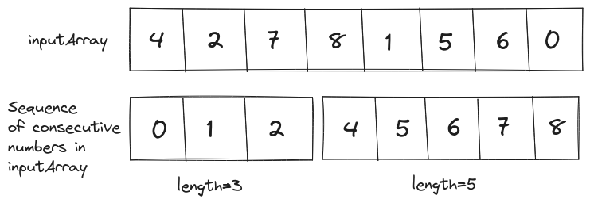
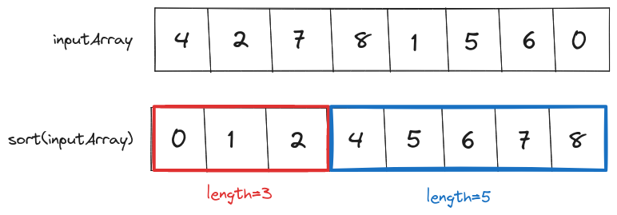
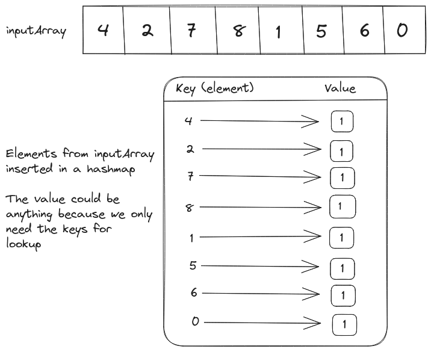
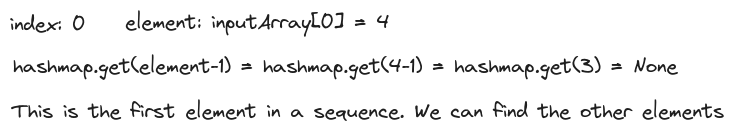
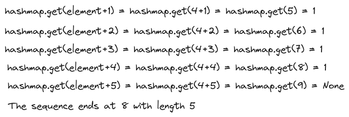

# Problem Statement
We have to implement the `longestConsecutive` function that takes an integer array as input and returns the length of the longest sequence of consecutive integers.

<p align="center"></p>

For example, in array `[4, 2, 7, 8, 1, 5, 6, 0]` we have two sequences of consecutive integers: `[0, 1, 2]` and `[4, 5, 6, 7, 8]`. The longest sequence (`[4, 5, 6, 7, 8]`) has length 5.

# Brute Force Solution
It would be easier to find consecutive sequences if the input array is sorted. 

<p align="center"></p>

Once we have the sorted array we can iterate over it and find the longest sequence.

## Psuedo-code for the Brute Force Solution
```text
sortedInputArray = sort(inputArray)

longest_sequence_length = 0
sequence_length = 1
loop index in from 1 to len(sortedInputArray)
  if sortedInputArray[index] - sortedInputArray[index-1]==1:
    sequence_length += 1
  else if sortedInputArray[index]==sortedInputArray[index-1]:
    pass
  else
    sequence_length = 1
	
  longest_sequence_length = max(longest_sequence_length, sequence_length) 
```

## Time Complexity Analysis 
### Best Case Scenario
For the best-case input, the brute-force solution will return the result in $O(n) + O(n \log(n))$ time. Since the time complexity of the best sorting algorithm will be $O(n \log(n))$ and the time complexity of iterating over the array is $O(n)$. We can simplify the total time complexity of the brute-force solution to $O(n \log(n))$.

### Worst Case Scenario
In the worst-case scenario, the time complexity of the brute-force solution will be the same i.e. $O(n \log(n))$.

## Space Complexity Analysis
We are assuming that the sorting operation is done in place for the elements in the input array. Thus, the space complexity of brute-force solution is constant i.e. $O(1)$.

## Code for Brute Force Solution
```Go
package main

import (
    "fmt"
    "sort"
    "math"
)

func longestConsecutive(nums []int)(int){
    
    // For an empty input array the length of
    // longest consecutive sequence will be 0
    if len(nums)==0{
        return 0
    }
    
    // The best sorting algorithm will sort in
    // O(nlog(n)) time
    sort.Ints(nums)
    
    // This variable will contain the length
    // of longest consecutive sequence
    longestSequenceLength := 1
    
    // Temporary variable to store the length
    // of the current sequence
    sequenceLength := 1
    
    for index:=1;index<len(nums);index++{
        if ((nums[index]-nums[index-1])==1){
            
            // If the values at index and index-1
            // are consecutive then increment the current
            // sequence length by 1
            sequenceLength+=1
            
        } else if (nums[index]==nums[index-1]){

            // If the values at index and index-1
            // are the same then don't increment the current
            // sequence length
            sequenceLength+=0
            
        } else {
            
            // If the consecutive sequence is broken
            // then reset the current sequence length to 1
            sequenceLength=1
            
        }
        
        // On every iteration check if the length
        // of the current sequence is greater than
        // the value stored in longestSequenceLength
        longestSequenceLength = int(math.Max(float64(sequenceLength), 
                                float64(longestSequenceLength)))
    }
    
    return longestSequenceLength
}

func main(){
    inputArray := []int{100, 4, 200, 1, 3, 2}
    fmt.Println("Length of Longest Consecutive Sequence:", 
                longestConsecutive(inputArray))
                
    inputArray = []int{4, 2, 7, 8, 1, 5, 6, 0}
    fmt.Println("Length of Longest Consecutive Sequence:", 
                longestConsecutive(inputArray))
}

// Output
// Length of Longest Consecutive Sequence: 4
// Length of Longest Consecutive Sequence: 5
```

# Optimized Solution
In terms of time complexity of the brute-force solution sorting is the most expensive operation ($O(n \log(n))$). We can eliminate it if we create a hashmap of elements in the array.

<p align="center"></p>

If the `value` is the first element in a consecutive sequence, it implies that `value-1` does not exist in the `inputArray`. So we can iterate over all the elements in `inputArray` and identify the first elements of consecutive sequences by searching for `inputArray[index]-1` in the hashmap. 

<p align="center"></p>

Once we have found the first element of consecutive sequence we can keep looking for the next value in the hashmap until the sequence is broken.

<p align="center"></p>

## Psuedo code for the Optimized Solution
```text
hashmap = HashMap()
loop value in inputArray
	if not hashmap[value]
		hashmap[value] = 1

longest_sequence = 0
sequence = 0
loop index in inputArray
	value = inputArray[index]
	if not hashmap[value-1]
		while hashmap[value+1]
			sequence += 1
			value+=1
	else
		sequence = 1
	longest_sequence = max(sequence, longest_sequence)
```

## Time Complexity Analysis
### Best Case Scenario
The loop executed to fill the hashmap has a fixed time complexity of $O(n)$.

If the input for the optimized solution contains only the sequences of length `1` then the nested `while` loop will not be executed. Thus, the total time complexity of the optimized solution in the best-case scenario will be $O(n) + O(n)$ or simply $O(n)$.

### Worst Case Scenario
The check for `hashmap[value-1]` ensures that we are only looking for consecutive numbers upon encountering the first value. Thus, the total complexity of the worst-case scenario is also $O(n)$.

## Space Complexity Analysis
The space complexity of the optimized solution is worse than the brute-force solution because it takes extra $O(n)$ space to store the hashmap.

## Code for Optimized Solution
```Go
package main

import (
    "fmt"
    "math"
)

func longestConsecutive(nums []int)(int){
    
    // Return 0 for the empty nums array
    if len(nums)==0{
        return 0
    }
    
    // Create a hashmap of all values in the nums array
    hashmap := make(map[int]int)
    for index:=0;index<len(nums);index++{
        _, key_exists := hashmap[nums[index]]
        if !key_exists{
            hashmap[nums[index]] = 1
        }
    }
    
    longestSequence := 1
    sequence := 1
    
    for index:=0;index<len(nums);index++{
        value := nums[index]
        _, key_exists := hashmap[value-1]
        
        // If value-1 does not exist in the hashmap
        // it is the start of a sequence
        if !key_exists{
            
            // Increment the value and sequence length
            // until we can't find value+1 in the hashmap
            for ;true;{
                value+=1
                _, key_exists = hashmap[value]
                if key_exists{
                    sequence+=1
                } else {
                    break
                }
            }
        }
        
        // Reset the value of longestSequence to the maximum
        // of current sequence and the current value of 
        // the longestSequence
        longestSequence = int(math.Max(float64(sequence), 
                                        float64(longestSequence)))
        sequence = 1
    }
    
    return longestSequence
}

func main(){
    inputArray := []int{100, 4, 200, 1, 3, 2}
    fmt.Println("Length of Longest Consecutive Sequence:", 
                longestConsecutive(inputArray))
                
    inputArray = []int{4, 2, 7, 8, 1, 5, 6, 0}
    fmt.Println("Length of Longest Consecutive Sequence:", 
                longestConsecutive(inputArray))
}

// Output
// Length of Longest Consecutive Sequence: 4
// Length of Longest Consecutive Sequence: 5
```

<hr>

Thank you for taking the time to read this blog post! If you found this content valuable and would like to stay updated with my latest posts consider subscribing to my <a href="https://www.avni.sh/index.xml" target="_blank">RSS Feed</a>.

# Resources
<a href="https://leetcode.com/problems/longest-consecutive-sequence/description/" target="_blank">128. Longest Consecutive Sequence</a>  
<a href="https://youtu.be/P6RZZMu_maU?si=WNGUGem6fZQfm7yj" target="_blank">Leetcode 128 - LONGEST CONSECUTIVE SEQUENCE</a>
