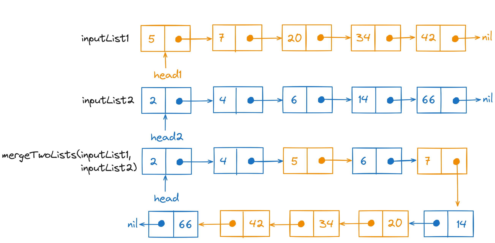

# Problem Statement
We have to implement the `mergeTwoLists` function that takes the `head` nodes of two sorted linked lists as input 
and returns the `head` node of the merged linked list as the output.

<p align="center"></p>

# Optimal Solution
To merge both linked lists we can use the <a href="/posts/dsa/two-pointers-approach/" target="_blank">two-pointer approach</a> by maintaining an iterator on both linked lists and 
comparing their values. The smaller value will be selected and <a href="/posts/dsa/linked-lists/#inserting-an-element-at-the-end" target="_blank">inserted at the end of a new list</a>. The result would 
be a merged sorted linked list.

If all the values from any one of the linked lists are added then the other linked list will be joined at the end of 
the merged linked list.

<p align="center"></p>

## Psuedo-code for the Optimal Solution
```text
if(linked_list2==nil){
  return linked_list1
} else if(linked_list1==nil){
  return linked_list2
}

temp1 = linked_list1.head
temp2 = linked_list2.head
mergedLinkedList = LinkedList()
while(temp1!=nil and temp2!=nil){
 if (temp1.value < temp2.value){
  mergedLinkedList.insertAtEnd(temp1.value)  
  temp1=temp1.next
 } else {
  mergedLinkedList.insertAtEnd(temp2.value) 
  temp2=temp2.next
 } 
}

if(temp1!=nil){
  mergedLinkedList.Add(temp1)
} else if(temp2!=nil){
  mergedLinkedList.Add(temp2)
}

return mergedLinkedList
```

## Time Complexity Analysis 
### Best Case Scenario
For the best case input i.e. either the first or second linked list is empty, the time complexity of the 
solution is $O(1)$ because we are returning the non-empty linked list as the result.

### Worst Case Scenario
In the worst-case scenario, we have to iterate over both the linked lists completely. 
But since we are iterating them together using two pointers the time complexity will be determined by the length of 
the larger linked list. 

So the total time complexity of the solution in the worst-case scenario will be $O(n)$ where $n$ is the size 
of the larger linked list.

## Space Complexity Analysis
The merged linked list will contain all the elements from both input lists (with repetition). If the length of both linked 
lists is $m$ and $n$, the additional memory space required by the solution will be $O(m+n)$.

## Code for the Optimal Solution
```Go
package main

import "fmt"

type ListNode struct {
    Val int
    Next *ListNode
}

func Display(ln *ListNode){
    temp := ln
    for(temp!=nil){
        fmt.Printf("%d->", temp.Val)
        temp=temp.Next
    }
    fmt.Println()
}

func InsertAtEnd(list *ListNode, value int)(*ListNode){
    if list==nil{
        list = &(ListNode{Val:value})
    } else {
        temp := list
        for(temp.Next!=nil){
            temp=temp.Next
        }
        temp.Next = &(ListNode{Val:value})
    }
    return list
}

func JoinLists(list1 *ListNode, list2 *ListNode)(*ListNode){
    // Joins list1 with list2 by the last node
    temp := list1
    for(temp.Next!=nil){
        temp=temp.Next
    }
    temp.Next = list2
    return list1
}

func mergeTwoLists(list1 *ListNode, list2 *ListNode)(*ListNode){
    // Checking if any of the input lists are empty
    if(list1==nil){
        return list2
    } else if(list2==nil) {
        return list1
    }

    temp1 := list1
    temp2 := list2
    var mergedList *ListNode
    
    // Loop over both linked lists until one of them/both
    // are empty
    for((temp1!=nil)&&(temp2!=nil)){
        
        // If the current value in the first list is smaller
        // then add it to the merged linked list and vice versa
        if(temp1.Val<temp2.Val){
            mergedList = InsertAtEnd(mergedList, temp1.Val)
            temp1=temp1.Next
        } else {
            mergedList = InsertAtEnd(mergedList, temp2.Val)
            temp2=temp2.Next
        }
    }
    
    // If any one of the linked list is not empty
    // add it to the merged linked list
    if(temp1!=nil){
        mergedList = JoinLists(mergedList, temp1)
    } else if(temp2!=nil){
        mergedList = JoinLists(mergedList, temp2)
    }
    return mergedList
}

func main(){
    var ln *ListNode
    ln = InsertAtEnd(ln, 5)
    ln = InsertAtEnd(ln, 7)
    ln = InsertAtEnd(ln, 20)
    ln = InsertAtEnd(ln, 34)
    ln = InsertAtEnd(ln, 42)
    fmt.Println("Input Linked List 1:")
    Display(ln)

    var ln2 *ListNode
    ln2 = InsertAtEnd(ln2, 2)
    ln2 = InsertAtEnd(ln2, 4)
    ln2 = InsertAtEnd(ln2, 6)
    ln2 = InsertAtEnd(ln2, 14)
    ln2 = InsertAtEnd(ln2, 66)
    fmt.Println("Input Linked List 2:")
    Display(ln2)
    
    fmt.Println("Merged Linked List:")
    Display(mergeTwoLists(ln, ln2))
}

// Output
// Input Linked List 1:
// 5->7->20->34->42->
// Input Linked List 2:
// 2->4->6->14->66->
// Merged Linked List:
// 2->4->5->6->7->14->20->34->42->66->
```

<hr>

Thank you for taking the time to read this blog post! If you found this content valuable and would like to stay updated with my latest posts consider subscribing to my <a href="https://www.avni.sh/index.xml" target="_blank">RSS Feed</a>.

# Resources
<a href="https://leetcode.com/problems/merge-two-sorted-lists/description/" target="_blank">21. Merge Two Sorted Lists</a>  
<a href="https://www.youtube.com/watch?v=XIdigk956u0" target="_blank">Merge Two Sorted Lists - Leetcode 21 - Python</a>
