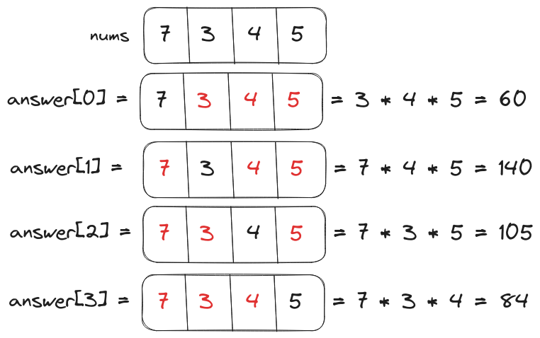
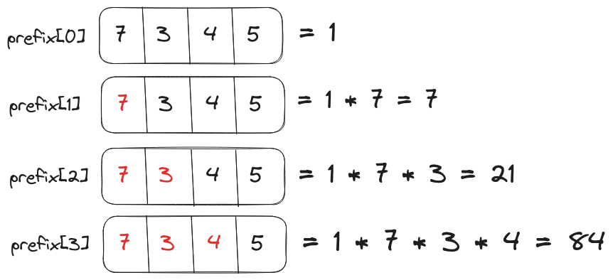
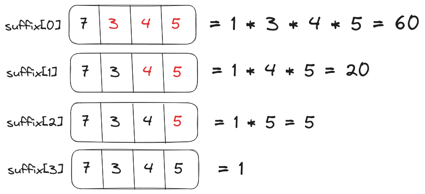

# Problem Statement

We have to implement a `productExceptSelf` function that takes an integer array `nums` as input and returns another array `answer` as output. The element `answer[i]` will be the product of all elements in `inputArray` except `inputArray[i]`.

<p align="center"></p>

The implementation should not contain a division (`/`) operation because the `answer` array could also be created by iterating over all elements in `inputArray` and dividing them from the product of the complete array.

# Brute Force Solution

The brute-force solution to this problem could be implemented using nested loops. Where the first loop will select an element from the array and the second loop will be used to calculate the product without the element from the first loop.

## Psuedo-code for the Brute Force Solution

```text
answer = []
loop index on nums
	product = 1
	loop index2 on nums
		if index!=index2
			product *= nums[index2]

	answer.append(product)
return answer
```

## Best Case Scenario

The brute-force solution will return the `answer` array in $O(n^2)$ time for the best-case input. Since both the loops will iterate completely over the `nums` array.

## Worst Case Scenario

The worst-case scenario will also take $O(n^2)$ to return the solution.

## Code for Brute Force Solution

```Go
package main

import "fmt"

func productExceptSelf(nums []int)([]int){
    answer := []int{}
    for index:=0;index<len(nums);index++{
        product := 1
        for index2:=0;index2<len(nums);index2++{

            // Skip the element selected by the outer loop
            if index!=index2{
                product *= nums[index2]
            }
        }
        answer = append(answer, product)
    }
    return answer
}

func main(){
    nums := []int{1, 2, 3, 4}
    fmt.Println("Product Except Self:", productExceptSelf(nums))

    nums = []int{45, 34, 67, 86, 23}
    fmt.Println("Product Except Self:", productExceptSelf(nums))
}

// Output
// Product Except Self: [24 12 8 6]
// Product Except Self: [4505884 5963670 3026340 2357730 8815860]
```

# Optimized Solution

If we have to improve the time complexity of brute-force solution then we have to think of something other than nested loops.

The "product except self" for an element `nums[i]` refers to the product of all elements before and after `nums[i]` i.e. `answer[i] = nums[0:i-1] * nums[i+1:]`. Thus, we can implement the `productExceptSelf` function with $O(n)$ time complexity if we calculate two arrays `prefix` and `suffix` where

- `prefix[i]` is the product of all elements before `nums[i]`

<p align="center"></p>

- `suffix[i]` is the product of all elements after `nums[i]`

<p align="center"></p>

and multiply them to create the `answer` array.

## Psuedo code for the Optimized Solution

```text
prefix = []
loop index on nums
	prefixProduct = 1
	prefix.append(prefixProduct)
	prefixProduct *= nums[index]

suffix = []
loop index from length(nums)-1 to 0
	suffixProduct = 1
	suffix.append_at_start(suffixProduct)
	suffixProduct *= nums[index]

answer = []
loop index on prefix
	answer.append(prefix[index]*suffix[index])

 return answer
```

## Best Case Scenario

The optimized solution will return the `answer` array in $O(n)$ time (generalized from $O(3n)$) since the time complexity of iterating over all three arrays (`prefix`, `suffix`, and `answer`) is $O(n)$.

We can improve the space complexity further if we use a single array for storing products of `prefix` and `suffix` and return it as the `answer`.

## Worst Case Scenario

The time complexity of iterating over arrays in worst-case input is the same as in the best-case scenario. Thus, the total time complexity of the function remains the same i.e. $O(n)$.

## Code for Optimized Solution

```Go
package main

import "fmt"

func productExceptSelf(nums []int)([]int){
    prefix := []int{}
    prefixProduct := 1
    for index:=0;index<len(nums);index++{
        prefix = append(prefix, prefixProduct)
        prefixProduct *= nums[index]
    }

    suffix := []int{}
    suffixProduct := 1

    // Loop over the nums array in reverse
    // starting from the last element

    for index:=(len(nums)-1);index>(-1);index--{
        // Append the element at the start
        // rather than at the end
        suffix = append([]int{suffixProduct}, suffix...)
        suffixProduct *= nums[index]
    }

    answer := []int{}
    for index:=0;index<len(prefix);index++{
        // Multiply prefix and suffix elements
        // to create the answer array
        answer = append(answer, prefix[index]*suffix[index])
    }

    return answer
}

func main(){
    nums := []int{4, 2, 3, 7}
    fmt.Println("Product Except Self:", productExceptSelf(nums))

    nums = []int{45, 34, 67, 86, 23}
    fmt.Println("Product Except Self:", productExceptSelf(nums))
}

// Output
// Product Except Self: [42 84 56 24]
// Product Except Self: [4505884 5963670 3026340 2357730 8815860]
```

## Code for Optimized Solution (Constant Space Complexity)

We aren't considering the memory space acquired by the `answer` array.

```Go
package main

import "fmt"

func productExceptSelf(nums []int)([]int){
    answer := []int{}

    // Fill up the answer array with prefixes
    prefixProduct := 1
    for index:=0;index<len(nums);index++{
        answer = append(answer, prefixProduct)
        prefixProduct *= nums[index]
    }


    // Multiply suffixes with the existing
    // values in the answer array i.e. prefixes
    suffixProduct := 1
    for index:=(len(nums)-1);index>(-1);index--{
        answer[index] *= suffixProduct
        suffixProduct *= nums[index]
    }

    return answer
}

func main(){
    nums := []int{4, 2, 3, 7}
    fmt.Println("Product Except Self:", productExceptSelf(nums))

    nums = []int{45, 34, 67, 86, 23}
    fmt.Println("Product Except Self:", productExceptSelf(nums))
}

// Output
// Product Except Self: [42 84 56 24]
// Product Except Self: [4505884 5963670 3026340 2357730 8815860]
```

<hr>

Thank you for taking the time to read this blog post! If you found this content valuable and would like to stay updated with my latest posts consider subscribing to my <a href="https://www.bovem.in/index.xml" target="_blank">RSS Feed</a>.

# Resources

<a href="https://leetcode.com/problems/product-of-array-except-self/description/" target="_blank">238. Product of Array Except Self</a>  
<a href="https://www.youtube.com/watch?v=bNvIQI2wAjk" target="_blank">Product of Array Except Self - Leetcode 238 - Python</a>
