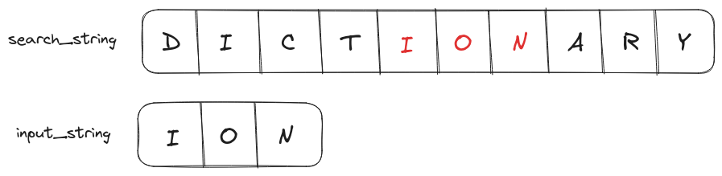
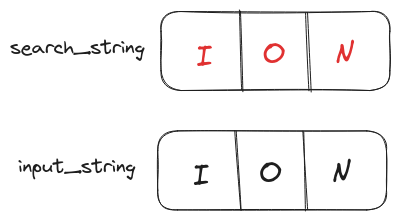
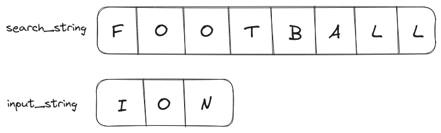
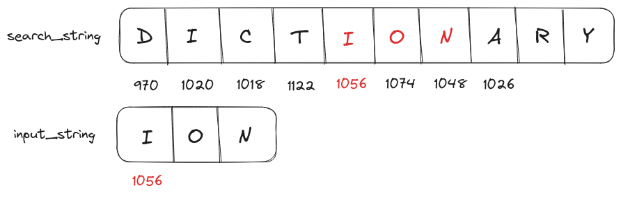
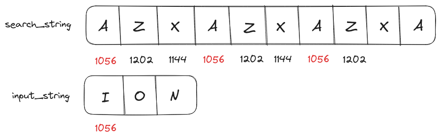

Searching contents on a website for a specific keyword, code search in text editors & IDEs, and information retrieval systems used in libraries and archives are use cases for an algorithm that searches a string within another string.

Unlike searching for a single character, searching for a complete string could be challenging. 

<p align="center"></p>

If we search string `ION` in `DICTIONARY`. For each character in `DICTIONARY`, we have to look for `I`, `O`, and `N` in the same order. 

Throughout this article, I'll be referring to the two strings as the following
* **search string**: The string upon which the search is executed. Example: `DICTIONARY`
* **input string**: The string being searched. Example: `ION`

# Brute Force Solution
A brute force solution of substring search will loop over characters in the search string and for each character, it will perform another loop over characters in the input string to check for equality.

## Psuedo Code for the Brute Force Solution

```text
loop(index1 in search_string)
    matchFlag = true
    
    loop(index2 in input_string)
        if search_string[index1 + index2] != input_string[index2]
            matchFlag = false
            break
            
    if matchFlag == true
        return True

return False
```

## Best Case Scenario
The best performance scenario for this algorithm will be when we have to search a string within itself.

<p align="center"></p>

Since the outer loop (over search string) is executed only once the resulting time complexity is $O(m)$, where $m$ is the size of the input string. 

The result will also be the same if the search string has characters after `ION` (like `IONIZED`, `IONIC`, etc.) because the algorithm will exit on the first match.

## Worst Case Scenario
The worst-case scenario in terms of performance will be when the input string is not present in the search string.

<p align="center"></p>

The algorithm will loop over all characters in the search string and for each character, it will also loop over every character in the input string. The worst-case time complexity will be $O((n-m) m)$ where $n$ and $m$ are lengths of the search string and input string respectively.

## Code for Brute Force Solution
```Go
package main

import "fmt"

func bruteForceSubstringSearch(inputString string, 
                                searchString string)(bool){

    // Looping over characters in searchString, time complexity: O(n)
    for indexN:=0;indexN<len(searchString)-len(inputString);indexN++{
        matchFlag := true

        // Looping over characters in inputString, time complexity: O(m)
        for indexM:=0;indexM<len(inputString);indexM++{
            if searchString[indexN+indexM] != inputString[indexM]{
                matchFlag = false
            } 
        }

        // Exit function if a match is found
        if matchFlag == true{
            return true
        }
    }

    return false
}

func main(){
  searchString := "DICTIONARY"

  inputString := "ION"
  fmt.Println("String",
              inputString,
              "is present in",
              searchString, ":", 
              bruteForceSubstringSearch(inputString, searchString)) 

  searchString = "FOOTBALL"
  fmt.Println("String",
              inputString,
              "is present in",
              searchString, ":", 
              bruteForceSubstringSearch(inputString, searchString)) 
}

// Output
// String ION is present in DICTIONARY : true
// String ION is present in FOOTBALL : false
```

# Optimized Solution
The major contributor to the time complexity of brute-force solution is the recurring inner loop ($O(m)$). If we can somehow reduce it to constant time, then the total time complexity of the program will be $O(n)$.

## Rabin-Karp Substring Search
The Rabin-Karp substring search algorithm was presented by Michael O. Rabin and Richard M. Karp in their research paper <a href="https://www.scinapse.io/papers/1972418517" target="_blank">Efficient randomized pattern-matching algorithms</a> published in March 1987.

In this algorithm, we calculate a *rolling* hash for all characters in the search string like the following

<p align="center"></p>

then we use the same hashing function on the input string.

The hash value of the input string is searched within rolling hashes of the search string. If a match is found then the characters of both strings are compared to confirm the match, as different strings could have the same hash value due to <a href="/posts/dsa/arrays-strings-hashmaps/#hash-function" target="_blank">hash collisions</a>.

The hash function could be defined like following

$$hash(input) = code(input[0])*128^{(n-1)} + code(input[1])*128^{(n-2)}+ \dots + code(input[n-1])*128^{0}$$

- $input$ is a set of characters for which the hash value is going to be calculated.
- $code()$ function converts characters to their ASCII values.
- $n$ is the length of $input$.
- The base is selected as $128$ to prevent hash collisions.

Applying this hash function on string `ION`, we get

$$hash(ION) = code(I)*128^{2} + code(O)*128^{1} + code(N)*128^{0}$$
$$hash(ION) = 73 \times 16384 + 79 \times 128 + 78 \times 1$$
$$hash(ION) = 1206222$$

Using arithmetic we can save the computation cost of calculating rolling hashes.

We can calculate the hash of the first 3 characters (because the size of the search string `ION` is 3).

$$ hash(DIC) = code(D)*128^2 + code(I)*128^1 + code(C)*128^0 $$

We can derive the value of the next rolling hash, $hash(ICT)$ from the hash of the first three characters, $hash(DIC)$ by performing the following operations

$$ hash(ICT) = code(I)*128^2 + code(C)*128^1 + code(T)*128^0 $$
$$ hash(ICT) = (code(I)*128^1 + code(C)*128^0)*128 + code(T)*128^0 $$
$$ hash(ICT) = (hash(DIC) - code(D)*128)*128 + code(T)*128^0 $$

We can repeat this operation to calculate all rolling hash values.

## Psuedo Code for Rabin-Karp Substring Search
```text
loop (index in M)
	if rollingHash[index] == rollingHash(N):
		if match(M[index:index+len(N)], N):
			return True
return False
```
## Best Case Scenario
The best case scenario for the Rabin-Karp algorithm is the same as the brute-force algorithm i.e. the input string is the same as the search string or present at the start of the search string. 

Since we are going to match the string only once the time complexity of the best case will be $O(n+m)$ where $n$ and $m$ are the sizes of the input string and search string respectively.

## Worst Case Scenario
The worst-case search string will have multiple substrings with the same rolling hash value as the input string while also having different characters i.e. we have to match characters for almost every character in the search string.

<p align="center"></p>

This is the same as running the brute-force algorithm. So the worst case time complexity is $O((n-m)n)$.

## Code for Optimized Solution
We can start with the implementation of the `calculateHash()` function that takes a string and a base value (`2`, `4`, `8`, etc.) as input and returns a hash value as output.

```Go
func calculateHash(inputString string, base int)(int){
  hashValue := 0
  
  // The time complexity of this function is O(m)
  // where m is the size of inputString
  
  for i:=0;i<len(inputString);i++{
    multiple := math.Pow(float64(base), float64(len(inputString)-i-1))
    hashValue += int(inputString[i])*int(multiple)
  }
  
  return hashValue
}
```

Now using this function we can also implement a `calculateRollingHash()` function to use on the search string.

```Go
func calculateRollingHash(searchString string, lenInputString int, base int)([]int){
  tempHash := calculateHash(searchString[:lenInputString], base)

  var rollingHashes []int
  rollingHashes = append(rollingHashes, tempHash)

  // The time complexity of this function is O(n)
  // where n is the size of searchString
  for i:=1;i<len(searchString)-lenInputString+1;i++{
    removedChar := searchString[i-1]
    addedChar := searchString[i-1+lenInputString]
    
    // Reusing tempHash to calculate values of subsequent hashes
    tempHash = tempHash - int(removedChar)*int(math.Pow(float64(base),
                                              float64(lenInputString-1)))
    tempHash = tempHash*base + int(addedChar) 

    rollingHashes = append(rollingHashes, tempHash)
  }

  return rollingHashes
}
```

A `match()` function for verifying the character match between the input string and search string.

```Go
func match(string1 string, string2 string)(bool){
    
  // Matching characters in string1 to characters in string2
  // Length of both strings is assumed to be equal
  for i:=0;i<len(string1);i++{
    if string1[i]!=string2[i]{
      return false
    }
  }
  
  return true
}
```

Using the helper functions implemented above we can finally implement the `rabinKarpSearch()` function that returns a boolean value representing the presence of an input string in the search string.

```Go
func rabinKarpSearch(inputString string, searchString string, base int)(bool){
  // Calculate all rolling hashes for searchString
  rollingHashes := calculateRollingHash(searchString, len(inputString), base)
  
  // Calculate the hash value of inputString
  inputStringHash := calculateHash(inputString, base)

  for i:=0;i<len(rollingHashes);i++{
    matchFlag := false
    
    if inputStringHash == rollingHashes[i]{
      // Match both strings using characters
      matchFlag = match(inputString, searchString[i:i+len(inputString)])
    }

    if matchFlag == true{
      // Exit function on the first match
      return true
    }
  }

  return false
}
```

### Complete Code
```Go
package main

import (
  "fmt"
  "math"
)

func calculateHash(inputString string, base int)(int){
  hashValue := 0
  
  // The time complexity of this function is O(m)
  // where m is the size of inputString
  
  for i:=0;i<len(inputString);i++{
    multiple := math.Pow(float64(base), float64(len(inputString)-i-1))
    hashValue += int(inputString[i])*int(multiple)
  }
  
  return hashValue
}

func calculateRollingHash(searchString string, lenInputString int, base int)([]int){
  tempHash := calculateHash(searchString[:lenInputString], base)

  var rollingHashes []int
  rollingHashes = append(rollingHashes, tempHash)

  // The time complexity of this function is O(n)
  // where n is the size of searchString
  for i:=1;i<len(searchString)-lenInputString+1;i++{
    removedChar := searchString[i-1]
    addedChar := searchString[i-1+lenInputString]
    
    // Reusing tempHash to calculate values of subsequent hashes
    tempHash = tempHash - int(removedChar)*int(math.Pow(float64(base),
                                              float64(lenInputString-1)))
    tempHash = tempHash*base + int(addedChar) 

    rollingHashes = append(rollingHashes, tempHash)
  }

  return rollingHashes
}

func match(string1 string, string2 string)(bool){
    
  // Matching characters in string1 to characters in string2
  // Length of both strings is assumed to be equal
  for i:=0;i<len(string1);i++{
    if string1[i]!=string2[i]{
      return false
    }
  }
  
  return true
}

func rabinKarpSearch(inputString string, searchString string, base int)(bool){
  // Calculate all rolling hashes for searchString
  rollingHashes := calculateRollingHash(searchString, len(inputString), base)
  
  // Calculate the hash value of inputString
  inputStringHash := calculateHash(inputString, base)

  for i:=0;i<len(rollingHashes);i++{
    matchFlag := false
    
    if inputStringHash == rollingHashes[i]{
      // Match both strings using characters
      matchFlag = match(inputString, searchString[i:i+len(inputString)])
    }

    if matchFlag == true{
      // Exit function on the first match
      return true
    }
  }

  return false
}

func main(){
  inputString := "ION"
  searchString := "DICTIONARY"
  fmt.Println("rabinKarpSearch",
               inputString,
               "in",
               searchString,
               "result:",
               rabinKarpSearch(inputString, searchString, 2))

  searchString = "FOOTBALL"
  fmt.Println("rabinKarpSearch",
               inputString,
               "in",
               searchString,
               "result:",
               rabinKarpSearch(inputString, searchString, 2))

  searchString = "UNION"
  fmt.Println("rabinKarpSearch",
               inputString,
               "in",
               searchString,
               "result:",
               rabinKarpSearch(inputString, searchString, 2))

  searchString = "IONIC"
  fmt.Println("rabinKarpSearch",
               inputString,
               "in",
               searchString,
               "result:",
               rabinKarpSearch(inputString, searchString, 2))

  searchString = "ION"
  fmt.Println("rabinKarpSearch",
               inputString,
               "in",
               searchString,
               "result:",
               rabinKarpSearch(inputString, searchString, 2))
}

// Output
// rabinKarpSearch ION in DICTIONARY result: true
// rabinKarpSearch ION in FOOTBALL result: false
// rabinKarpSearch ION in UNION result: true
// rabinKarpSearch ION in IONIC result: true
// rabinKarpSearch ION in ION result: true
```

<hr>
Thank you for taking the time to read this blog post! If you found this content valuable and would like to stay updated with my latest posts consider subscribing to my <a href="https://www.bovem.in/index.xml" target="_blank">RSS Feed</a>.    

# Resources
<a href="https://www.scinapse.io/papers/1972418517" target="_blank">Efficient randomized pattern-matching algorithms</a>  
<a href="https://amturing.acm.org/award_winners/rabin_9681074.cfm" target="_blank">Michael O. Rabin</a>  
<a href="https://www2.eecs.berkeley.edu/Faculty/Homepages/karp.html" target="_blank">Richard M. Karp</a>  
