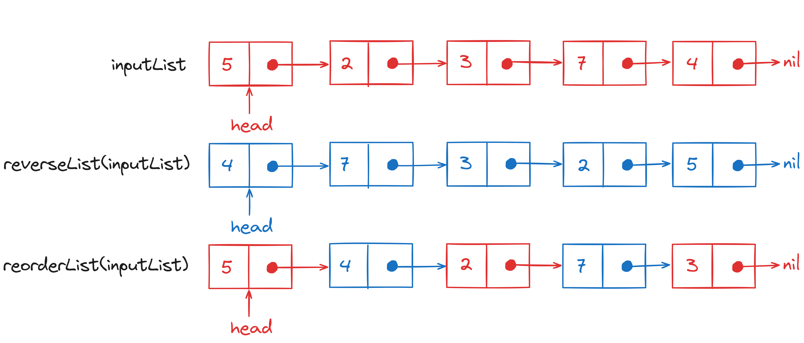
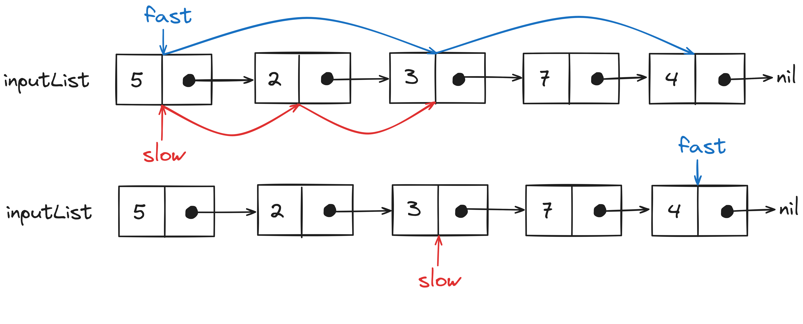
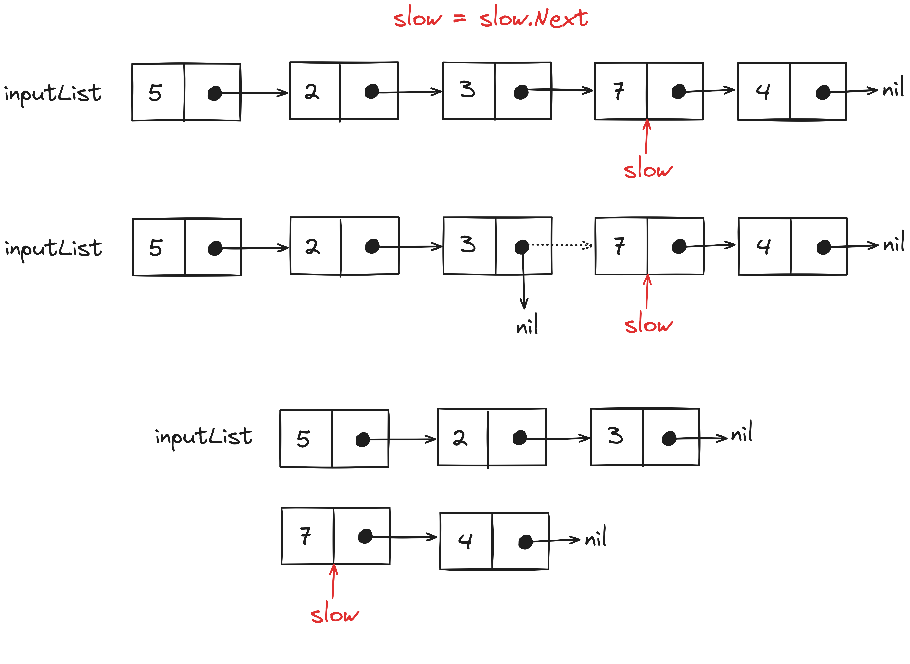
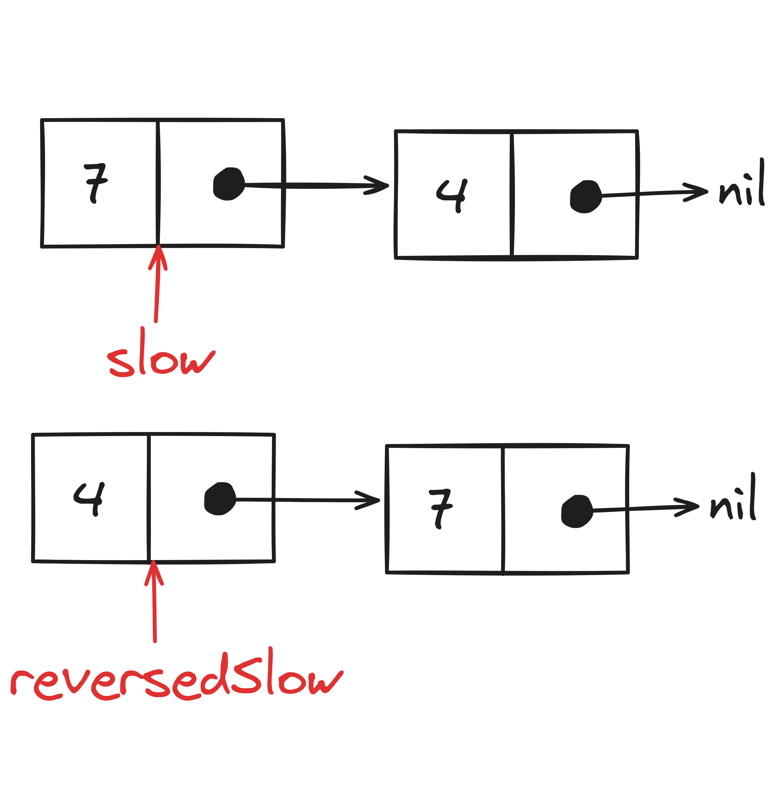
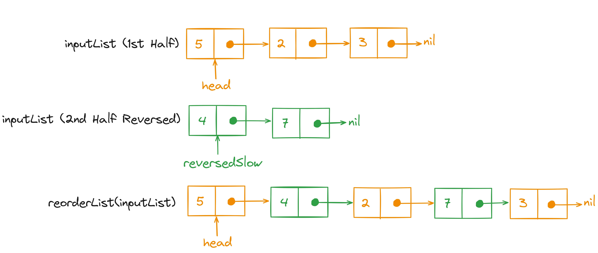

# Problem Statement
We have to implement the `reorderList` function that takes the `head` node of a linked list as input and reorders its 
nodes in the format specified below.

Given an input list like the following:

$$Node_0 \rightarrow Node_1 \rightarrow Node_2 \rightarrow \dots \rightarrow Node_{(n-2)} \rightarrow Node_{(n-1)} \rightarrow Node_n$$

the `reorderList` function should reorder its nodes as:

$$Node_0 \rightarrow Node_n \rightarrow Node_1 \rightarrow Node_{(n-1)} \rightarrow Node_2 \rightarrow Node_{(n-2)} \rightarrow \dots$$

<p align="center"></p>

# Brute Force Solution
To solve this problem we use two iterators: one starting from the `head` of the input list and another 
starting from the `head` of the <a href="/posts/dsa/reverse-linked-lists/" target="_blank">reversed input list</a>. 

We pick values alternatively from both iterators and create a new 
linked list. The loop will continue until the length of the length of the new linked list is equal to the length of 
the input list. The nodes in the new linked list will be ordered as specified in the problem statement.

<p align="center"></p>


## Psuedo-code for the Brute Force Solution
```text
reversed_linked_list = reverseList(linked_list)
forward_iter = linked_list.head
reverse_iter = reversed_linked_list.head
reorderedLinkedList = LinkedList()

while(length(reorderedLinkedList)!=length(linked_list)){
  reorderedLinkedList.insert(forward_iter)
  if(length(reorderedLinkedList)==length(linked_list))
    break

  reorderedLinkedList.insert(reverse_iter)
  if(length(reorderedLinkedList)==length(linked_list))
    break

  forward_iter=forward_iter.next
  reversed_linked_list=reverse_iter.next
}

return reorderedLinkedList
```

## Time Complexity Analysis 
### Best Case Scenario
With this brute-force solution, we have to iterate over the complete linked list, even in the best-case scenario. 
The time complexity of the brute-force solution will be $O(n)$ (for iterating over the `reorderedList`) times 
$O(n)$ (for calculating the current length of `reorderedList`) which will result in the total time complexity of $O(n^2)$.

### Worst Case Scenario
The time complexity of the worst-case scenario will also be $O(n^2)$.

## Space Complexity Analysis
The brute-force solution is using additional $O(2n)$ memory space to store the reversed and reordered linked list.

## Code for Brute Force Solution
```Go
package main

import "fmt"

type ListNode struct {
    Val int
    Next *ListNode
}

func Display(ln *ListNode){
    temp := ln
    for(temp!=nil){
        fmt.Printf("%d->", temp.Val)
        temp=temp.Next
    }
    fmt.Println()
}

func Length(ln *ListNode)(int){

    // Since this function iterates the complete linked list 
    // the time complexity of this function is O(n)
    // where n is the length of the linked list
    temp := ln
    length := 0
    for(temp!=nil){
        length += 1
        temp=temp.Next
    }
    return length
}

func insertAtFront(ln *ListNode, value int)(*ListNode){

    // Time complexity of inserting a value at the head of the 
    // linked list is O(1)
    newNode := &(ListNode{Val: value})
    newNode.Next = ln
    return newNode
}

func insertAtEnd(ln *ListNode, value int)(*ListNode){

    // Time complexity of inserting a value at the end of the 
    // linked list is O(n)
    if(ln==nil){
        ln = &(ListNode{Val: value})
    } else {
        temp := ln
        for(temp.Next!=nil){
            temp = temp.Next
        }
        temp.Next = &(ListNode{Val: value})
    }
    return ln
}

func reverseList(ln *ListNode)(*ListNode){

    // Time complexity of reversing a linked list is O(n)
    // where n is the length of the linked list
    var reversedList *ListNode
    temp := ln
    for(temp!=nil){
        reversedList = insertAtFront(reversedList, temp.Val)
        temp=temp.Next
    }
    return reversedList
}

func reorderList(head *ListNode){
    forwardIter := head
    reverseIter := reverseList(head)
    inputListLength := Length(head)
    var reorderedList *ListNode
    
    // The following loop will be executed n times
    // where n is the length of the linked list
    for(Length(reorderedList)!=inputListLength){

        // Inserting a value at the end of a linked list will take O(n) time
        reorderedList = insertAtEnd(reorderedList, forwardIter.Val)

        // Validating the length of a linked list will take O(n) time as well
        if(Length(reorderedList)==inputListLength){
            break
        }
        
        // Time Complexity: O(n)
        reorderedList = insertAtEnd(reorderedList, reverseIter.Val)

        // Time Complexity: O(n)
        if(Length(reorderedList)==inputListLength){
            break
        }
        
        forwardIter = forwardIter.Next
        reverseIter = reverseIter.Next
    }
    
    // Copying the values of reorderedList to the input linked list
    for(head!=nil){
        head.Val = reorderedList.Val
        head=head.Next
        reorderedList=reorderedList.Next
    }
}

func main(){
    var ln *ListNode
    ln = insertAtEnd(ln, 1)
    ln = insertAtEnd(ln, 2)
    ln = insertAtEnd(ln, 3)
    ln = insertAtEnd(ln, 4)
    ln = insertAtEnd(ln, 5)
    fmt.Println("Input Linked List:")
    Display(ln)

    reorderList(ln)
    fmt.Println("Reordered Linked List:")
    Display(ln)
}

// Output
// Input Linked List:
// 1->2->3->4->5->
// Reordered Linked List:
// 1->5->2->4->3->
```

# Optimized Solution
To solve this problem in linear time while also reducing the space complexity (by performing operations in-place) we 
have to switch to the <a href="/posts/dsa/two-pointers-approach/#fast-slow-pointers" target="_blank">Fast-Slow Pointer Approach</a>. 

We have to break the input linked list from the middle 
(or the `middle.Next` node in the case of an odd number of nodes). Then we will insert the nodes from the second half of 
the linked list in between the nodes of the first half. However, the second half of the linked list has to be reversed to 
achieve the reordering format specified in the problem statement.

First, we will iterate over the input linked list using the `fast` and `slow` pointers.

<p align="center"></p>

At the end of the iteration, the `fast` pointer will be at the end of the linked list and the `slow` pointer will be at 
the middle node.

Then we will break the input linked list into two halves from the `slow.Next` node.

<p align="center"></p>

Since the reordering form requires the last node to be placed in between the first and second node of the list 
we have to reverse the second half of the input linked list.

<p align="center"></p>

Finally, we will iterate over the first half of the input linked list while also inserting the nodes from the second half 
(reversed) in between.

<p align="center"></p>

## Psuedo code for the Optimized Solution
```text
fast = linked_list.head
slow = linked_list.head
while(fast.next!=nil or fast!=nil){
  fast = fast.next.next
  slow = slow.next
}

temp = slow.next
slow.next = nil
slow = temp

reversed_half_list = reverse(slow)

temp = linked_list.head
reverse_temp = reversed_half_list.head
while(temp!=nil){
  temp2 = temp.next
  temp.next = reverse_temp
  reverse_temp.next = temp2
  temp = temp2
}
return linked_list.head
```

## Time Complexity Analysis
### Best Case Scenario
The time complexity of iterating over the input linked list using `fast` and `slow` pointers will be $O(n/2)$ 
(where $n$ is the size of the linked list) because the `fast` pointer will skip over every other node.

Reversing the second half of the input linked list will also take $O(n/2)$ time. 

Since we are iterating over only the first half of the linked list in the last loop its time complexity will also be $O(n/2)$.

So the total time complexity of the optimized solution in the best-case scenario is $O(3n/2)$ which could be 
generalized to $O(n)$.

### Worst Case Scenario
All the steps in the optimized solution will be executed regardless of the characteristics of the input 
linked list. So the time complexity for the worst-case scenario will also be $O(n)$.

## Space Complexity Analysis
Since we are performing operations in place on the input linked list, no additional memory space is required 
by the optimized solution. Thus, the total space complexity of the optimized solution is $O(1)$.

## Code for Optimized Solution
```Go
package main

import "fmt"

type ListNode struct {
    Val int
    Next *ListNode
}

func Display(ln *ListNode){
    temp := ln
    for(temp!=nil){
        fmt.Printf("%d->", temp.Val)
        temp = temp.Next
    }
    fmt.Println()
}

func insertAtFront(ln *ListNode, value int)(*ListNode){
    newNode := &(ListNode{Val: value})
    newNode.Next = ln
    return newNode
}

func insertAtEnd(ln *ListNode, value int)(*ListNode){
    if(ln==nil){
        ln = &(ListNode{Val: value})
    } else {
        temp := ln
        for(temp.Next!=nil){
            temp=temp.Next
        }
        temp.Next = &(ListNode{Val: value})
    }
    return ln
}

func reverseList(ln *ListNode)(*ListNode){
    var reverseList *ListNode
    temp := ln
    for(temp!=nil){
        reverseList = insertAtFront(reverseList, temp.Val)
        temp=temp.Next
    }
    return reverseList
}
    
func reorderList(head *ListNode){

    // Iterating over the input linked list
    // using the fast and slow pointer
    // Time Complexity: O(n/2) since the fast pointer 
    // will skip over every other node
    fast := head
    slow := head
    for(fast.Next!=nil){
        if(fast.Next.Next!=nil){

            // When the fast pointer finishes iteration 
            // the slow pointer will be at the middle node
            fast = fast.Next.Next
            slow = slow.Next
        } else {
            break
        }
    }
  
    // Breaking the input linked list 
    // after the middle node
    temp := slow.Next
    slow.Next = nil
    slow = temp

    // Reversing the 2nd half of the linked list 
    // Time Complexity: O(n/2), where n is the size 
    // of the input linked list
    reversedSecond := reverseList(slow)

    // Iterating over the 1st half of the linked list 
    // and inserting nodes from the reversed 2nd half
    // Time Complexity: O(n/2)
    temp = head
    for(reversedSecond!=nil){

        // Storing next values of temp and reversedSecond 
        // in temporary variables
        temp2 := temp.Next
        tempReversedSlow := reversedSecond.Next
  
        // Reassigning Next nodes of temp and reversedSecond
        temp.Next = reversedSecond
        reversedSecond.Next = temp2
   
        temp = temp2
        reversedSecond = tempReversedSlow
    }
}

func main(){
    var ln *ListNode
    ln = insertAtEnd(ln, 1)
    ln = insertAtEnd(ln, 2)
    ln = insertAtEnd(ln, 3)
    ln = insertAtEnd(ln, 4)
    ln = insertAtEnd(ln, 5)
    fmt.Println("Input Linked List:")
    Display(ln)

    reorderList(ln)
    fmt.Println("Reordered Linked List:")
    Display(ln)
}

// Output
// Input Linked List:
// 1->2->3->4->5->
// Reordered Linked List:
// 1->5->2->4->3->
```

<hr>

Thank you for taking the time to read this blog post! If you found this content valuable and would like to stay updated with my latest posts consider subscribing to my <a href="https://www.avni.sh/index.xml" target="_blank">RSS Feed</a>.

# Resources
<a href="https://leetcode.com/problems/reorder-list/description/" target="_blank">143. Reorder List</a>  
<a href="https://www.youtube.com/watch?v=S5bfdUTrKLM" target="_blank">Linkedin Interview Question - Reorder List - Leetcode 143 - Python</a>
