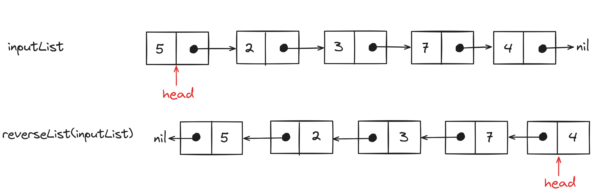
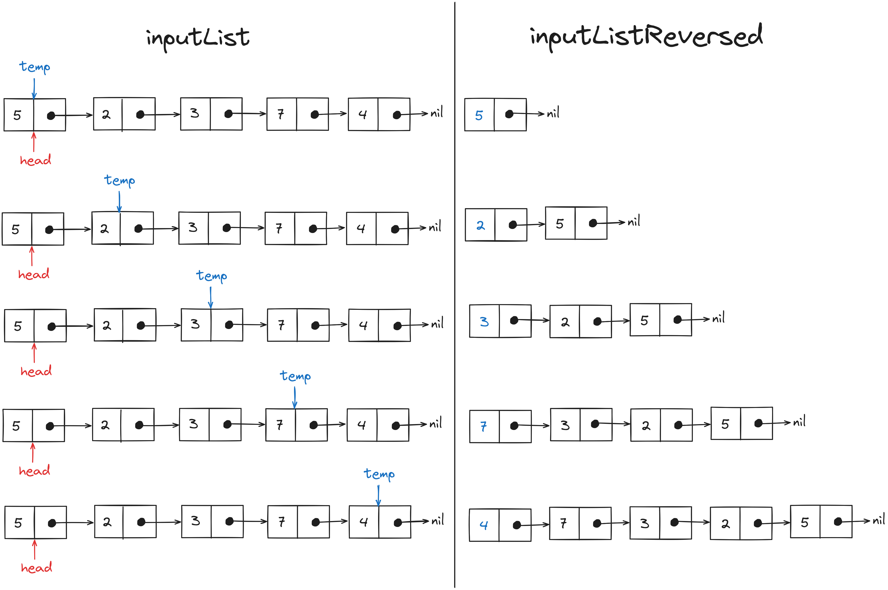
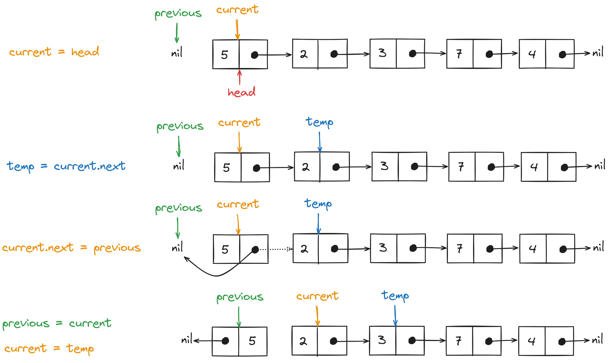

# Problem Statement
We have to implement the `reverseList` function that takes the `head` node of a linked list as an input 
and returns the `head` node of the reversed linked list in the output.

<p align="center"></p>

# Brute Force Solution
If we iterate over the input linked list and insert its <a href="/posts/dsa/linked-lists/#inserting-an-element-at-the-beginning" target="_blank">value at the beginning</a> of a new list the result would be a reversed linked list.

<p align="center"></p>

## Psuedo-code for the Brute Force Solution
```text
reversedLinkedList = LinkedList()
temp = linked_list.head
while(temp!=nil){
  reversedLinkedList.insertAtStart(temp.value)
  temp = temp.next
}
return reversedLinkedList
```

## Time Complexity Analysis 
### Best Case Scenario
In the best-case scenario, the time complexity of the brute force solution will be $O(n)$ as it requires a loop over 
the input linked list.

### Worst Case Scenario
The time complexity worst-case scenario for the brute force solution is the same as the best-case scenario i.e. $O(n)$.

## Space Complexity Analysis
The brute-force solution assumes that we have enough memory space to store the input linked list and the 
reversed linked list in the memory at the same time. Thus, the space complexity of the brute force solution will 
scale linearly ($O(2n)$) to the size of the input data.

## Code for Brute Force Solution
```Go
package main

import "fmt"

type ListNode struct {
    Val int
    Next *ListNode
}

func Display(ln *ListNode){
    temp := ln
    for(temp!=nil){
        fmt.Printf("%d->", temp.Val)
        temp=temp.Next
    }
    fmt.Println()
}

func insertAtStart(ln *ListNode, value int)(*ListNode){
    tempNode := &(ListNode{Val:value, Next:ln})
    return tempNode
}

func reverseList(ln *ListNode)(*ListNode){

    // Creating a new linked list to store nodes in 
    // the reverse order
    var reversedList *ListNode
    temp := ln
    for(temp!=nil){

        // Inserting values at the start of the reversed
        // linked list
        reversedList = insertAtStart(reversedList, temp.Val)
        temp=temp.Next
    }
    return reversedList
}

func main(){
    ln := &(ListNode{Val:5})
    ln.Next = &(ListNode{Val:2})
    ln.Next.Next = &(ListNode{Val:3})
    ln.Next.Next.Next = &(ListNode{Val:7})
    ln.Next.Next.Next.Next = &(ListNode{Val:4})
    fmt.Println("Input Linked List:")
    Display(ln)
    
    fmt.Println("Reversed Linked List:")
    Display(reverseList(ln))
}

// Output
// Input Linked List:
// 5->2->3->7->4->
// Reversed Linked List:
// 4->7->3->2->5->
```

# Optimized Solution
Since reversing a linked list will require traversal of all the nodes, the time complexity of the solution 
could not be improved from $O(n)$. But if we could reverse the `next` node reference in place for each 
node the space complexity would be reduced to $O(n)$.

We will use the <a href="/posts/dsa/two-pointers-approach/" target="_blank">two-pointer approach</a> to maintain references to nodes `current` and `previous`. The 
`current` pointer will start from the `head` node and iterate till the `nil` at the end. Whereas, the 
`previous` pointer will be one step behind the `current`.

<p align="center"></p>

At the end of the iteration, the `previous` pointer will be pointing to the head of the reversed linked list.

## Psuedo code for the Optimized Solution
```text
previous = none
current = head
while(current!=none){
  temp = current.next
  current.next = previous
  previous = current
  current = temp
}
return previous
```

## Time Complexity Analysis
### Best Case Scenario
We are iterating over the complete linked list so the time complexity is the same as the brute force solution i.e. $O(n)$.

### Worst Case Scenario
The time complexity of the optimized solution for the worst-case scenario will also be $O(n)$.

## Space Complexity Analysis
Unlike brute-force solution we are performing operations on the input linked list directly so we don't 
need additional memory space and the space complexity will be $O(1)$.

## Code for Optimized Solution
```Go
package main

import "fmt"

type ListNode struct {
    Val int
    Next *ListNode
}

func Display(ln *ListNode){
    temp := ln
    for(temp!=nil){
        fmt.Printf("%d->", temp.Val)
        temp=temp.Next
    }
    fmt.Println()
}

func reverseList(ln *ListNode)(*ListNode){
    var prev *ListNode
    curr := ln
    for(curr!=nil){

        // Storing the location of the node 
        // next to the current pointer
        temp := curr.Next

        // Changing next for the current node to 
        // the node pointed by the previous pointer
        curr.Next = prev

        // Moving the previous pointer one node forward
        prev = curr

        // Resetting current to the next node 
        // in iteration
        curr = temp
    }
    return prev
}

func main(){
    ln := &(ListNode{Val:5})
    ln.Next = &(ListNode{Val:2})
    ln.Next.Next = &(ListNode{Val:3})
    ln.Next.Next.Next = &(ListNode{Val:7})
    ln.Next.Next.Next.Next = &(ListNode{Val:4})
    fmt.Println("Input Linked List:")
    Display(ln)
    
    fmt.Println("Reversed Linked List:")
    Display(reverseList(ln))
}
```

<hr>

Thank you for taking the time to read this blog post! If you found this content valuable and would like to stay updated with my latest posts consider subscribing to my <a href="https://www.avni.sh/index.xml" target="_blank">RSS Feed</a>.

# Resources
<a href="https://leetcode.com/problems/reverse-linked-list/description/" target="_blank">206. Reverse Linked List</a>  
<a href="https://www.youtube.com/watch?v=G0_I-ZF0S38" target="_blank">Reverse Linked List - Iterative AND Recursive - Leetcode 206 - Python</a>
