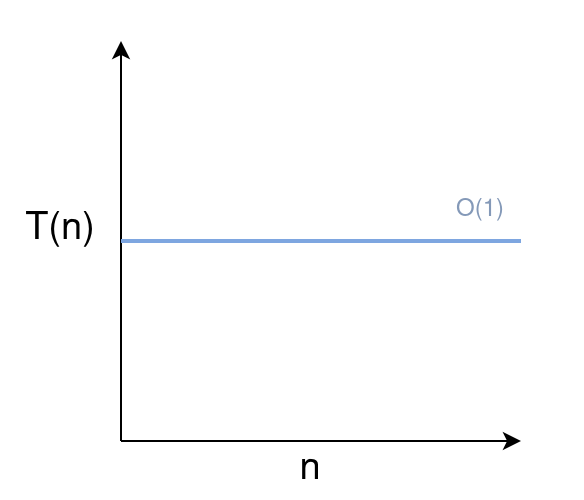
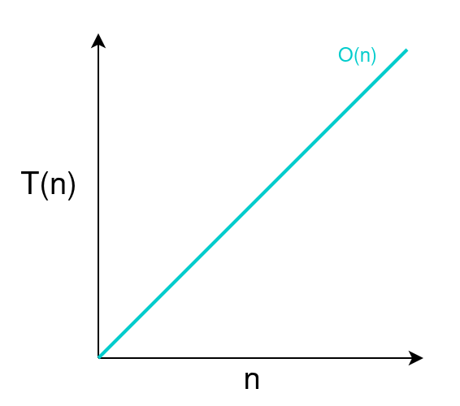
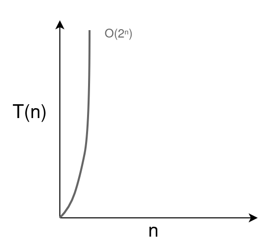
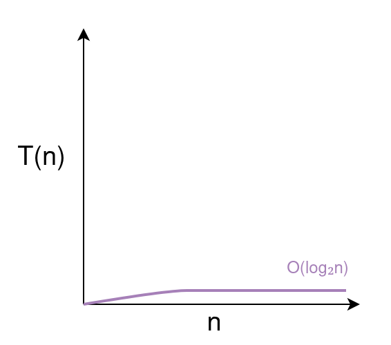
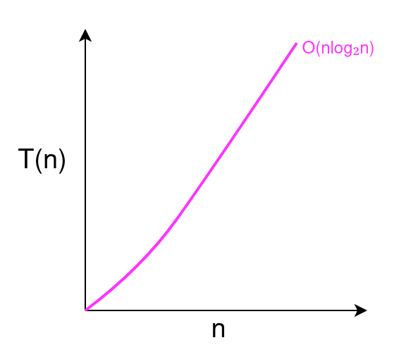

While programming allows us to create virtually anything, the true test of performance arises when we deploy the same code on a significantly larger scale. 

**Time Complexity** ($T(n)$) is a function that calculates the time taken by a program to produce results given the amount of data processed. It is a common benchmark used to measure an algorithm's performance.

# Bounds of Time Complexity
The value provided by the time complexity function will represent the time taken by a program but it doesn't factor the characteristics of data provided as input. With the same amount of data passed as input, some algorithms perform best when data is sorted in ascending order and worst when sorted in descending order. That's why we have bounds on a time complexity function, a range starting from best-case to worst-case algorithm performance for the same amount of data.

## Upper Bound ($O$)
The "big O" function ($O(n)$) represents the upper bound (worst case scenario) on time complexity i.e. the algorithm won't perform worse than this.

## Lower Bound ($\Omega$)
The "big Omega" function ($\Omega(n)$) represents the lower bound (best case scenario) on time complexity i.e. the algorithm won't perform better than this.

## Expected Case ($\Theta$)
The "big Theta" function ($\Theta(n)$) represents the case where both upper and lower bounds are at the same point (expected case scenario) i.e. algorithm won't perform better or worse than this.

# Common Time Complexity Functions
Recurring patterns in algorithms could be categorized by their time complexity functions. It helps in calculating estimates for their performance on scale.

## Constant Time Complexity $O(1)$
<p align="center"></p>
<p align="center"><small>Scaling an Algorithm with Constant Time Complexity</small></p>

An algorithm has **constant time complexity** when the time taken by it isn't affected by the amount of data passed as input. An example would be a function that performs addition on its two inputs.

```Go
package main

import "fmt"

func addition(x int, y int) (int){
	return x+y
}

func main(){
	x := 2000
	y := 2132
	fmt.Println("Addition of", x, "and", y, "is:", addition(x, y)) 
}

// Result
// Addition of 2000 and 2132 is: 4132
```

The above example is implemented in <a href="/posts/go/go-programming-language/" target="_blank">Go Programming Language</a>.

## Linear Time Complexity $O(n)$
<p align="center"></p>
<p align="center"><small>Scaling an Algorithm with Linear Time Complexity</small></p>

For some algorithms the execution time is directly proportional to the size of its input, such algorithms are categorized in **linear time complexity**.

An example would be a loop that iterates over elements in a list and returns its sum.

```Go
package main

import "fmt"

func arraySum(arr []int)(int){
	sum := 0

	// Time taken to complete this loop
	// will be directly proportional to the
	// size of arr
	for _, element := range arr{
		sum += element
	}

	return sum
}

func main(){
	arrayExample := []int{1, 2, 3, 2, 1, 1}
	fmt.Println("Sum of the array:", arrayExample, "will be", 
                arraySum(arrayExample))
}

// Output
// Sum of the array: [1 2 3 2 1 1] will be 10
```

If we call the function `arraySum()` twice then the time complexity of the program will be $O(2n)$. However, we can generalize it to $O(n)$ because even though the program performs two passes over the array, the growth rate in runtime remains linear with respect to the input size. 

## Quadratic Time Complexity $O(n^2)$
<p align="center"></p>
<p align="center"><small>Scaling an Algorithm with Quadratic Time Complexity</small></p>

Much like linear time complexity, algorithms exhibiting quadratic time complexity experience execution times that are directly proportional to the square of the number of inputs. These algorithms scale relatively slower (longer execution time) compared to linear time complexity algorithms like $O(n)$, $O(2n)$, etc.

For example, a program that displays pair combinations of all elements in an array using nested loops.

```Go
package main

import "fmt"

func showCombinations(arr []int){

	// The inner loop is executed n (size of arr) times.
	// Thus, the total time complexity of this function will be O(n*n)
	for _, element1 := range arr{

		// Time complexity of the inner loop
		// is directly proportional to the size of arr i.e. O(n)
		for _, element2 := range arr{

			if(element1 != element2){
				fmt.Println("Combination:", element1, "and", 
                                            element2)
			}

		}

	}
}

func main(){
	arrayExample := []int{123, 1234, 456, 5462}
	fmt.Println("Pair combination of all elements in the array: ", 
                arrayExample, "are:")
	showCombinations(arrayExample)
}

// Output
// Pair combination of all elements in the array:  [123 1234 456 5462] are:
// Combination: 123 and 1234
// Combination: 123 and 456
// Combination: 123 and 5462
// Combination: 1234 and 123
// Combination: 1234 and 456
// Combination: 1234 and 5462
// Combination: 456 and 123
// Combination: 456 and 1234
// Combination: 456 and 5462
// Combination: 5462 and 123
// Combination: 5462 and 1234
// Combination: 5462 and 456
```

## Exponential Time Complexity $O(2^n)$
<p align="center"></p>
<p align="center"><small>Scaling an Algorithm with Exponential Time Complexity</small></p>

A brute-force algorithm to find the $n$th number in the Fibonacci series has exponential time complexity because it branches in two recursive calls on every iteration.

```Go
package main

import "fmt"

func fibonacci(n int) (int){
	if n <= 1 {
		return n
	}
	
	// The recursive calls will branch
	// further in two more calls
	return fibonacci(n-1) + fibonacci(n-2)
}

func main() {
	n := 10 
	fmt.Println("The", n, "th Fibonacci number is:", fibonacci(n))
}

// Output
// The 10 th Fibonacci number is: 55
```

Exponential Time Complexity groups algorithms with $O(2^n)$, $O(e^n)$, $O(10^n)$, etc. time complexities. The $2^n$ function has widespread use in computer science like Moore's law or finding the number of memory addresses possible with $n$ bits arrangement.

> The number of transistors in an Integrated Circuit (IC) doubles about every two years
> 
> <cite><a href="https://en.wikipedia.org/wiki/Gordon_Moore" target=_blank>Gordon Moore</a>, Co-Founder of Intel, 1965</cite>

## Logarithmic Time Complexity $O(\log_2{n})$
<p align="center"></p>
<p align="center"><small>Scaling an Algorithm with Logarithmic Time Complexity</small></p>

The $\log_2{n}$ is the inverse of function $2^n$. The following example of a number guessing game has $O(\log_2{n})$ time complexity because it cuts the search space by half on each iteration.

```Go
package main

import "fmt"

func guessNumber(low int, high int)(int){
	// Returns the middle number in a range from low to high
	mid := (high+low)/2
	return mid
}

func main(){
	low := 0
	high := 100
	fmt.Println("Think of a number between 1 and 100")
	numQuestions := 0

	for {
            var answer1, answer2 int
            guessedNumber := guessNumber(low, high)

            fmt.Println("I guessed:", guessedNumber, "Is that correct?")
            fmt.Println("1) Yes")
            fmt.Println("2) No")
            fmt.Print("Enter your response (1 or 2):")
            fmt.Scan(&answer1)

            switch(answer1){
                case 1:
                    fmt.Println("It took me", 
                                numQuestions, 
                                "questions to guess your number")

                    // It will take maximum log(n) questions to guess a number
                    // Where n is size of the number range in this case 100

                    fmt.Println("Thanks for playing")
                    return
                
                case 2:
                    numQuestions += 1
                    fmt.Println("Is it higher or lower than", guessedNumber)
                    fmt.Println("1) Higher")
                    fmt.Println("2) Lower")
                    fmt.Print("Enter your response (1 or 2):")
                    fmt.Scan(&answer2)

                    switch(answer2){
                        case 1:
                            // Halving the search space 
                            // to exclude number lower than guessed
                            low = guessedNumber
                        case 2:
                            // Halving the search space 
                            // to exclude number higher than guessed
                            high = guessedNumber
                    }
            }
	}
}

// Output
// Think of a number between 1 and 100
// I guessed: 50 Is that correct?
// 1) Yes
// 2) No
// Enter your response (1 or 2):2
// Is it higher or lower than 50
// 1) Higher
// 2) Lower
// Enter your response (1 or 2):2
// I guessed: 24 Is that correct?
// 1) Yes
// 2) No
// Enter your response (1 or 2):2
// Is it higher or lower than 24
// 1) Higher
// 2) Lower
// Enter your response (1 or 2):1
// I guessed: 37 Is that correct?
// 1) Yes
// 2) No
// Enter your response (1 or 2):1
// It took me 2 questions to guess your number
// Thanks for playing
```

## Linearithmic Time Complexity $O(n \log_2 n)$
<p align="center"></p>
<p align="center"><small>Scaling an Algorithm with Linearithmic Time Complexity</small></p>

<a href="/posts/dsa/merge-sort/" target="_blank">Merge Sort</a>, <a href="/posts/dsa/quick-sort/" target="_blank">Quick Sort</a>, and <a href="/posts/dsa/heap-sort/" target="_blank">Heap Sort</a> are some examples of algorithms with **linearithmic time complexity**. Their performance is relatively better than their linear counterparts but worse than logarithmic ones.

## Factorial Time Complexity $O(n!)$
<p align="center"></p>
<p align="center"><small>Scaling an Algorithm with Factorial Time Complexity</small></p>

The solution to the <a href="/posts/dsa/travelling-salesman-problem/" target="_blank">Travelling Salesman Problem</a> has factorial time complexity.

# Comparing Algorithm Performance Using Time Complexity
In a hypothetical scenario where we have to sort elements in an array, we can compare the performance of each algorithm by their time complexity. Assuming the output of the time complexity function is the algorithm's execution time in seconds.

Execution time to sort 100 elements by an algorithm with 
* $O(\log_2{ n})$ time complexity: 6.644 seconds
* $O(n)$ time complexity: 100 seconds 
* $O(n \log_2 n)$ time complexity: 664.4 seconds
* $O(n^2)$ time complexity: 10000 seconds (2.7 hours)
* $O(2^n)$ time complexity: $1.26 \times 10^{30}$ seconds ($3.99 \times 10^{22}$ years)
* $O(n!)$ time complexity: $9.33 \times 10^{157}$ seconds ($2.9585 \times 10^{150}$ years)

<p align="center"></p>
<p align="center"><small>Time Complexity Comparison of Algorithms</small></p>

With the same computation power, an algorithm with $O(2^n)$ time complexity will sort 100 elements in $3.99 \times 10^{22}$ years while an algorithm with $O(n \log_2{n})$ time complexity will take only 664.4 seconds .

<hr>
Thank you for taking the time to read this blog post! If you found this content valuable and would like to stay updated with my latest posts consider subscribing to my <a href="https://www.bovem.in/index.xml" target="_blank">RSS Feed</a> or newsletter.   

&nbsp;

<iframe src="https://bovem.substack.com/embed" width="100%" height="320" style="border:2px solid #EEE; background:white;" frameborder="0" scrolling="no"></iframe>        

# Resources
<a href="https://www.freecodecamp.org/news/big-theta-and-asymptotic-notation-explained/" target="_blank">Big Theta and Asymptotic Notation Explained</a>  
<a href="http://watson.latech.edu/book/future/futureMoores1.html" target="_blank">What is Moore's Law</a>  
<a href="https://www.khanacademy.org/math/algebra2/x2ec2f6f830c9fb89:logs/x2ec2f6f830c9fb89:log-intro/v/plotting-exponential-logarithm" target="_blank">Relationship between exponentials & logarithms</a>  
<a href="https://www.khanacademy.org/computing/computer-science/algorithms/recursive-algorithms/a/the-factorial-function" target="_blank">The factorial function</a>  