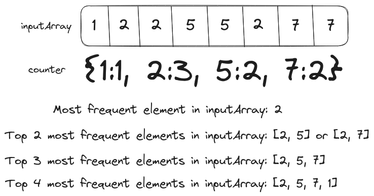

# Problem Statement

We have to implement a `topKFrequent` function that takes an integer array and a value `k` as input and returns the `k` most frequent elements in the input array. For example, `topKFrequent({1, 1, 2, 2, 3, 5, 2}, 2)` will return the top `2` most frequent elements in the array i.e. `{2, 1}`.

<p align="center"></p>

If multiple elements have the same frequency, then any of them could be returned in the solution as long as its length is `k`.

<p align="center"></p>

# Brute Force Solution

First, we have to gather the data for the frequency of array elements inside a hashmap. We have to group elements with the same frequency, so we'll invert the key and values in the hashmap from `element -> count` to `count -> [elements]`.

<p align="center"></p>

We can also extract a list of frequencies from this hashmap which will be sorted in descending order to extract the top `k` elements.

## Psuedo-code for the Brute Force Solution

```text
counter = HashMap()
loop index on array
  if counter[array[index]]
    counter[array[index]]+=1
  else
    counter[array[index]]=1

reverseCounter = HashMap()
freq = []
loop key, value in counter
  if reverseCounter[value]
    reverseCounter[value].append(key)
  else
    reverseCounter[value] = [key]
  freq.append(value)

sort(freq, descending=True)

topKElements = []
loop index on freq
  value = reverseCounter[freq[index]]
  for fq in value
    topKElements.append(fq)

    if len(topKElements)==k
      return topKElements
```

## Time Complexity Analysis
### Best Case Scenario

The first loop over the array has $O(n)$ time complexity, where $n$ is the size of the input array.

Let's assume that the second loop also has $O(n)$ time complexity (`length(counter) == length(reverseCounter)`). In the best-case scenario, there will be only one key in `reverseCounter` i.e. all elements have the same frequency, which decreases the time complexity of this loop to $O(1)$.

The fastest sorting algorithm will sort the `freq` array in $O(n \log(n))$ time.

The final loop (over `freq`) will execute `k` times. On each iteration, it will also loop over the list stored in `reverseCounter[freq[index]]`. Since the loop will exit as soon as the length of the result array reaches `k` its time complexity could be generalized to $O(k)$.

Thus, the total time complexity of the best-case scenario for brute force solution will be $O(n) + O(1) + O(n \log(n)) + O(k)$, which could be generalized to $O(n \log n)$.

### Worst Case Scenario

In the worst-case scenario, all the elements in the input array will have distinct frequencies. Thus, the length of `counter` and `reverseCounter` will be the same resulting in total time complexity $O(n) + O(n) + O(n \log(n)) + O(k)$, which could also be generalized to $O(n \log n)$.

## Space Complexity Analysis
The memory space used by `counter` and `reverseCounter` will be $O(n)+O(n)$. We are assuming that the `freq` array is sorted in place so it won't require additional memory space. Finally, the space complexity of the `topKElements` array will be $O(n)$ if `k=length(nums)`. Thus, the total space complexity of the brute-force solution could be simplified to $O(n)$.

## Code for the Brute Force Solution

```Go
package main

import (
    "fmt"
    "sort"
)

func topKElements(nums []int, k int)([]int){

  // counter hashmap for storing frequency data
  // of elements in nums
  // Time Complexity: O(n)
  counter := make(map[int]int)
  for index:=0;index<len(nums);index++{
      _, key_exists := counter[nums[index]]
      if key_exists{
          counter[nums[index]] += 1
      } else {
          counter[nums[index]] = 1
      }
  }

  // freq array for storing different frequencies
  var freq []int

  // reverseCounter maps frequencies to elements of
  // nums
  // Time Complexity: O(n)
  reverseCounter := make(map[int][]int)
  for key, value := range counter{
      _, key_exists := reverseCounter[value]
      if key_exists{
          reverseCounter[value] = append(reverseCounter[value], key)
      } else {
          reverseCounter[value] = []int{key}
      }
      freq = append(freq, value)
  }

  // Sorting freq in descending order
  // Time Complexity: O(nlog(n))
  sort.Sort(sort.Reverse(sort.IntSlice(freq)))

  // Creating topKElements from the top k
  // elements in sorted freq array
  // Time Complexity: O(k)
  var topKElements []int
  for index:=0;index<len(freq);index++{
      value := reverseCounter[freq[index]]
      for index2:=0;index2<len(value);index2++{
          topKElements = append(topKElements, value[index2])
          if len(topKElements)==k{
              return topKElements
          }
      }
  }
  return topKElements
}

func main(){
  nums := []int{1, 1, 1, 2, 2, 3, 3, 4}
  k := 3
  fmt.Println("Top", k, "elements in nums:", topKElements(nums, k))

  nums = []int{1, 2}
  k = 2
  fmt.Println("Top", k, "elements in nums:", topKElements(nums, k))
}

// Output
// Top 3 elements in nums: [1 2 3]
// Top 2 elements in nums: [1 2]
```

# Optimized Solution

The sorting operation on the frequency array has the highest time complexity ($O(n \log(n))$).

The highest frequency an element can achieve in an array is the length of the array (all the elements are the same) and the lowest frequency for an element is `1` (a single element in the array). Thus, instead of sorting frequencies, we can loop over the known range of frequencies and return the top `k` elements.

## Psuedo code for the Optimized Solution

```text
counter = HashMap()
loop index on array
  if counter[array[index]]
    counter[array[index]] += 1
  else
    counter[array[index]] = 1

reverseCounter = HashMap()
loop key, value on counter
  if reverseCounter[value]
    reverseCounter[value].append(key)
  else
    reverseCounter[value] = [key]

topKElements = []
loop index from (len(nums), 1)
  if reverseCounter[index]
    for value in reverseCounter[index]
      topKElements.append(value)

      if len(topKElements) == k
        return topKElements

return topKElements
```

## Time Complexity Analysis
### Best Case Scenario

In the best-case scenario (all elements have the same frequency), the time complexity of all loops except the one on `reverseCounter` will be $O(n)$ which sums up to $O(2n)$ for the complete function (could also be generalized to $O(n)$).

### Worst Case Scenario

For the worst-case scenario, where all elements have distinct frequencies, the time complexity of every loop is $O(n)$ resulting in $O(3n)$ (generalized to $O(n)$) time complexity for the complete function.

## Space Complexity Analysis
The additional memory required by the optimized solution to store `counter`, `reverseCounter`, and `topKElements` will be $O(n)$. 

## Code for the Optimized Solution

```Go
package main

import "fmt"

func topKElements(nums []int, k int)([]int){
    counter := make(map[int]int)
    for index:=0;index<len(nums);index++{
        _, key_exists := counter[nums[index]]
        if key_exists{
            counter[nums[index]] += 1
        } else {
            counter[nums[index]] = 1
        }
    }

    reverseCounter := make(map[int][]int)
    for key, value := range counter{
        _, key_exists := reverseCounter[value]
        if key_exists{
            reverseCounter[value] = append(reverseCounter[value], key)
        } else {
            reverseCounter[value] = []int{key}
        }
    }

    // Instead of sorting the list of frequencies
    // We can loop over range (len(nums), 1)
    // and check if the value is present in
    // reverseCounter
    var topKElements []int
    for freq:=len(nums);freq>0;freq--{
        value, key_exists := reverseCounter[freq]
        if key_exists{
            for _, val := range value{
                topKElements = append(topKElements, val)
                if len(topKElements) == k{
                    return topKElements
                }
            }
        }

    }

    return topKElements
}

func main(){
    nums := []int{1, 1, 1, 2, 2, 3, 3, 4}
    k := 3
    fmt.Println("Top", k, "elements in nums:", topKElements(nums, k))

    nums = []int{1, 2}
    k = 2
    fmt.Println("Top", k, "elements in nums:", topKElements(nums, k))
}
```

<hr>

Thank you for taking the time to read this blog post! If you found this content valuable and would like to stay updated with my latest posts consider subscribing to my <a href="https://www.avni.sh/index.xml" target="_blank">RSS Feed</a>.

# Resources

<a href="https://leetcode.com/problems/top-k-frequent-elements/" target="_blank">347. Top K Frequent Elements</a>  
<a href="https://www.youtube.com/watch?v=YPTqKIgVk-k" target="_blank">Top K Frequent Elements - Bucket Sort - Leetcode 347 - Python</a>
