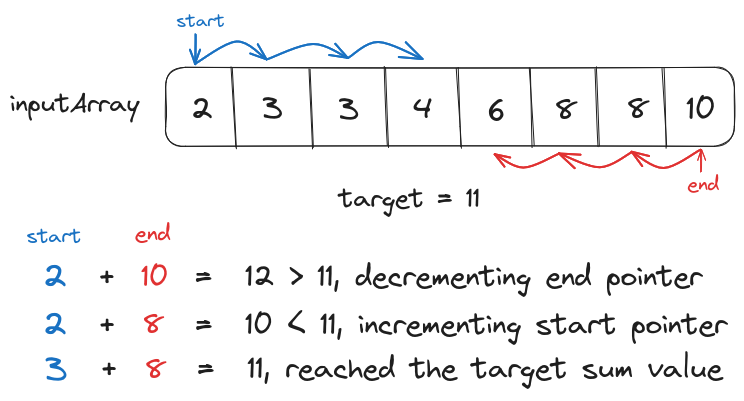
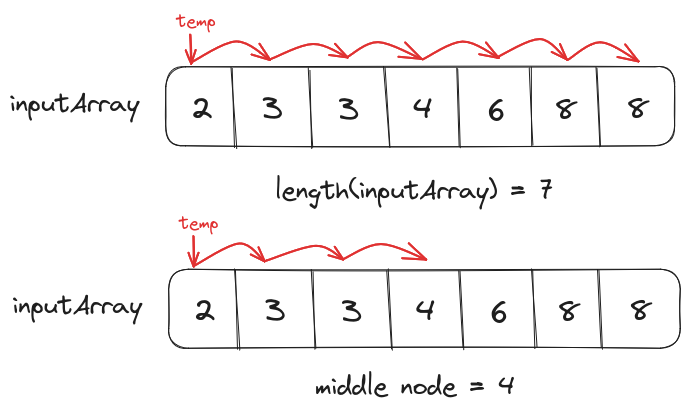
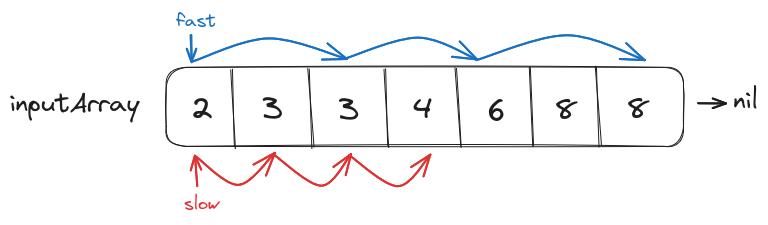
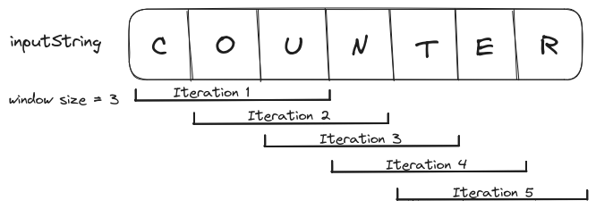
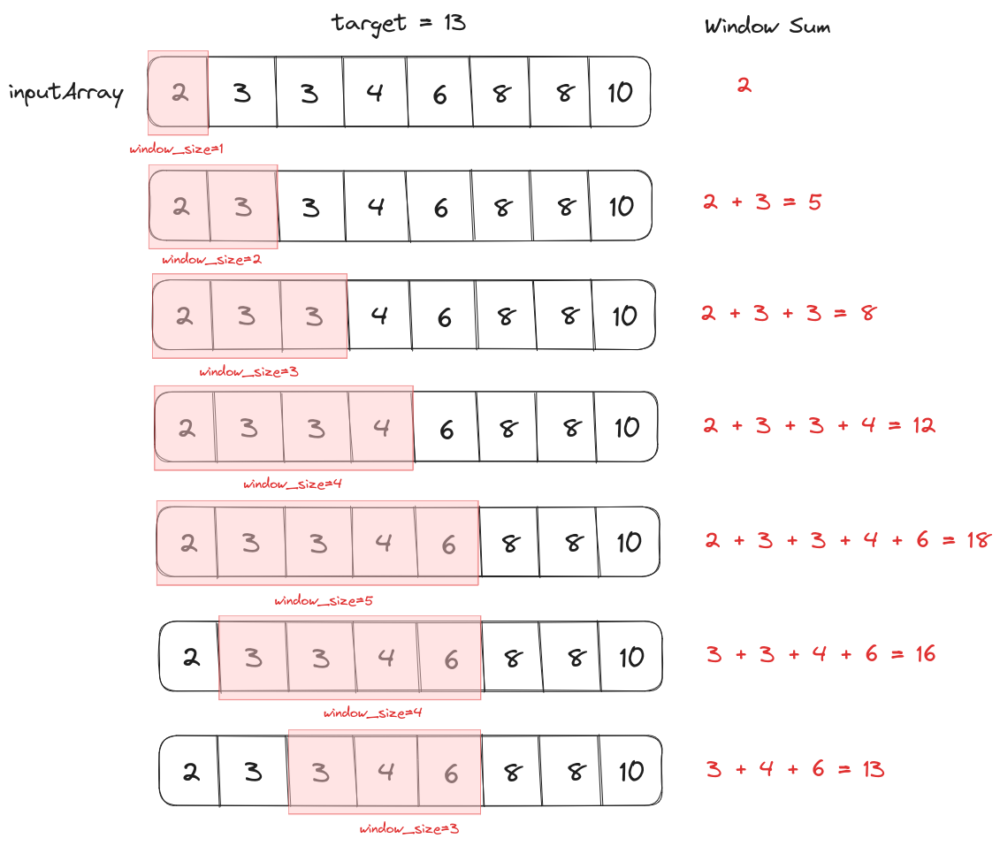

To solve problems like <a href="/posts/dsa/two-sums/" target="_blank">Two Sums</a>, 
<a href="/posts/dsa/product-except-self/" target="_blank">Product Except Self</a>, or 
<a href="/posts/dsa/contains-duplicate/" target="_blank">Contains Duplicate</a> we have to 
access multiple values at the same time from a sequential data structure (for example, a 
<a href="/posts/dsa/linked-lists/" target="_blank">Linked List</a> or an 
<a href="/posts/dsa/arrays-strings-hashmaps/#arrays" target="_blank">Array</a>).

The initial instinct while solving these problems is to use nested loops where each layer 
of the loop will maintain a different iterator on the data structure. But this 
approach does not scale well with the size of input as a single 
order of nested loops has $O(n^2)$ worst-case time complexity.

To implement a scalable solution we have to avoid nesting and access multiple values
in a single loop by maintaining two iterators. We can use this *two-pointer* approach 
to solve the **Two Sums** problem (assuming the input is sorted).

<p align="center"></p>

```text
startPointer = 0
endPointer = length(array)-1

while(startPointer<endPointer){
  sumValue = array
  if(sumValue==target){
    return (startPointer, endPointer)
  }
  else if (sumValue<target){

    // Since the sumValue is small we have
    // to increment the startPointer to a 
    // larger value
    startPointer += 1

  } else {

    // Since the sumValue is larger we have
    // to decrement the endPointer to a 
    // smaller value
    endPointer -= 1

  }
}

return none, none
```

Unlike the <a href="/posts/dsa/two-sums/#brute-force-solution" target="_blank">brute-force solution to two sums</a> problem which uses nested loops to 
return results in quadratic time ($O(n^2)$), this approach will return results 
in linear time ($O(1)$) while also maintaining a constant space complexity.

# Fast-Slow Pointers
The pointers can also iterate the data structure at an independent pace. For example, 
a *fast* pointer can iterate over two or more values at a time whereas a *slow* 
pointer can iterate over a single value at a time.

## Finding the middle node of a Linked List
Assume that we have to find the middle node of a Linked List. The Linked List 
is a dynamically allocated data structure so its size could not be determined without 
iterating it once completely. So a loop with $O(n)$ time complexity will be executed 
on the linked list to determine its length $n$, then a second loop with $O(n/2)$ time 
complexity will be executed to fetch the middle node. This will result in the total 
time complexity of $O(n) + O(n/2)$ in the worst-case scenario.

```text
// Finding the length of the linked list
linked_list_length = 1
temp = linked_list.head
while(temp.next != nil){
 temp = temp.next 
 linked_list_length += 1
}

// Iterating over the linked list until
// the middle node
middle_node_location = linked_list_length/2 
temp = linked_list.head
i=0
while(i<middle_node_location){
  temp=temp.next
  i+=1
}

return temp
```

<p align="center"></p>

But we can reduce the time complexity of the solution to just $O(n)$ if we use a fast and 
a slow pointer to iterate over the linked list simultaneously. The slow pointer will 
iterate over every node in the linked list whereas the fast pointer will skip over every other node. 

```text
fast = linked_list.head
slow = linked_list.head

while(fast!=nil) or (fast.next!=nil){
  // fast will skip over every other node
  fast = fast.next.next

  // slow will iterate the linked list
  // one node at a time
  slow = slow.next
}

return slow
```

<p align="center"></p>

Since the fast pointer covers twice the distance as the slow pointer in the same number of 
iterations when it reaches the end of the linked list the slow pointer would be at the middle node.

# Sliding Window
Some problems require analysis of sub-sequences of a data structure. Instead 
of iterating the data structure one value at a time, we can define a *window* and move 
it by one value on every iteration i.e. value/pattern identified from the previous window 
would be reused with the new element to analyze the current window, eliminating redundancy.

<p align="center"></p>

Depending on the problem, the window size could be static (constant on every iteration) or 
dynamic (variable on every iteration).

## Static Window Size
If the subsequence size defined in the problem is static then the sliding window size 
will also be constant.

### Calculating Moving Average
The **Moving Average / Rolling Mean** is the mean calculated over a window of values with a constant size. 

For example, 30 days moving average, 5 months moving average, etc.

$$Mean(a_1, a_2, a_3, a_4, a_5)={(a_1+a_2+a_3+a_4+a_5) \over 5}$$
$$Mean_{Rolling}(a_1, a_2, a_3, \dots , a_n, 3)=Mean(a_1, a_2, a_3),\ Mean(a_2, a_3, a_4),\newline Mean(a_3, a_4, a_5),\ \dots,\ Mean(a_{n-2}, a_{n-1}, a_{n})$$

If we have to calculate the moving average of values over the data provided in the 
form of an array. We can implement a brute force solution that will use 
a nested loop of window size $k$ and calculate the individual averages.

```text
func calculate_moving_average(array, k)
  moving_averages = []

  for index in array
    moving_sum = 0

    for index2 in range(0, k)
      // Calculating the sum of the current window
      moving_sum += array[index+index2]

    // Appending the average from the current window 
    // to the moving average list 
    moving_averages.append(moving_sum/k)
  
  return moving_averages
```

This approach will result in the total time complexity of $O(kn)$ where $k$ is the size 
of the window and $n$ is the number of elements in the array.

By using a sliding window of size $k$ (the moving average window size) we can 
eliminate the nested loop from the solution and decrease the total time 
complexity to $O(n)$.

We know the formula for calculating the mean over the window of the first 3 values is
$$Mean(a_1, a_2, a_3)={(a_1+a_2+a_3) \over 3}$$

Instead of calculating the next rolling mean from scratch, we can use the value of 
$Mean(a_1, a_2, a_3)$ by adding the value of the element introduced in this window 
and subtracting the value of the element from the previous window (divided by the 
window size).

$$Mean(a_2, a_3, a_4) = {{a_2 + a_3 + a_4} \over 3}$$
$$Mean(a_2, a_3, a_4) = {{a_2 + a_3 + a_4 + a_1 - a_1} \over 3}$$
$$Mean(a_2, a_3, a_4) = {{a_1 + a_2 + a_3} \over 3} + {a_4 \over 3} - {a_1 \over 3}$$
$$Mean(a_2, a_3, a_4) = {{a_1 + a_2 + a_3} \over 3} + {{a_4 - a_1} \over 3}$$
$$Mean(a_2, a_3, a_4) = Mean(a_1, a_2, a_3) + {{a_4 - a_1} \over 3}$$

```text
func average(values)
  return sum(values)/length(values)

func calculate_moving_average(array, k)
  moving_averages = []

  // Calculating the average value of the 
  // first window
  temp_average = average(array[:k])
  moving_averages.append(temp_average)

  for index in range(k, length(array))

    // Using the average value from the 
    // previous window to calculate the average 
    // value of the current window
    temp_average = temp_average + (array[index] + array[index-k])/k
    moving_averages.append(temp_average)
  
  return moving_averages
```

## Dynamic Window Size
Finding the largest/smallest subsequence satisfying a particular condition inside an array
or string requires us to work with an unknown window size. In such cases, to apply the sliding
window approach we have to maintain a start and an end pointer, updated dynamically while 
iterating over the data structure.

### Finding the sub-array that sum up to a target value
Given a sorted array of positive integers as input, we have to find the first sub-array 
that sums up to a target value. 

Since the length of the sub-array is unknown 
we have to create a dynamically sized window and calculate the sum of its elements.
If the sum is smaller than the target value then we will increase the window size from 
the end and if the window sum is larger than the target value then we decrease its size 
from the beginning. This cycle will be repeated until we have found the sub-array.

<p align="center"></p>

```text
func calculate_sum(array, start, end)
  sum = 0
  for index in [start, end]
    sum += array[index]
  return sum

func find_subarray(array, target)
  start = 0 
  end = 0
  while(end<len(array))
    window_sum = calculate_sum(array, start, end)
    if window_sum < target:

      // If the sum of the current window
      // is smaller than the target value
      // then increase the window size from 
      // the end
      end += 1
    else if window_sum > target:

      // If the sum of the current window
      // is larger than the target value
      // then decrease the window size from 
      // the start
      start += 1
    else:
      return start, end

  return nil, nil
```
<hr>
Thank you for taking the time to read this blog post! If you found this content valuable and would like to stay updated with my latest posts consider subscribing to my <a href="https://www.avni.sh/index.xml" target="_blank">RSS Feed</a>.    

# Resources
<a href="https://usaco.guide/silver/two-pointers?lang=cpp" target="_blank">Two Pointers</a>  
<a href="https://github.com/Chanda-Abdul/Several-Coding-Patterns-for-Solving-Data-Structures-and-Algorithms-Problems-during-Interviews/blob/main/%E2%9C%85%20%20Pattern%2001%20%3A%20Sliding%20Window.md" target="_blank">Sliding Window</a>  
<a href="https://en.wikipedia.org/wiki/Moving_average" target="_blank">Moving Average</a>  
<a href="https://www.youtube.com/watch?v=GcW4mgmgSbw" target="_blank">Solve subarray problems FASTER (using Sliding Windows)</a>  
