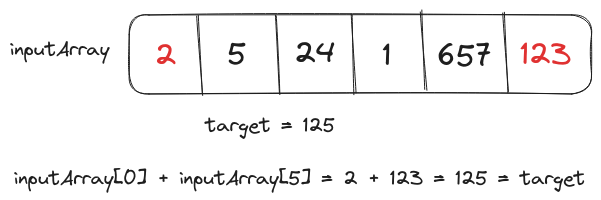

# Problem Statement
We have to implement a `twoSums()` function that takes an integer array and a target value as inputs. It returns the indexes of two elements in the input array which could be summed up to the target value.

It is assumed that the input array contains only one valid pair of elements that sum up to the target value.

# Brute Force Solution
The brute-force solution will find the sum of all element pairs in the array using nested loops.

<p align="center"></p>

## Psuedo-code for the Brute Force Solution
```text
loop index1 in array
    loop index2 in array
        sum_value = array[index1]+array[index2]
        if index1!=index2 and sum_value==target:
            return index1, index2
return none, none
```

## Time Complexity Analysis
### Best Case Scenario
If the sum of the first and second elements in the input array is equal to the target value, that would be the best-case runtime scenario. Since the inner and outer loop will be executed only once the time complexity will be $O(1)$.

### Worst Case Scenario
In the worst-case scenario, the input array won't contain any valid pair of elements. Thus, both loops will be executed completely resulting in $O(n^2)$ time complexity, where $n$ is the size of the input array.

## Space Complexity Analysis
There isn't any additional memory used by the brute-force solution. Thus, the total space complexity will be $O(1)$.

## Code for the Brute Force Solution
```Go
package main

import "fmt"

func twoSums(nums []int, target int)([]int){
    for i:=0;i<len(nums);i++{
        for j:=0;j<len(nums);j++{
            sumValue := nums[i] + nums[j]
            if i!=j && sumValue==target{
                return []int{i, j}
            } 
        }
    }
    
    return []int{}
}

func main(){
    nums := []int{2, 5, 54, 1, 657, 123}
    target := 125
    indices := twoSums(nums, target)
    if len(indices)==0{
        fmt.Println("No elements in nums that sum up to", target)
    } else {
        fmt.Println("twoSum() for", target, 
        "in nums are", indices)
    }
    
    target = 34
    indices = twoSums(nums, target)
    if len(indices)==0{
        fmt.Println("No elements in nums that sum up to", target)
    } else {
        fmt.Println("twoSum() for", target, 
        "in nums are", indices)
    }
}

// Output
// twoSum() for 125 in nums are [0 5]
// No elements in nums that sum up to 34
```

# Optimized Solution
We can find both elements with a single loop and a hashmap that will store the elements mapped to their index.

<p align="center"></p>

The loop will iterate over the elements in the array, if the `difference` (`target - element`) is present in the hashmap the loop will exit otherwise the element will be added to the hashmap.

## Psuedo-code for the Optimized Solution
```text
hashmap = HashMap()
loop index in array
    difference = target - array[index]
    if difference in hashmap
        return hashmap[difference], index
    else
        hashmap[array[index]] = index
return none, none
```

## Time Complexity Analysis
### Best Case Scenario
For the best-case scenario inputs i.e. the first and second elements sum up to the target value, the solution will finish in $O(1)$ time as the loop will always finish after iterating over the first two values.

### Worst Case Scenario
In the worst-case scenario, the loop will iterate over all elements to conclude that none of the element pairs sum up to the target value, finishing in $O(n)$ time.

## Space Complexity Analysis
The `hashmap` used to store elements from the input array will take $O(n)$ additional memory space.

## Code for the Optimized Solution

```Go
package main

import "fmt"

func twoSums(nums []int, target int)([]int){
    hashmap := make(map[int]int)
    
    for index:=0;index<len(nums);index++{
        diff := target-nums[index]
        _, key_exists := hashmap[diff]
        if key_exists{
            // Difference exists in the hashmap
            return []int{hashmap[diff], index}
        } else {
            // Difference does not exist in the hashmap
            // Add the element to hashmap
            hashmap[nums[index]] = index
        }
    }
    
    return []int{}
}

func main(){
    nums := []int{2, 5, 54, 1, 657, 123}
    target := 125
    indices := twoSums(nums, target)
    if len(indices)==0{
        fmt.Println("No elements in nums that sum up to", target)
    } else {
        fmt.Println("twoSum() for", target, 
        "in nums are", indices)
    }
    
    target = 34
    indices = twoSums(nums, target)
    if len(indices)==0{
        fmt.Println("No elements in nums that sum up to", target)
    } else {
        fmt.Println("twoSum() for", target, 
        "in nums are", indices)
    }
}

// Output
// twoSum() for 125 in nums are [0 5]
// No elements in nums that sum up to 34
```

<hr>

Thank you for taking the time to read this blog post! If you found this content valuable and would like to stay updated with my latest posts consider subscribing to my <a href="https://www.avni.sh/index.xml" target="_blank">RSS Feed</a>.

# Resources
<a href="https://leetcode.com/problems/two-sum/" target="_blank">1. Two Sum</a>  
<a href="https://www.youtube.com/watch?v=KLlXCFG5TnA" target="_blank">Two Sum - Leetcode 1 - HashMap - Python</a>
