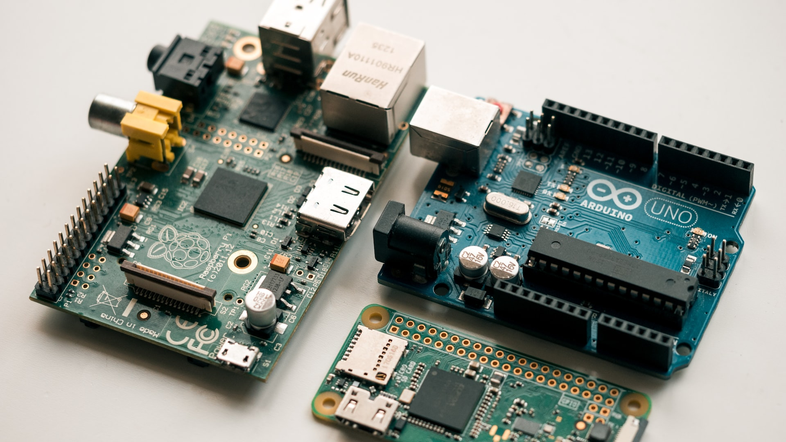
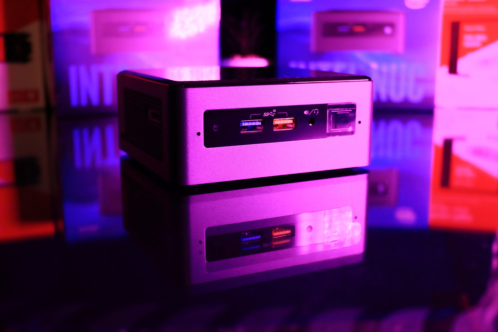
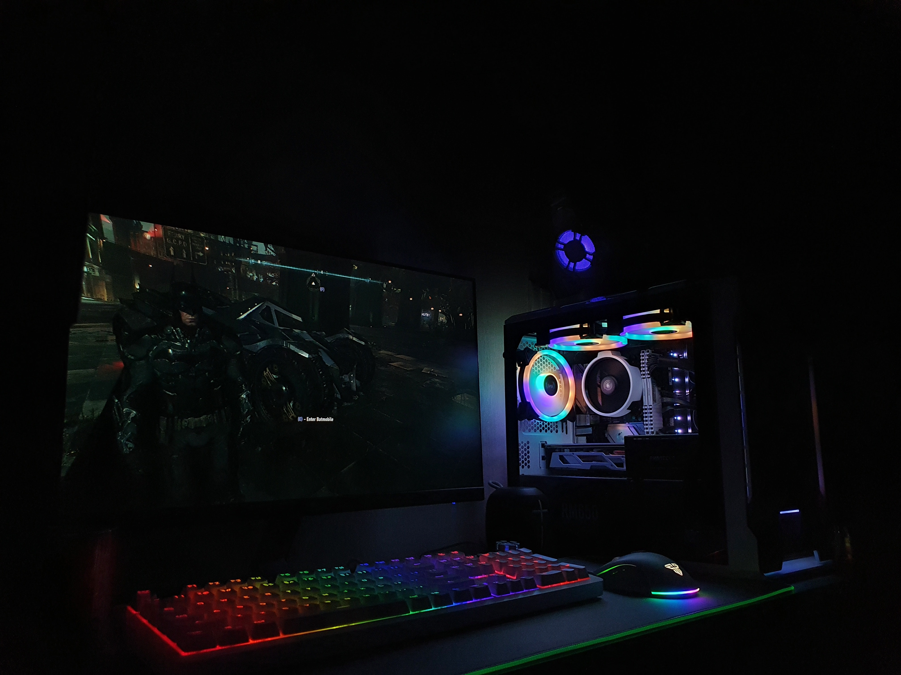
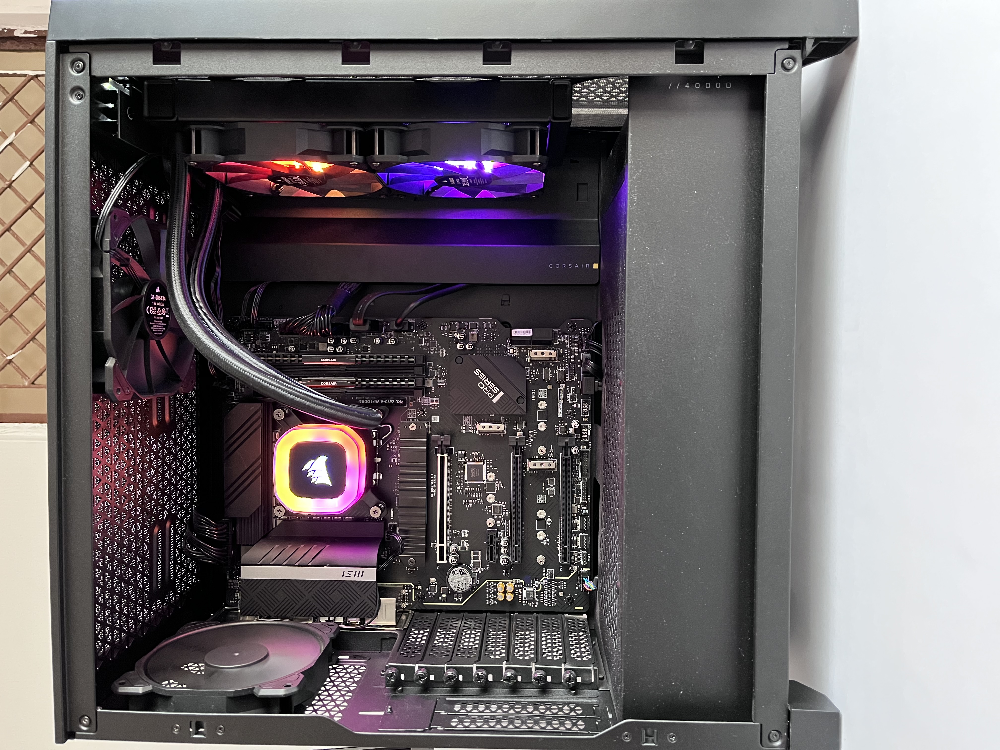
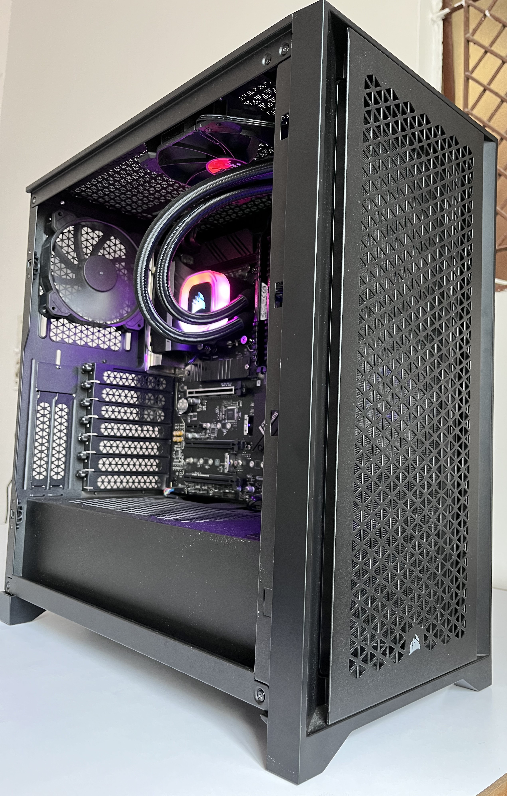

There is an app for everything and modern app stores have made it extremely convenient to install them on your device. However, some underlying issues need to be discussed

* Each application has a different set of terms and services. A small subset of users read it and a smaller subset of them will refuse to use the application if they disagree with it.

* These applications are critical for your daily life but if you lose access to them, there might not be a proper support channel to regain access or retrieve data. 

If you lose access to your Google account you’ll also lose access to your emails, your photos (backed up on Google Photos), your YouTube account, and probably most of the services you signed in using Google.

* Many of them operate on a subscription-based model which means you don't own the product outright, you are just renting it as a service.

The application provider can change their payment model to subscription-based, while also discontinuing your existing “lifetime” license. <a href="https://support.google.com/a/answer/2855120?hl=en" target="_blank">G Suite legacy free edition</a>, <a href="https://community.teamviewer.com/English/discussion/119369/has-anyone-who-bought-a-lifetime-license-for-earlier-version-5-gotten-free-update-to-v-1" target="_blank">TeamViewer</a>

The service itself could be discontinued. <a href="https://killedby.tech/google/" target="_blank">Killed by Google</a>

Content "owned" by you could be removed without your consent. <a href="https://www.pushsquare.com/news/2022/07/sony-removing-some-purchased-films-movies-from-users-accounts" target="_blank">Sony Removing Some Purchased Films, Movies from Users' Accounts</a>

Self-Hosted alternatives to some or all of these services will give you more control while also keeping your data private. There are multiple hardware options available across the budget that could be used to host services like media streaming, cloud storage, VPN server, etc. at your home. 

# Mini PCs
Mini PCs provide maximum utility for homelab but in a smaller package with low power consumption and noise.

If you want to get started with self-hosting or deploy a secondary server for services running round-the-clock (like a password manager, DNS, router, etc.) then a mini PC would be a great option.

## Raspberry Pi and Alternatives

<small><i>Photo by <a href="https://unsplash.com/@harrisonbroadbent?utm_source=unsplash&utm_medium=referral&utm_content=creditCopyText">Harrison Broadbent</a> on <a href="https://unsplash.com/photos/1mu9gF8OhNk?utm_source=unsplash&utm_medium=referral&utm_content=creditCopyText">Unsplash</a></i></small>

Raspberry Pi is a credit-card-sized mini PC that uses CPUs based on ARM architecture. Due to its modularity and open design, it is used for monitoring weather, robotics, and teaching basic computer science.

General-Purpose Input/Output (GPIO) pins on Raspberry Pi could be used for integrating it with different circuits or appliances to monitor/control them or extend their functionality.

It is a great candidate for self-hosting due to
* its smaller size
* a large community of developers
* minimal energy consumption
* relatively affordable compared to other options

At the time of writing the Raspberry Pis are unavailable in most countries or sold at a price significantly higher than their MSRP so you can explore its alternatives in this video from LinusTechTips: <a href="https://youtu.be/uJvCVw1yONQ" target="_blank">I Can Save You Money! – Raspberry Pi Alternatives</a>

## Intel NUC and Alternatives

<small><i>Photo by <a href="https://unsplash.com/@gabimedia?utm_source=unsplash&utm_medium=referral&utm_content=creditCopyText">Gabriel Vasiliu</a> on <a href="https://unsplash.com/photos/1cIirhlCMts?utm_source=unsplash&utm_medium=referral&utm_content=creditCopyText">Unsplash</a></i></small>

Next Unit of Computing (NUC) kits (PC kits without memory and storage) from Intel provide a relatively powerful alternative to Raspberry Pi or similar mini PCs.

NUCs are available with four types of Intel x86 processors: Celeron, Core i3, Core i5, and Core i7. NUC Extreme could be configured with a Core i9 processor and a desktop GPU.

MiniPCs like Beelink's <a href="https://www.bee-link.net/products/pre-order-beelink-gtr6-6900hx-first-quad-8k-mini-pc" target="_blank">GTR</a>, <a href="https://www.bee-link.net/products/beelink-ser5-mini-pc-amd-ryzen-5-5500u-16g-ddr4-500gb-m-2-2280-nvme-ssd-mini-desktop-computer-4k-60hz-wifi-6-bt5-2-dual-hdmi-type-c-support-2-5-inch-hdd" target="_blank">SER</a>, and <a href="https://www.bee-link.net/products/beelink-sr55-5800h-mini-pc" target="_blank">SR</a> series provide an AMD alternative to NUC in similar form factors.

## Limitations of Using Mini PCs for Self-Hosting
While MiniPCs are a great starting point for self-hosting services, there are still some limitations that you have to keep in mind

* MiniPCs do provide options for expansion and upgrades but relatively less than a custom PC build or a server.
* You might not be able to run multiple intensive workloads in parallel.
* To scale your homelab running on MiniPC you have to create a cluster of mini PC nodes.

# Cloud Service Providers (CSPs)
You can host your services on VMs provided by Cloud Service Providers (CSPs) like Azure, Amazon Web Services (AWS), and Google Cloud Platform (GCP). They also provide a static IP for VMs which could be useful if you want your services publicly available.

## Limitations of Using CSPs for Self-Hosting
* You are dependent on your CSP for the availability of your services. A CSP outage could also mean a homelab outage.
* Depending on your workload and your geographical location, hosting and running a VM round-the-clock might be expensive due to cloud costs.
* Scaling your lab on the cloud could be expensive.

# Decommissioned Servers/Workstations

<small><i>Photo by <a href="https://unsplash.com/@tvick?utm_source=unsplash&utm_medium=referral&utm_content=creditCopyText">Taylor Vick</a> on <a href="https://unsplash.com/photos/M5tzZtFCOfs?utm_source=unsplash&utm_medium=referral&utm_content=creditCopyText">Unsplash</a></i></small>

Datacenters and IT organizations often decommission servers and sell them on the secondary market. They might not perform well with the current enterprise workloads but their performance should be adequate for homelab.

Some enterprise features could help you in managing your homelab like
* 10 Gigabit Ethernet: If you are running a media streaming service or a video editing file server then having 10GbE could significantly improve your workflow.
* Intelligent Platform Management Interface (IPMI): A Motherboard with IPMI allows you to access your system’s firmware remotely. Using this you can diagnose firmware/hardware-related issues or install OS without connecting a display or peripherals.
* Error Correction Code (ECC) memory: ECC memory unlike non-ECC memory automatically detects and corrects memory errors. It is a necessary feature for critical workloads as it prevents unexpected crashes and outages.
* Ability to swap Power Supply Units (PSUs) and storage devices easily.

## Limitations of Using Decommissioned Servers for Self-Hosting
* Scarce availability of replacements for components.
* Datacenter servers are designed to provide maximum cooling with the tradeoff of the high noise level. This might not be ideal if you want to deploy it in your home.
* The footprint of a server might be larger than an average PC.

# Custom PC Build

<small><i>Not my PC. Photo by <a href="https://unsplash.com/ja/@amieldh?utm_source=unsplash&utm_medium=referral&utm_content=creditCopyText">Amiel D Hechanova</a> on <a href="https://unsplash.com/photos/XznGSZ9DtpQ?utm_source=unsplash&utm_medium=referral&utm_content=creditCopyText">Unsplash</a>
  </i></small>

Custom PC builds provide maximum upgradability and customization and that’s why I decided to build one. I’ll go through my thought process for selecting each component, while it might not be the same for you, it can provide a direction for decision-making.

My planned use case for homelab:
* Hosting a Network Attached Storage (NAS) server
* Deploying Kubernetes/Red Hat OpenShift Local cluster
* Hosting a Virtual Private Network (VPN) server
* Hosting a media streaming server
* Windows VM for gaming
* Trying different self-hosted applications

Based on my use case I decided on the following specification:
* More than 8 cores and 16 threads for simultaneous execution of multiple VMs and containers. I decided that I'll allocate at least 4 threads to my Windows VM.
* 2TB of redundant storage i.e. two drives mirrored on NAS.
* 2.5 Gigabit networking on the motherboard as I’ll be accessing services remotely.
* 32GB memory would be adequate for VMs. I went with DDR4 because DDR5 exceeds my budget.
* 1TB NVMe SSD storage for the host OS/hypervisor to be installed on homelab.
* PCIe bandwidth and PSU wattage to support Nvidia’s GeForce RTX 3070/RTX 4070 GPU with an expansion card like Network Interface Card (NIC) for a possible 10 Gigabit upgrade in the future.
* 2 X 2TB HDD for NAS server.

<a href="/posts/homelab/building-your-own-homelab/#my-pc-build-specification">Skip to My PC Build Specification >></a>

## CPU
You should make sure that your CPU has support for virtualization with enough cores and threads to host and deploy multiple services concurrently.

Depending on your goals you should also look for:
* Overclocking support
* ECC Memory support
* Integrated Graphics: If your CPU doesn’t have integrated graphics then you have to purchase a GPU to install or access the OS/hypervisor.

I wanted a CPU with more than or equal to 8 cores with integrated graphics, the options in my budget were: <a href="https://www.amd.com/en/products/apu/amd-ryzen-7-7700" target="_blank">AMD Ryzen 7 7700</a> or <a href="https://www.intel.in/content/www/in/en/products/sku/230580/intel-core-i513500-processor-24m-cache-up-to-4-80-ghz/specifications.html" target="_blank">Intel Core i5-13500</a>. I didn't have any overclocking requirements, otherwise, I would've gone with <a href="https://www.intel.in/content/www/in/en/products/sku/230493/intel-core-i513600k-processor-24m-cache-up-to-5-10-ghz/specifications.html" target="_blank">Intel Core i5-13600K</a>.

I went with the **i5-13500** as it has more cores and threads compared to Ryzen 7700.

## Motherboard
The choice of your CPU limits the choices of your motherboard. First, you'll have to select the motherboard chipset compatible with your CPU:

* <a href="https://www.amd.com/en/chipsets/am5" target="_blank">AMD chipsets</a>: B650, B650E, X670, X670E
* <a href="https://ark.intel.com/content/www/us/en/ark/products/series/229717/intel-700-series-desktop-chipsets.html#@Desktop" target="_blank">Intel 700 series chipsets</a>: Z790, H770, B760, W790

Motherboard features you might want to consider for your homelab:

* Upgradability path with future CPU releases
* PCIe Bandwidth for expansion cards
* 2.5 Gigabit networking
* SATA ports for storage expansion
* IPMI support

I planned on getting <a href="https://www.msi.com/Motherboard/PRO-B760M-A-WIFI-DDR4" target="_blank">MSI PRO B760M-A WIFI DDR4</a> but I got a better deal with <a href="https://www.msi.com/Motherboard/PRO-Z690-P-WIFI" target="_blank">MSI PRO Z690-P WIFI DDR4</a> so I went with that. It has 2.5 Gigabit networking and 6x SATA ports which provides me the option to add more drives in the future.

## CPU Cooler
Most CPUs come with an air cooler. But if you are using a high-end CPU you might not be able to extract its complete performance using the default cooler.

Options are air cooling, custom water cooling, or an All-In-One (AIO) Liquid cooler. You can make your decision based on your CPU, cooling performance, noise level, and ease of installation.

I went with <a href="https://www.corsair.com/br/en/Categories/Products/Liquid-Cooling/RGB-Liquid-CPU-Coolers/p/CW-9060053-WW" target="_blank">Corsair H100 RGB 240mm Liquid CPU Cooler</a> due to its price and aesthetics.

## Memory
At the time of writing the price of DDR5 memory is significantly higher than its MSRP so I opted for DDR4.

I went with 2 x <a href="https://www.corsair.com/us/en/Categories/Products/Memory/VENGEANCE-LPX/p/CMK16GX4M1E3200C16" target="_blank">Corsair VENGEANCE LPX 16GB DDR4 DRAM Memory Kit</a> because its 3200MHz speed will be adequate for my workload.

## Storage
Network Attached Storage (NAS) server is a common self-hosted service. With a NAS server, you have your cloud storage without privacy concerns or subscriptions. That’s why selecting the right storage device is important.

Along with drives for NAS you'll need additional storage for the OS/Hypervisor running on your homelab.

### Boot Drive
It's ideal to store the OS/Hypervisor in a faster drive compared to the drives used for NAS, like NVMe or SATA Solid-State Drive (SSD).

I'm using <a href="https://www.kingston.com/en/ssd/nv2-nvme-pcie-ssd?capacity=1tb" target="_blank">Kingston NV2 PCIe 4.0 NVMe SSD </a> as the boot disk for the Proxmox hypervisor.

### NAS Drives
Although you can use any Hard Disk Drive (HDD) for your NAS server you might want to consider NAS-rated hard drives because they provide advantages like

* Optimization for read-and-write operations
* Relatively fewer vibrations compared to desktop hard drives
* Rated for 24/7 operation

If you are using two hard drives in mirrored mode then it is safer to source them from different vendors.

I opted for <a href="https://www.westerndigital.com/en-in/products/internal-drives/wd-blue-desktop-sata-hdd#WD5000AZLX" target="_blank">WD Blue PC Desktop Hard Drive 2TB</a> and <a href="https://www.seagate.com/in/en/products/hard-drives/barracuda-hard-drive/" target="_blank">Seagate BarraCuda Hard Drives 2TB</a> as storage drives. I'll be running them in mirrored mode using TrueNAS.

## Power Supply Unit (PSU)
Websites like <a href="https://outervision.com/power-supply-calculator" target="_blank">OuterVision Power Supply Calculator</a> could be used to calculate the power budget of your PC. It's ideal to select a power supply with higher wattage to ensure upgradability.

PSUs are rated as White, Bronze, Silver, Gold, Platinum, and Titanium in the increasing order of their efficiency. An efficient PSU will draw less power and run quieter. Hence, reducing your power bill.

I opted for <a href="https://www.corsair.com/us/en/Categories/Products/Power-Supply-Units/Power-Supply-Units-Advanced/RM-Series%E2%84%A2-80-PLUS-Gold-Power-Supplies/p/CP-9020196-NA" target="_blank">Corsair RM850 850 Watt 80 PLUS Gold Certified Fully Modular PSU</a> which provides 850W of wattage and that is enough to run my homelab while also providing an option to add an Nvidia GeForce RTX 3070/RTX 4070 in the future.

## PCIe Expansion Cards
If you are planning to use your homelab for video editing, animation, machine learning, gaming, or any similar workloads then adding a GPU can improve its performance significantly.

By adding a 10 Gigabit Network Interface Card (NIC) you can reduce the access time to your services.

## Case
As long as all the components fit, any PC case could be used for homelab. You might want to consider its
* options for expansion
* cooling
* build quality
* cable management

I selected <a href="https://www.corsair.com/us/en/Categories/Products/Cases/Mid-Tower-ATX-Cases/4000D-Airflow-Tempered-Glass-Mid-Tower-ATX-Case/p/CC-9011200-WW" target="_blank">Corsair 4000D AIRFLOW Tempered Glass Mid-Tower ATX Case</a> due to its airflow and ease of building.

## Limitations of Using Custom PC Build for Self-Hosting
* While it is easy to build PCs by following guides and tutorials on the internet. It might still be very difficult for novice builders. Retailers do provide an option to assemble the components, sometimes at no extra cost.
* Current prices of some components are significantly higher than their MSRPs, even double in some cases.
* The upfront cost is higher compared to other options.

# My PC Build Specification  
| Component   | Product                                                                                                                                                                                                                                                                     |
|-------------|-----------------------------------------------------------------------------------------------------------------------------------------------------------------------------------------------------------------------------------------------------------------------------|
| CPU         | <a href="https://www.intel.in/content/www/in/en/products/sku/230580/intel-core-i513500-processor-24m-cache-up-to-4-80-ghz/specifications.html" target="_blank">Intel Core i5-13500</a>                                                                                    |
| Motherboard | <a href="https://www.msi.com/Motherboard/PRO-Z690-P-WIFI" target="_blank">MSI PRO Z690-P WIFI DDR4</a>                                                                                                                                                                 |
| CPU Cooler  | <a href="https://www.corsair.com/br/en/Categories/Products/Liquid-Cooling/RGB-Liquid-CPU-Coolers/p/CW-9060053-WW" target="_blank">Corsair H100 RGB 240mm Liquid CPU Cooler</a>                                                                                              |
| Memory      | 2 X <a href="https://www.corsair.com/us/en/Categories/Products/Memory/VENGEANCE-LPX/p/CMK16GX4M1E3200C16" target="_blank">Corsair VENGEANCE LPX 16GB DDR4 DRAM Memory Kit</a>                                                                                               |
| SSD         | <a href="https://www.kingston.com/en/ssd/nv2-nvme-pcie-ssd?capacity=1tb" target="_blank">Kingston NV2 PCIe 4.0 NVMe SSD </a>                                                                                                                                                |
| HDD 1       | <a href="https://www.westerndigital.com/en-in/products/internal-drives/wd-blue-desktop-sata-hdd#WD5000AZLX" target="_blank">WD Blue PC Desktop Hard Drive 2TB</a>                                                                                                           |
| HDD 2       | <a href="https://www.seagate.com/in/en/products/hard-drives/barracuda-hard-drive/" target="_blank">Seagate BarraCuda Hard Drives 2TB</a>                                                                                                                                    |
| PSU         | <a href="https://www.corsair.com/us/en/Categories/Products/Power-Supply-Units/Power-Supply-Units-Advanced/RM-Series%E2%84%A2-80-PLUS-Gold-Power-Supplies/p/CP-9020196-NA" target="_blank">Corsair RM850 850 Watt 80 PLUS Gold Certified Fully Modular PSU</a> |
| Case        | <a href="https://www.corsair.com/us/en/Categories/Products/Cases/Mid-Tower-ATX-Cases/4000D-Airflow-Tempered-Glass-Mid-Tower-ATX-Case/p/CC-9011200-WW" target="_blank">Corsair 4000D AIRFLOW Tempered Glass Mid-Tower ATX Case</a>                                           | 

<small><i>The Result</i></small>

# Challenges of Self-Hosting
* Deploying and managing a homelab could be difficult for people who don't work with computers. But it is possible with patience and research.
* Managing some services like an email server is difficult, especially when they integrate with other services.
* You have to manage and debug issues yourself. You'll learn a lot, which might help you in your professional career.
* You have to provide technical support to everyone else using your services.
* You might lose out on some features or their quality provided by proprietary services. Like AI face recognition provided with Google Photos.
* You are responsible for the security of your data. Make sure that all of the services, OS, and hypervisors are up to date.
* For some applications, you might not have full autonomy to switch to a self-hosted alternative. For example, if your friends and family use WhatsApp then you can’t simply switch to a self-hosted alternative and expect others to do the same.

# Resources to Learn About Homelab and Self-Hosting
## Blogs
<a href="https://pimylifeup.com/" target="_blank">PiMyLifeUp</a>  
<a href="https://blog.patshead.com/" target="_blank">Pat's Blog</a>  
<a href="https://noted.lol/" target="_blank">noted.lol</a>  
<a href="https://www.homelabrat.com/" target="_blank">homelabrat</a>  

## Repositories
<a href="https://github.com/awesome-selfhosted/awesome-selfhosted" target="_blank">awesome-selfhosted</a>  
<a href="https://github.com/tteck/Proxmox" target="_blank">tteck/Proxmox</a>  
<a href="https://github.com/topics/homelab" target="_blank">topics/homelab</a>  

## Subreddits
<a href="https://old.reddit.com/r/selfhosted/" target="_blank">r/selfhosted</a>  
<a href="https://old.reddit.com/r/homelab/" target="_blank">r/homelab</a>  
<a href="https://old.reddit.com/r/homeautomation/" target="_blank">r/homeautomation</a>  

## Youtube Channels
<a href="https://www.youtube.com/@NetworkChuck" target="_blank">NetworkChuck</a>  
<a href="https://www.youtube.com/@TechnoTim" target="_blank">TechnoTim</a>  
<a href="https://www.youtube.com/@RaidOwl" target="_blank">RaidOwl</a>  
<a href="https://www.youtube.com/@HardwareHaven" target="_blank">Hardware Haven</a>  
<a href="https://www.youtube.com/@WolfgangsChannel" target="_blank">Wolfgang's Channel</a>  
<a href="https://www.youtube.com/@LearnLinuxTV" target="_blank">Learn Linux TV</a>  
<a href="https://www.youtube.com/@LAWRENCESYSTEMS" target="_blank">Lawrence Systems</a>  
<a href="https://www.youtube.com/@AwesomeOpenSource" target="_blank">AwesomeOpenSource</a>  

Thank you for taking the time to read this blog post! If you found this content valuable and would like to stay updated with my latest posts consider subscribing to my <a href="https://www.avni.sh/index.xml" target="_blank">RSS Feed</a>.

# Resources
<a href="https://support.google.com/a/answer/2855120?hl=en" target="_blank">G Suite legacy free edition</a>  
<a href="https://community.teamviewer.com/English/discussion/119369/has-anyone-who-bought-a-lifetime-license-for-earlier-version-5-gotten-free-update-to-v-1" target="_blank">Has anyone who bought a lifetime license for earlier version (5) gotten free update to v.1?</a>
<a href="https://killedby.tech/google/" target="_blank">Killed by Google</a>  
<a href="https://www.pushsquare.com/news/2022/07/sony-removing-some-purchased-films-movies-from-users-accounts" target="_blank">Sony Removing Some Purchased Films, Movies from Users' Accounts</a>  
<a href="https://www.raspberrypi.org/help/what-%20is-a-raspberry-pi/" target="_blank">What is a Raspberry Pi?</a>  
<a href="https://www.raspberrypi.com/software/" target="_blank">Raspberry Pi OS</a>  
<a href="https://youtu.be/uJvCVw1yONQ" target="_blank">I Can Save You Money! – Raspberry Pi Alternatives</a>  
<a href="https://www.intel.in/content/www/in/en/products/details/nuc.html" target="_blank">Intel NUC Mini PCs</a>  
<a href="https://www.amd.com/en/products/embedded-minipc-solutions" target="_blank">Mini PCs – Powered by AMD Ryzen™ Embedded Processors</a>  
<a href="https://www.bee-link.net/products/pre-order-beelink-gtr6-6900hx-first-quad-8k-mini-pc" target="_blank">GTR</a>  
<a href="https://www.bee-link.net/products/beelink-ser5-mini-pc-amd-ryzen-5-5500u-16g-ddr4-500gb-m-2-2280-nvme-ssd-mini-desktop-computer-4k-60hz-wifi-6-bt5-2-dual-hdmi-type-c-support-2-5-inch-hdd" target="_blank">SER</a>  
<a href="https://www.bee-link.net/products/beelink-sr55-5800h-mini-pc" target="_blank">SR</a>  
<a href="https://blog.synology.com/xmas-wishlist-why-choose-nas-drives-over-desktop-drives-for-your-nas" target="_blank">Why choose NAS drives over desktop drives for your NAS?</a>  
<a href="https://www.pcworld.com/article/394951/pc-power-supply-ratings-80-plus-platinum-vs-gold-vs-bronze-vs-white-explained.html" target="_blank">Power supply ratings explained: 80 Plus Platinum vs. Gold vs. Bronze vs. White</a>  
<a href="https://outervision.com/power-supply-calculator" target="_blank">OuterVision® Power Supply Calculator</a>  
<a href="https://www.howtogeek.com/719270/how-to-choose-a-pc-case-5-features-to-consider/" target="_blank">How to Choose a PC Case: 5 Features to Consider</a>  
<a href="https://old.reddit.com/r/selfhosted/comments/t8gqir/why_you_really_dont_want_to_selfhost_your_own/" target="_blank">Why you really DON'T want to self-host your own e-mail server</a>  
<a href="https://thehackernews.com/2023/03/lastpass-hack-engineers-failure-to.html" target="_blank">LastPass Hack: Engineer's Failure to Update Plex Software Led to Massive Data Breach</a>  