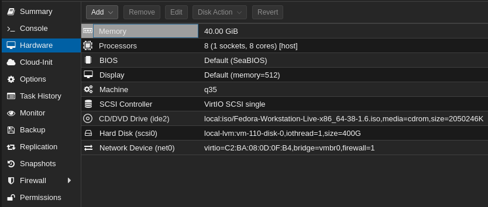
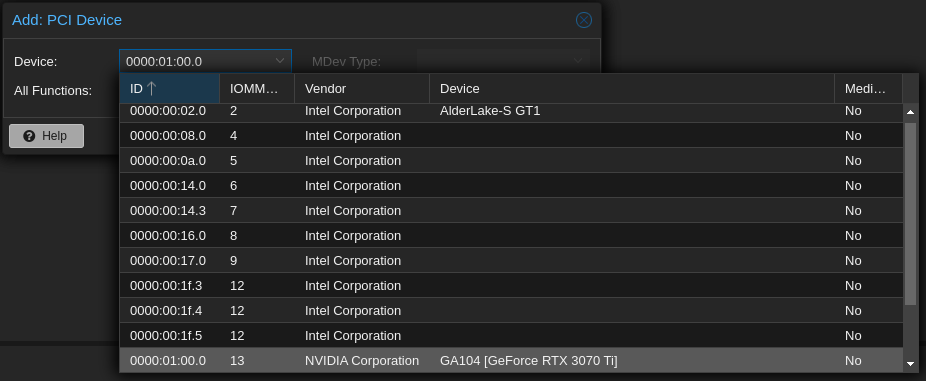
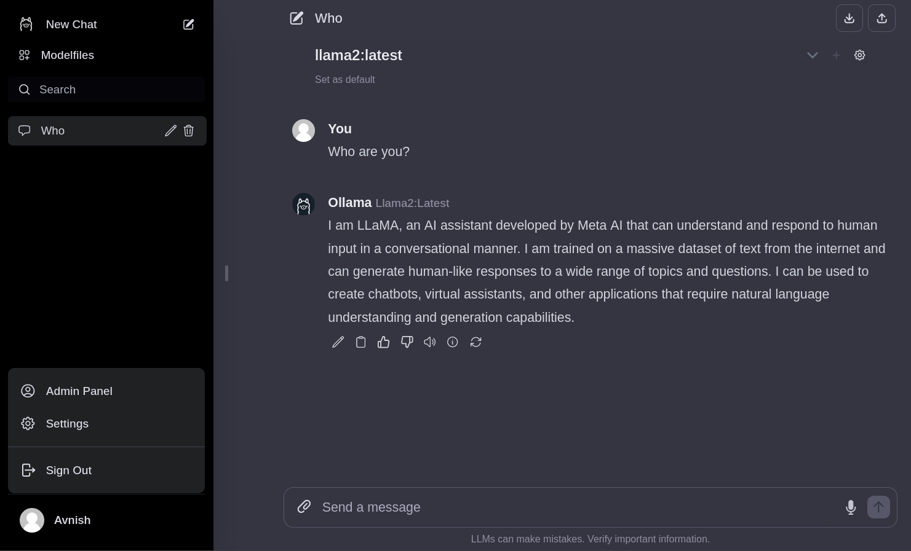
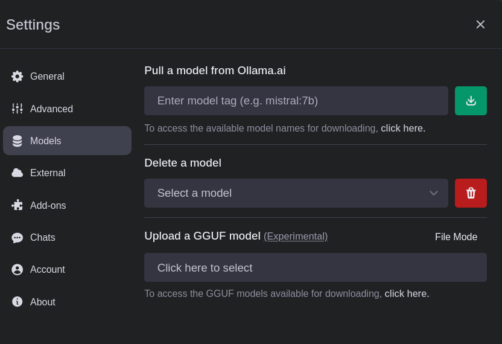
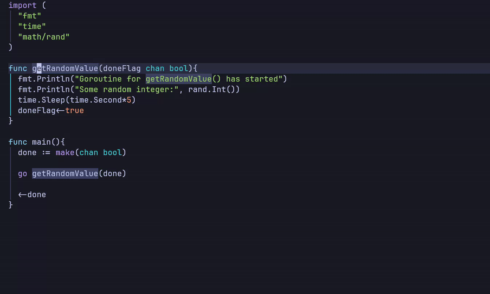
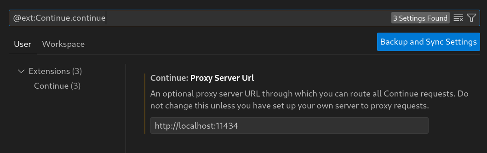
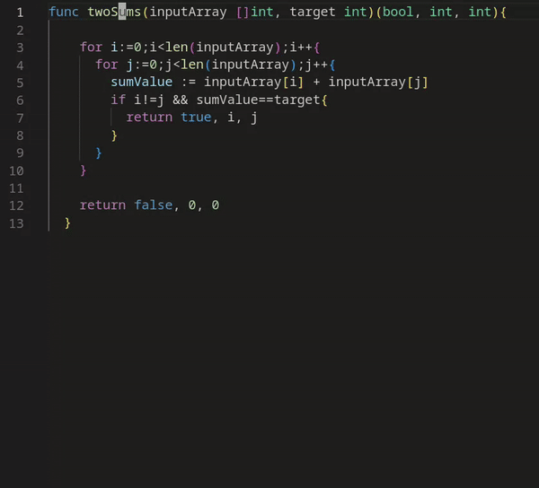

Ollama provides an interface to self-host and interact with 
open-source LLMs (Large Language Models) using its binary 
or container image. Managing LLMs using Ollama 
is like managing <a href="/posts/kubernetes/container-lifecycle" target="_blank">container lifecycle</a> using container engines like `docker` or `podman`.

* Ollama commands `pull` and `run` are used to download and execute
LLMs respectively, just like the ones used to manage containers
with `podman` or `docker`. 

* Tags like `13b-python` and `7b-code` are used to manage different
variations of an LLM.

* A `Modelfile` (like `Dockerfile`) is created to build a custom
model using an existing LLM as its base. Additional
parameters like `TEMPLATE` and `PARAMETER` could be used to define 
a prompt template or fine-tune model parameters respectively.


# Deploying Ollama container with NVIDIA GPU
Deploying the Ollama container directly would allow it to 
utilize CPU resources for its LLM workloads, but with the parallel
computation capabilities of a Graphics Processing Unit (GPU), we can 
improve the inference performance of all models.

In this article I'm using an **NVIDIA GeForce RTX 3070 Ti** GPU, if you 
want to use a GPU from AMD/Intel or any other manufacturer then steps 
like driver and container toolkit installation and GPU configuration 
for the container engine will differ.

## GPU Passthrough to VM 
I am deploying the Ollama container on a Fedora 38 virtual machine 
so the first step will be the GPU Passthrough from my hypervisor 
(Proxmox) to the VM. You can skip this step if you are deploying 
Ollama on a baremetal machine.

In the Proxmox's Web UI, we can go to the VM's `Hardware` section 
and `Add` your `PCI  Device` i.e. your GPU. 

<p align="center"></p>
<p align="center"><small>Proxmox VM's Hardware Section</small></p>

Make sure to mark the `All Functions` checkbox.

<p align="center"></p>
<p align="center"><small>GPU Passthrough to a Proxmox VM</small></p>

Once the VM is rebooted we can verify the GPU Passthrough using 
the following command. 
```bash
lspci | grep NVIDIA
```

If the GPU name is present in the command's output (like below) 
then the passthrough is successful and we can move to the next step.

```text
06:10.0 VGA compatible controller: NVIDIA Corporation GA104 [GeForce RTX 3070 Ti] (rev a1)
06:10.1 Audio device: NVIDIA Corporation GA104 High Definition Audio Controller (rev a1)
```

## CUDA Toolkit Installation
To utilize the parallel computation capabilities of the CUDA cores 
provided in NVIDIA GPUs we have to install the CUDA Toolkit. 
You can follow <a href="https://docs.nvidia.com/cuda/cuda-installation-guide-linux/index.html" target="_blank">NVIDIA's documentation</a> on the CUDA Toolkit 
installation on Linux because the steps vary depending on the host's configuration.

Here are the steps for Fedora 38:

1. Downloading CUDA Toolkit Repo RPM. 
```bash
wget https://developer.download.nvidia.com/compute/cuda/12.3.2/local_installers/cuda-repo-fedora37-12-3-local-12.3.2_545.23.08-1.x86_64.rpm
```

2. Installing CUDA Toolkit Repo RPM.
```bash
sudo rpm -i cuda-repo-fedora37-12-3-local-12.3.2_545.23.08-1.x86_64.rpm
```

3. Cleaning `dnf` Repository Metadata.
```bash
sudo dnf clean all
```

4. Installing `cuda-toolkit` package.
```bash
sudo dnf -y install cuda-toolkit-12-3
```

5. Installing `legacy` (proprietary) or `open` (open source) 
kernel module for `nvidia-driver`.
```bash
sudo dnf -y module install nvidia-driver:latest-dkms
```
or 
```bash
sudo dnf -y module install nvidia-driver:open-dkms
```

## NVIDIA Container Toolkit Installation
With `nvidia-container-tookit`, we can use our NVIDIA GPU 
in containerized applications. Here are the steps for installing 
NVIDIA Container Toolkit on Fedora 38:

1. Adding `nvidia-container-tookit` repository.
```bash
curl -s -L https://nvidia.github.io/libnvidia-container/stable/rpm/nvidia-container-toolkit.repo \
    | sudo tee /etc/yum.repos.d/nvidia-container-toolkit.repo
````

2. Installing the `nvidia-container-tookit` package.
```bash
sudo dnf install -y nvidia-container-toolkit
```

3. Once the container toolkit is installed, we have to add its 
runtime to our container engine.
```bash
sudo nvidia-ctk runtime configure --runtime=docker
```
4. Finally, we can start using our NVIDIA GPU with Docker 
containers after restarting the `docker` Daemon.
```bash
sudo systemctl restart docker
```

## Deploying Ollama as a Docker Container
1. Create a directory on our host to store LLMs to avoid 
re-downloading models after reprovisioning or updating the 
container.
```bash
mkdir -p ~/container-data/ollama
```

2. The following `compose.yaml` file will deploy 
the `ollama` container with our NVIDIA GPU.
```yaml
version: '3.6'

services:
  ollama:
    container_name: ollama
    image: ollama/ollama:latest
    volumes:
      - ~/container-data/ollama:/root/.ollama
    ports:
      - "11434:11434"
    restart: unless-stopped
    deploy:
      resources:
        reservations:
          devices:
            - driver: nvidia
              count: all
              capabilities: [gpu]
```

If you want to provision the container without GPU 
you have to remove the `deploy` section.

3. Deploy the `ollama` container using the following command.
```bash
docker compose down && docker compose up -d
```

If you want to deploy Ollama with a ChatGPT-Style Web UI 
then follow the deployment steps for [Ollama Web UI](#ollama-web-ui).

# Managing LLMs using Ollama
Once the container is provisioned we can start downloading and 
executing models.

To attach the Ollama container with a terminal use the 
following command
```bash
docker exec -it ollama /bin/bash
```

## Downloading LLMs using the `pull` command
To download a model use the `ollama pull` command with the name 
of LLM and its tag (refer to the <a href="https://ollama.ai/library" target="_blank">Ollama Library</a>).

For example, to download the Code Llama model with 7 Billion 
parameters we have to pull the `codellama:7b` model.
```bash
ollama pull codellama:7b
```
The model size could range from 4 to 19 GB (or even more).
So choosing the right model tag is crucial to decrease downloading 
time and resource utilization.

If we want to delete a downloaded model we'll use the `ollama rm` 
command followed by the name of the model.

## Executing LLMs using the `run` command
Before we prompt the model we have to run it 
first using the `ollama run` command followed by the name of 
the model.
```bash
ollama run codellama:7b
```
This command will drop us directly into the model's 
prompting window.
```text
>>> Who are you?
I am LLaMA, an AI assistant developed by Meta AI that 
can understand and respond to human input in a conversational 
manner. I am trained on a massive dataset of text from the 
internet and can generate human-like responses to a wide range 
of topics and questions. I can be used to create chatbots, 
virtual assistants, and other applications that require natural 
language understanding and generation capabilities.
```

# Prompting LLMs from Command Line
Ollama exposes multiple REST API endpoints to manage and interact
with the models
* `/api/tags`: To list all the local models.
* `/api/generate`: To generate a response from an LLM with the 
prompt passed as input.
* `/api/chat`: To generate the next chat response from an LLM. 
The prior chat history could be passed as input.

We can perform these API requests using `curl` and format the
response using `jq`.

```bash
curl -d '{
  "model": "codellama:7b",
  "prompt": "Write a quicksort program in Go",
  "stream": false
}' http://localhost:11434/api/generate | jq -r ".response"
```

By assigning the `stream` as `false` we will receive the complete
response as a single JSON object rather than a stream of multiple
objects.

# Ollama Web UI
With self-hosted applications, it always helps to have a web interface
for management and access from any device. 
The Ollama Web UI provides an interface similar to ChatGPT to interact
with LLMs present in Ollama.

## Deploying Ollama Web UI
Similar to the `ollama` container deployment we will create a data 
directory for `ollama-webui`
```bash
mkdir -p ~/container-data/ollama-webui
```

Modify our existing `compose.yaml`.
```yaml
version: '3.6'

services:
  ollama:
    container_name: ollama
    image: ollama/ollama:latest
    volumes:
      - ~/container-data/ollama:/root/.ollama
    ports:
      - "11434:11434"
    restart: unless-stopped
    deploy:
      resources:
        reservations:
          devices:
            - driver: nvidia
              count: all
              capabilities: [gpu]
  ollama-webui:
    container_name: ollama-webui
    image: ghcr.io/ollama-webui/ollama-webui:main
    ports:
        - "3030:8080"
    extra_hosts:
        - host.docker.internal:host-gateway
    volumes:
        - ~/container-data/ollama-webui:/app/backend/data
    restart: always
```

Deploy both containers using `docker compose`.
```bash
docker compose down && docker compose up -d
```
If the `ollama` container is deployed on a different host then
we have to rebuild the `ollama-webui` container image by following 
the instructions from <a href="https://github.com/ollama-webui/ollama-webui#using-ollama-on-a-different-server" target="_blank">here</a>.

## Managing LLMs from Ollama Web UI

Once the deployment is completed we can visit the web UI 
at <a href="http://localhost:3030" target="_blank">`localhost:3030`</a>.

<p align="center"></p>
<p align="center"><small>Ollama Web UI</small></p>

Alongside prompting we can also use the Web UI to manage models.

<p align="center"></p>
<p align="center"><small>Managing models using Ollama Web UI</small></p>

# Integrating Ollama with Neovim
If you are using Neovim (<a href="/posts/developer-tools/my-development-environment" target="_blank">like me</a>)
then you can integrate models in your development environment
using <a href="https://github.com/nomnivore/ollama.nvim" target="_blank">`ollama.nvim`</a>. 

`ollama.nvim` supports the following features:
* Code generation from a text prompt
* Generating an explanation for a code snippet
* Code modification suggestions 

<p align="center"></p>
<p align="center"><small>Code explanation from Ollama using ollama.nvim</small></p>

I am using LazyVim so I've created `~/.config/nvim/lua/plugins/ollama.lua`
with the following content.

```lua
return {
	"nomnivore/ollama.nvim",
	dependencies = {
		"nvim-lua/plenary.nvim",
	},
	-- All the user commands added by the plugin
	cmd = { "Ollama", "OllamaModel", "OllamaServe", "OllamaServeStop" },
	keys = {
		-- Sample keybind for prompt menu.
		-- Note that the <c-u> is important for selections
		-- to work properly.
		{
			"<leader>oo",
			":<c-u>lua require('ollama').prompt()<cr>",
			desc = "ollama prompt",
			mode = { "n", "v" },
		},
		-- Sample keybind for direct prompting.
		-- Note that the <c-u> is important for selections
		-- to work properly.
		{
			"<leader>oG",
			":<c-u>lua require('ollama').prompt('Generate_Code')<cr>",
			desc = "ollama Generate Code",
			mode = { "n", "v" },
		},
	},
	---@type Ollama.Config
	opts = {
		model = "codellama:7b",
		url = "http://127.0.0.1:11434",
	},
}
```

# Integrating Ollama with VSCode
The <a href="https://marketplace.visualstudio.com/items?itemName=Continue.continue" target="_blank">Continue</a> VSCode 
extension supports the integration of LLMs 
as coding assistants. To use it with Ollama we have to 
change the **Proxy Server Url** in its settings to the one 
used by our Ollama container.

<p align="center"></p>
<p align="center"><small>Continue Extension Settings</small></p>

Watch Ollama in action inside VSCode

<p align="center"></p>
<p align="center"><small>Adding Comments to code using Ollama in VSCode</small></p>

<hr>
Thank you for taking the time to read this blog post! If you found this content valuable and would like to stay updated with my latest posts consider subscribing to my <a href="https://www.avni.sh/index.xml" target="_blank">RSS Feed</a>.

# Resources
<a href="https://ollama.ai/" target="_blank">Ollama</a>  
<a href="https://hub.docker.com/r/ollama/ollama" target="_blank">Ollama Docker Image</a>  
<a href="https://www.nvidia.com/en-in/geforce/graphics-cards/30-series/rtx-3070-3070ti/" target="_blank">NVIDIA GeForce RTX 3070 Ti</a>  
<a href="https://docs.nvidia.com/cuda/cuda-installation-guide-linux/index.html" target="_blank">NVIDIA CUDA Installation Guide for Linux</a>  
<a href="https://docs.nvidia.com/datacenter/cloud-native/container-toolkit/latest/index.html" target="_blank">NVIDIA Container Toolkit</a>  
<a href="https://ollama.ai/library" target="_blank">Ollama Library</a>  
<a href="https://github.com/ollama-webui/ollama-webui" target="_blank">Ollama Web UI</a>  
<a href="https://github.com/nomnivore/ollama.nvim" target="_blank">ollama.nvim</a>  
<a href="https://marketplace.visualstudio.com/items?itemName=Continue.continue" target="_blank">Continue</a> 
