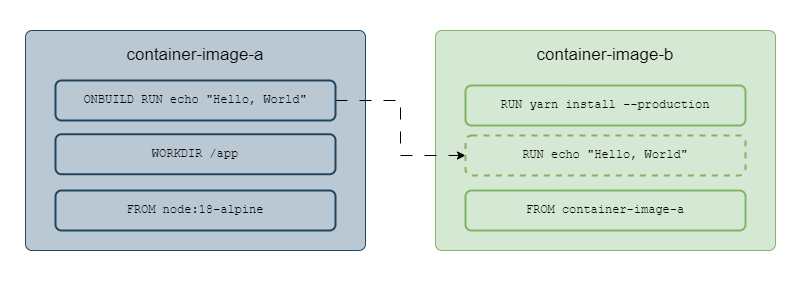

Public registries provide container images for most use cases but they might not cover all of them. That's why container engines such as Podman & Docker and CLI tools like `buildah` provide utilities for creating custom <a href="/posts/kubernetes/container-images" target="_blank">container images</a>.

The build steps are written in a plaintext file called **Containerfile** and parsed by container engines (or `buildah`) during the build process.

```dockerfile
# Containerfile
FROM node:18-alpine
LABEL version="1.0" 
WORKDIR /app
COPY . .
RUN yarn install --production
CMD ["node", "src/index.js"]
EXPOSE 3000
```

## Containerfile Instructions
Steps inside the containerfile are defined using instructions such as `FROM`, `RUN`, `ADD`, `COPY`, etc. 
Container Engines go through the containerfile line-by-line and perform each step, stacking a new image layer on top of the previous one.

### FROM
`FROM` instruction specifies the base layer container image. The base layer image could be chosen based on OS preference (like Fedora, Kali, etc.) or programming language preference (like gcc, python, etc.), or any other preference.
It is mandatory to have a `FROM` instruction in the containerfile.

### ARG
Variables for `FROM` instruction are defined using `ARG`.

```dockerfile
ARG IMAGE_VERSION=3.7
FROM python:${IMAGE_VERSION}
```

After `FROM` instruction is executed, the value for the variable declared in `ARG` becomes inaccessible.

### ENV
The Environment variables (used by other instructions or container at runtime) are declared using `ENV`.

```dockerfile
ENV DEPLOYMENT_FOLDER=src
WORKDIR ${DEPLOYMENT_FOLDER}
```

The `=` operator between the variable name and its value is optional.

### LABEL
`LABEL` is used to add metadata for container images in the form of key-value pairs. Metadata usually contains the author's name, author's email, version of the container image, etc.

### ADD
`ADD` instruction will copy files/directories from the source (host OS/URL/tarball) to the destination (container image). `ADD` allows permissions to be omitted on the copied files/directories with the `--chown` flag.

```dockerfile
ADD --chown=user:group src/ dest
```

Builds are performed inside a build context directory on the host. `ADD` will fail if the source file/directory is outside the build context.

### COPY
`COPY` is similar to `ADD` but it is limited to sources on the host, it doesn't support URLs or tarball. `COPY` is sufficient for most use cases, so it is preferred over `ADD`.

### WORKDIR
`WORKDIR` changes the current working directory (inside the image) for the next instructions. 

### RUN
`RUN` instruction executes the shell command passed as an argument. 

A temporary container is created to execute the shell command and the changes on the file system (after command execution) are layered on top of existing image layers. By default, the instruction `RUN apt-get update -y` will be executed as `/bin/bash -c apt-get update -y`. 

`SHELL` instruction is used in containerfile to change the default shell for `RUN`, for example, `SHELL ["/bin/zsh", "-c"]` will change the default shell from `bash` to `zsh`.

### EXPOSE
`EXPOSE` specifies the network ports to be used by the container on runtime. The ports still have to be published when the <a href="/posts/kubernetes/container-lifecycle/#port-forwarding" target="_blank">container is provisioned</a>.

### CMD
`CMD` adds a shell command that will be executed on container startup. `CMD` instructions could be written as `CMD param1 param2` or `CMD ["/bin/executable", "param1", "param2"]`. 

Adding a `CMD` instruction can define the behavior of the container on startup, for example, a webserver container should start the webserver automatically on startup by running the invocation command defined in `CMD`.

### ENTRYPOINT
If the executable on container startup is expected to be the same in most conditions then it is preferable to add `ENTRYPOINT` over `CMD`. Parameters for the executable could be passed from `CMD` instruction.

```dockerfile
ENTRYPOINT /bin/executable
CMD ["param1", "param2"]
```

### VOLUME
To create a mount point inside the container, `VOLUME` instruction can be used. During runtime, the `--volume` flag is used to map a directory on the host to the mount point declared by `VOLUME` instruction. The data stored on the mount point will persist after container execution.

### ONBUILD
The command added in the `ONBUILD` instruction is executed when the built image is used as the base container image. 

If container image `container-image-b` uses `container-image-a` as a base image, then the `ONBUILD` instruction defined in `container-image-a` will be triggered after `FROM` instruction is executed in `container-image-b`.

<p align="center"></p>
<p align="center"><small><i>Execution of ONBUILD instruction</i></small></p>

Using `ONBUILD`, the developers can ensure that any new image built upon their container image has the latest source code or that packages are up-to-date.

```dockerfile
ONBUILD RUN git clone source-code-repo-link.git
```

### USER
`USER` instruction sets `UID` or `GID` during the build process.

## Building container images using Docker
Docker and Podman provide `build` subcommand for building container images from containerfile.

```bash
docker build .
```

`.` will be substituted with the current working directory on the host. 

By default Docker expects *Dockerfile* (instead of *Containerfile*) in the build context, `--file` flag could be used to pass the path to containerfile.

```bash
docker build --tag node-application:latest . --file ./Containerfile
```

Container Engines cache the built layers to save time and storage. Cached layers are reused in other image builds to disable this behavior `--no-cache` flag could be used with the `build` subcommand.

`--rm` flag ensures that the intermediate container images are removed once the build process is successful.

Adding files with sensitive data to `.dockerignore` will make sure that they aren't included in the container image.

## Building container images using buildah
`buildah` provides a `bud` subcommand for building container images from containerfile.

```dockerfile
buildah bud --tag "webserver:latest" .
```

Images built by `buildah` could then be executed using Podman and Docker or any other OCI image-compatible container engine. Podman also has a `build` subcommand for building container images and it uses the same code as `buildah`.

`buildah` provides finer control over image building process that allows users to
* Create base images using the scratch image, an image with a minimal footprint.
* Mount a container's root filesystem, useful for debugging container-related issues.
* Create a container image from a working container, helpful if Containerfile isn't accessible.
* Execution of containerfile instructions using subcommands. For example, `RUN` instruction could be executed on a container image using `buildah run`. Similarly for `COPY` and `ADD` instructions.
* Debug image building process by executing instructions manually with buildah.
* Making ad-hoc changes to existing container images.
* Automating build process.

# Resources Referenced in this Article
<a href="https://opencontainers.org/about/overview/" target="_blank">About the Open Container Initiative</a>  
<a href="https://github.com/opencontainers/image-spec/blob/main/manifest.md" target="_blank">OCI Image Manifest Specification</a>  
<a href="https://github.com/opencontainers/image-spec/blob/main/layer.md" target="_blank">Image Layer Filesystem Changeset</a>  
<a href="https://github.com/opencontainers/image-spec/blob/main/config.md" target="_blank">OCI Image Configuration</a>  
<a href="https://docs.docker.com/storage/storagedriver/" target="_blank">About storage drivers</a>  
<a href="https://docs.docker.com/engine/reference/builder/" target="_blank">Dockerfile reference</a>  
<a href="https://docs.docker.com/engine/reference/commandline/build/" target="_blank">docker build</a>  
<a href="https://github.com/containers/buildah/blob/main/README.md" target="_blank">buildah</a>  
<a href="https://hub.docker.com/_/scratch" target="_blank">scratch container image</a>  
<a href="https://github.com/containers/buildah/blob/main/docs/tutorials/01-intro.md" target="_blank">Buildah Tutorial 1</a>  
<a href="https://github.com/containers/buildah#buildah-and-podman-relationship" target="_blank">Buildah and Podman relationship</a>  