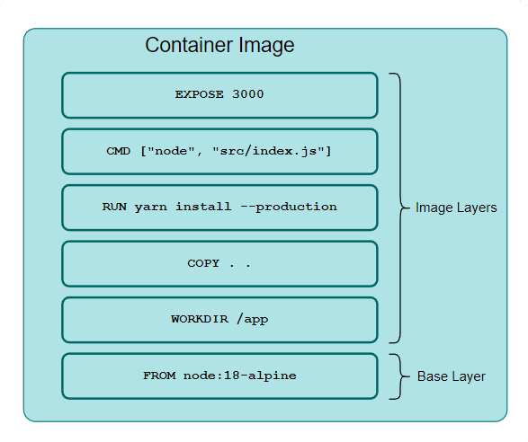

A container image is a static file that contains the necessary resources (packages, configuration, other dependencies) required to provision a container. It consists of multiple layered-filesystems and a *Manifest* file, containing its metadata.

# Open Container Initiative (OCI) Specification
Open Container Initiative was established by The Linux Foundation in 2015 to provide
* Runtime specification
* Image specification
* Distribution specification
for container images.

A container image created from OCI Image specification should have
* Layered Filesystem: Stores the packaged contents of the container.
* Image Index and Manifest: Contains a manifest list that stores the container image metadata for multiple platforms.
* Image Configuration: Arguments and environment variables for the applications inside the container.

Images created from Docker, Podman, and buildah follow OCI Image Specification.

## Layered filesystems
Each filesystem layer stores changes performed on top of the previous layer. They are differentiated using their SHA256 digest.

<p align="center"></p>
<p align="center"><small><i>Base and Image Layers</i></small></p>

To build a container image the developer has to use another container image as a **base layer**. The base layer container image could be chosen based on OS preference (like Fedora, Kali, etc.) or programming language preference (like gcc, python, etc.), or any other preference. On top of the base layer developers can add changes (like installing packages and dependencies, performing configuration changes, etc.) by creating stacked **image layers**.

The layers are cached on the host to reduce the build time and storage space required by the image. Cached layers could also be reused in the build process of different images, for example, two images (on the same host) using base layer `ubuntu:22.0` will refer to the same cached layer.

When a container image is provisioned as a container, the base and image layers are locked as read-only. 

<p align="center"></p>
<p align="center"><small><i>Read-Write layer added on top of Image Layers</i></small></p>

A data state of image layers is generated and a writable **container layer** is added on top. It stores runtime changes (like file creation, configuration changes, etc.) and deleted with the container.

## Image Index and Manifest
The **Image Index** of a container image contains the metadata related to the filesystem layers, the command to be executed once the container is provisioned and other information required by the container runtime.

To view the index of a container image, the `manifest` subcommand with `inspect` option could be used.

```bash
docker manifest inspect docker.io/library/httpd:latest
```

The output will be a JSON document with a `manifest` array containing references to multiple image variations based on the OS and CPU architecture of the host.

```json
{
    "schemaVersion": 2,
    "mediaType": "application/vnd.docker.distribution.manifest.list.v2+json",
    "manifests": [
        {
            "mediaType": "application/vnd.docker.distribution.manifest.v2+json",
            "size": 1366,
            "digest": "sha256:d866e5c91f31fc6a122aaf37149cc67ba2ca0de68ae73ab206747a190937967e",
            "platform": {
                "architecture": "amd64",
                "os": "linux"
            }
        },
        {
            "mediaType": "application/vnd.docker.distribution.manifest.v2+json",
            "size": 1366,
            "digest": "sha256:32588e5c7552750100ad3110a64d163b1881ce92216d67e828c42d3322c439d1",
            "platform": {
                "architecture": "arm",
                "os": "linux",
                "variant": "v5"
            }
        },
        {
            "mediaType": "application/vnd.docker.distribution.manifest.v2+json",
            "size": 1366,
            "digest": "sha256:67586a7e127abd9b362884172b575a43b3342725ae310c339f4f7d5e5bdba918",
            "platform": {
                "architecture": "arm",
                "os": "linux",
                "variant": "v7"
            }
        },
        {
            "mediaType": "application/vnd.docker.distribution.manifest.v2+json",
            "size": 1366,
            "digest": "sha256:bc5f484630b50cec12a50035d22ed717d980c52c9871105e91e276ebcbee69a2",
            "platform": {
                "architecture": "arm64",
                "os": "linux",
                "variant": "v8"
            }
        }
    ]
}
```

An image could be built and distributed for different platforms with singular name and tag. The container engine verifies from the manifest if a compatible image is available for the host.

## Image Configuration
The changes to be implemented on the filesystem during the creation of the container are stored in the **image configuration** . It also stores parameters and environment variables for applications inside the container.

`docker image inspect image-name` could be used to view the configuration of a container image in JSON format.

```bash
[
    {
        "Id": "sha256:daab1fa13f8608841399e8552ab7833e90307543509ced13cd40b3f7411632a3",
        "RepoTags": [
            "httpd:latest"
        ],
        "RepoDigests": [
            "httpd@sha256:76618ddd53f315a1436a56dc84ad57032e1b2123f2f6489ce9c575c4b280c4f4"
        ],
        "Parent": "",
        "Comment": "",
        "Created": "2023-03-07T20:24:12.062824222Z",
        "Container": "30df81c7e4e9fcec6990ff7a5aee09f0b8d765a65d575599d92fa3d2c2da6048",
        "DockerVersion": "20.10.23",
        "Author": "",
        "Config": {
            "Hostname": "",
            "Domainname": "",
            "User": "",
            "AttachStdin": false,
            "AttachStdout": false,
            "AttachStderr": false,
            "ExposedPorts": {
                "80/tcp": {}
            },
            "Tty": false,
            "OpenStdin": false,
            "StdinOnce": false,
            "Env": [
                "PATH=/usr/local/apache2/bin:/usr/local/sbin:/usr/local/bin:/usr/sbin:/usr/bin:/sbin:/bin",
                "HTTPD_PREFIX=/usr/local/apache2",
                "HTTPD_VERSION=2.4.56",
                "HTTPD_SHA256=d8d45f1398ba84edd05bb33ca7593ac2989b17cb9c7a0cafe5442d41afdb2d7c",
                "HTTPD_PATCHES="
            ],
            "Cmd": [
                "httpd-foreground"
            ],
            "Image": "sha256:a5930d7e9b3c7fa530cff2806db329c228e08a75d9db73314b3b5724c0858b60",
            "Volumes": null,
            "WorkingDir": "/usr/local/apache2",
            "Entrypoint": null,
            "OnBuild": null,
            "Labels": null,
            "StopSignal": "SIGWINCH"
        },
        "Architecture": "amd64",
        "Os": "linux",
        "Size": 145140075,
        "VirtualSize": 145140075,
        "RootFS": {
            "Type": "layers",
            "Layers": [
                "sha256:650abce4b096b06ac8bec2046d821d66d801af34f1f1d4c5e272ad030c7873db",
                "sha256:2309cdaf4afb9ce407a51c6d3ae54fb915bfbcc480e596e72417206902b4c51f",
                "sha256:849b101b0e3b3f03fad010462b6ab14f1372d449a1fb803750182547e7df3d28",
                "sha256:a30707f342ec97e05e57d91804d8ae3d5f93d5e6c9ef2c4e8a3d805b70b0d53e",
                "sha256:087e3023406cdd4c0765ee68d24c88da0c0335ac2ce82d991bd336a648c033c6"
            ]
        },
        "Metadata": {
            "LastTagTime": "0001-01-01T00:00:00Z"
        }
    }
]
```

# Distributing container images
## Tarfile
### Exporting containers
Containers could be exported as tar archives using the `export` subcommand.

```bash
docker export httpd-container > httpd.tar
```

To import this tarfile as a container image, the `import` subcommand is used.

```bash
docker import httpd.tar
```

`import` also supports URL for tarfile as an argument.

### Exporting container images
To export container images as tarfile we can use the `save` subcommand. Output from the command needs to be redirected using `>` operator into a `*.tar` file.

```bash
docker save httpd:latest > httpd.tar
```

This tarfile could be loaded as a container image using the `load` subcommand and `<` operator.

```bash
docker load < httpd.tar
```

## Container Registry
<p align="center"></p>
<p align="center"><small><i>Distributing images using Container Registry</i></small></p>

**Container Registry** is a service that allows the distribution of container images. It also provides features such as

* Access control to images
* Vulnerability scanning
* Control over distribution
* High availability

Some of the commonly used container registries are Quay.io, DockerHub, and Google Container Registry.

A registry account is necessary to distribute an image. The credentials from the registry will be used to log in from the container engine.

```bash
docker login quay.io
```

The image to be pushed should be tagged/renamed in format `<registry-name>/<username>/<image-name>:<image-tag>`, for example, `quay.io/username/webserver:latest`.

```bash
docker tag webserver:latest quay.io/username/webserver:latest
```

`push` subcommand is used to upload the tagged image to the registry.

```bash
docker push quay.io/username/webserver:latest
```

### Creating images from existing containers
<p align="center"></p>
<p align="center"><small><i>Commit running containers to container image</i></small></p>

To create a container image from a running container, the `commit` subcommand could be used.

```bash
docker commit webserver-container quay.io/username/webserver:latest
```

# Resources Referenced in this Article
<a href="https://opencontainers.org/about/overview/" target="_blank">About the Open Container Initiative</a>  
<a href="https://github.com/opencontainers/image-spec/blob/main/manifest.md" target="_blank">OCI Image Manifest Specification</a>  
<a href="https://github.com/opencontainers/image-spec/blob/main/layer.md" target="_blank">Image Layer Filesystem Changeset</a>  
<a href="https://github.com/opencontainers/image-spec/blob/main/config.md" target="_blank">OCI Image Configuration</a>  
<a href="https://docs.docker.com/storage/storagedriver/" target="_blank">About storage drivers</a>  
<a href="https://docs.docker.com/engine/reference/commandline/export/" target="_blank">docker export</a>  
<a href="https://docs.docker.com/engine/reference/commandline/import/" target="_blank">docker import</a>  
<a href="https://docs.docker.com/engine/reference/commandline/save/" target="_blank">docker save</a>  
<a href="https://docs.docker.com/engine/reference/commandline/load/" target="_blank">docker load</a>  
<a href="https://docs.docker.com/engine/reference/commandline/commit/" target="_blank">docker commit</a>   
<a href="https://docs.docker.com/engine/reference/commandline/push/" target="_blank">docker push</a>   