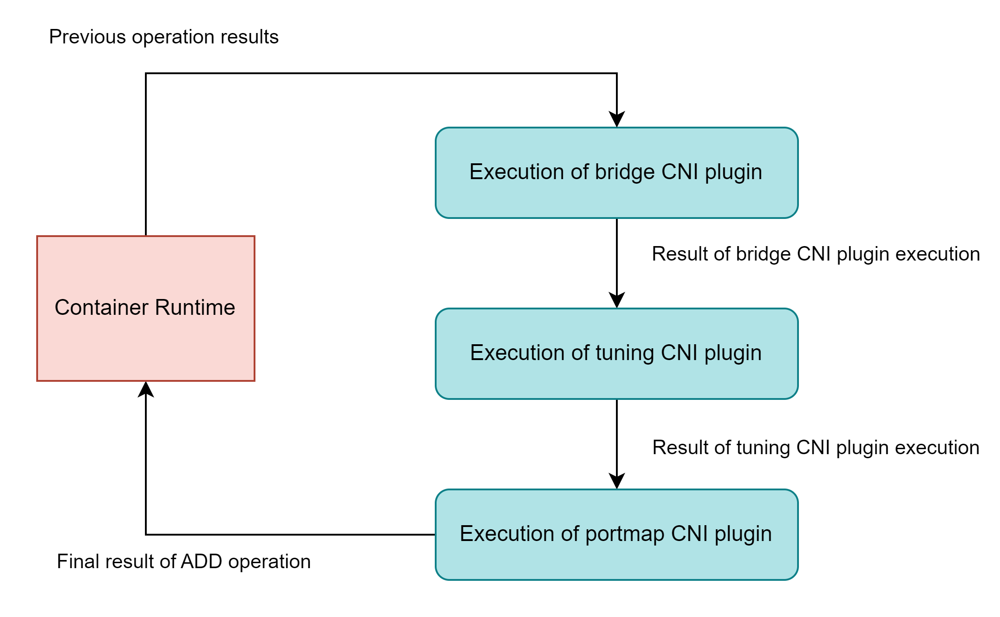
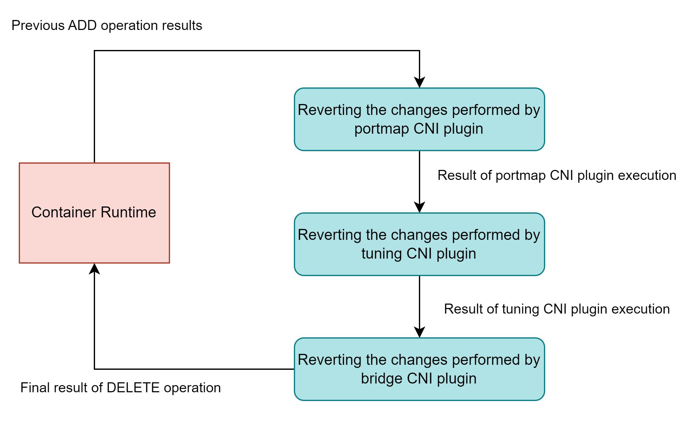

<a href="/posts/kubernetes/containers/#container-runtime" target="_blank">Container runtimes</a> allocate <a href="/posts/kubernetes/container-architecture/#network" target="_blank">network namespaces</a> for containers deployed on the host. A network interface (like `docker0`, `bridge`,  or `host`) is configured inside the namespace to facilitate the communication with host, the internet, or other containers.

The **Container Network Interface (CNI)** project provides specifications and libraries for implementing a plugin-based solution for managing network interfaces for containers. The runtime executes the CNI plugins provided as binary executable files.

A **network configuration** is passed to the runtime as a JSON file. It contains the details of the CNI plugins and the network interfaces to be configured. 

Example of a network configuration file from CNI specification

```json
{
  "cniVersion": "1.0.0",
  "name": "dbnet",
  "plugins": [
    {
      "type": "bridge",
      // plugin specific parameters
      "bridge": "cni0",
      "keyA": ["some more", "plugin specific", "configuration"],
      
      "ipam": {
        "type": "host-local",
        // ipam specific
        "subnet": "10.1.0.0/16",
        "gateway": "10.1.0.1",
        "routes": [
            {"dst": "0.0.0.0/0"}
        ]
      },
      "dns": {
        "nameservers": [ "10.1.0.1" ]
      }
    },
    {
      "type": "tuning",
      "capabilities": {
        "mac": true
      },
      "sysctl": {
        "net.core.somaxconn": "500"
      }
    },
    {
        "type": "portmap",
        "capabilities": {"portMappings": true}
    }
  ]
}
```

Runtime executes the CNI plugins with the following environment variables
* `CNI_COMMAND`: Operation for CNI (`ADD`/`DELETE`/`CHECK`/`VERSION`)
* `CNI_ARGS`: Arguments for CNI 
* `CNI_PATH`: Path to CNI binaries.
* `CNI_IFNAME`: Name of the network interface to be configured
* `CNI_NETNS`: Path to the container's network namespace
* `CNI_CONTAINERID`: Container ID assigned by the runtime

# CNI Operations
According to the CNI specification, a CNI plugin should have `ADD`, `DELETE`, `CHECK`, and `VERSION` operations.

## `ADD`
If the environment variable passed to the runtime by the CNI plugin is `CNI_COMMAND=ADD` then it will create or configure the network interfaces specified in the configuration.

<p align="center"></p>
<p align="center"><small><i>Execution flow of ADD operation</i></small></p>

The interfaces will be created or configured in the order specified in the `plugins` key inside the network configuration. The result from the previous plugin execution will be passed to the next plugin and the final result will be stored with runtime.

So from the example above the `bridge` plugin will be executed first, followed by the `tuning` plugin, and finally the `portmap` plugin.

## `DELETE`
The `DELETE` operation will undo operations performed by the `ADD`, deleting the created interfaces and reverting the configurations. It executes CNI plugins in the reverse order of their specification in network configuration. So the changes performed by the `portmap` plugin will be reverted first then the `tuning` plugin and lastly the `bridge` plugin.

<p align="center"></p>
<p align="center"><small><i>Execution flow of DELETE operation</i></small></p>

It has to be preceded by an `ADD` operation because it takes the final result stored by the last `ADD` operation as input from container runtime.

## `CHECK`
`CHECK` operation probes the container and network interfaces for their health and current status. The container runtime will go through the changes performed by each CNI plugin and validate its functionality. Similar to the `DELETE` operation it also uses the result from the previous `ADD` operation as input from container runtime.

## `VERSION`
The `VERSION` operation returns the version of the CNI plugin.

# Reference CNI Plugins
## Network Interface Plugins
- `bridge`: Creates a virtual switch that connects all the containers on a host. An IP address is assigned to each container by the bridge.
- `macvlan`: Creates a sub-interface from the host interface. Each virtual interface connected to `macvlan` has its own MAC address.
* `ipvlan`: Similar to `macvlan` but all connected devices share the same MAC address. Before transmitting a packet the kernel driver inspects the IP address of the destination virtual interface.
* `ptp`: Creates a point-to-point link between the container and its host by creating a Virtual Ethernet (veth) pair where one end resides inside the container and the other on the host.
- `host-device`: An existing device could be moved from the host's network namespace to the container's network namespace.
- `vlan`: Creates a Virtual Local Area Network (VLAN) interface between the host and the container.

## Windows Plugins
These plugins are created specifically for Microsoft Windows containers.
- `win-bridge`: All containers will be connected to a bridge network that has an endpoint on the host's network namespace.
- `win-overlay`: An **Overlay network** allows containers from different hosts to act as if they are on the same host. Using the `win-overlay` plugin all containers on a host could be connected to an Overlay network.

## IP Address Allocation Plugin
- `dhcp`: The IP leased by the DHCP server has to be renewed periodically. The `dhcp` plugin creates a daemon separate from the container to perform these requests.
- `host-local`: Allocates IPv4 and IPv6 addresses out of a provided range of addresses.
- `static`: Allocates static IPv4 and IPv6 addresses to the containers.

## Other Plugins
- `tuning`: Used with other plugins to change system controls or interface attributes (like MTU and MAC address)
- `portmap`: Forwards traffic from the host's network ports to the container's network ports.
- `bandwidth`: Configures traffic bucket filter (tbf) to limit bandwidth on ingress and egress traffic.
- `sbr`: Configures source based routing (sbr) where the application (source) decides the correct network interface for outgoing traffic.
- `firewall`: Creates firewall rules to allow traffic to the container's IP address.

# Example of 3rd Party CNI Plugin: Weave
The **Weave** is a CNI plugin created by Weaveworks that creates an overlay mesh network that allows Dockers containers running on different hosts to connect. 

Features of Weave:
- Containers from different hosts and data centers will act as if they are on the same network without any additional configuration.
- Application containers (running on any host) could be exposed to the outside network.
- It can create networks between legacy systems and containers.
- Traffic could be encrypted.
- Supports Amazon ECS, Apache Mesos, Kubernetes, etc.


<iframe src="https://bovem.substack.com/embed" width="100%" height="320" style="border:2px solid #EEE; background:white;" frameborder="0" scrolling="no"></iframe>

# Resources
<a href="https://www.tigera.io/learn/guides/kubernetes-networking/kubernetes-cni/" target="_blank">Kubernetes CNI Explained</a>   
<a href="https://www.youtube.com/watch?v=YjjrQiJOyME" target="_blank">Introduction to CNI, the Container Network Interface Project - Bryan Boreham & Dan Williams</a>   
<a href="https://www.youtube.com/watch?v=zChkx-AB5Xc" target="_blank">Deep Dive: CNI - Bryan Boreham, Weaveworks & Dan Williams, Red Hat</a>   
<a href="https://www.tigera.io/learn/guides/kubernetes-networking/" target="_blank">Kubernetes Networking: The Complete Guide | Tigera</a>   
<a href="https://www.tigera.io/learn/guides/kubernetes-networking/container-networking/" target="_blank">Container Networking: What You Should Know</a>   
<a href="https://github.com/containernetworking/cni/blob/main/SPEC.md" target="_blank">cni/SPEC.md at main · containernetworking/cni · GitHub</a>   
<a href="https://www.youtube.com/watch?v=zmYxdtFzK6s" target="_blank">Kubernetes Networking: How to Write a CNI Plugin From Scratch - Eran Yanay, Twistlock</a>   
<a href="https://www.redhat.com/sysadmin/cni-kubernetes" target="_blank">A brief overview of the Container Network Interface (CNI) in Kubernetes | Enable Sysadmin</a>   
<a href="https://www.cni.dev/plugins/current/" target="_blank">CNI Plugins Overview</a>   
<a href="https://kubernetes.io/docs/concepts/extend-kubernetes/compute-storage-net/network-plugins/" target="_blank">Network Plugins | Kubernetes</a>   
<a href="https://github.com/containernetworking/plugins" target="_blank">containernetworking/plugins</a>   
<a href="https://www.weave.works/docs/net/latest/overview/" target="_blank">Introduction to Weave Net</a>   