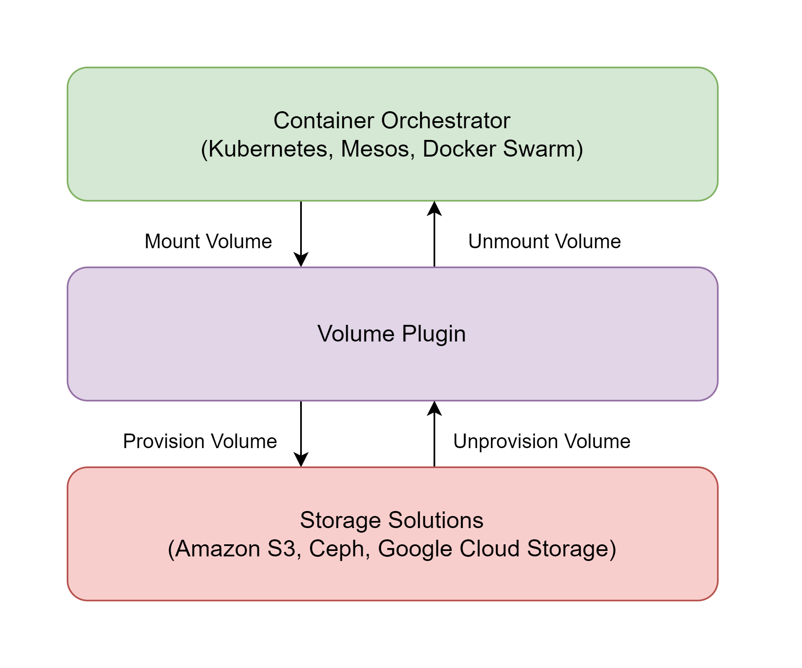
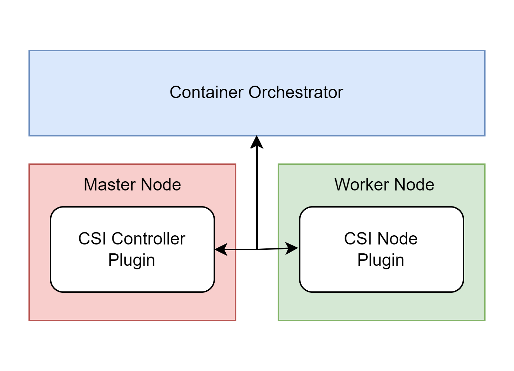
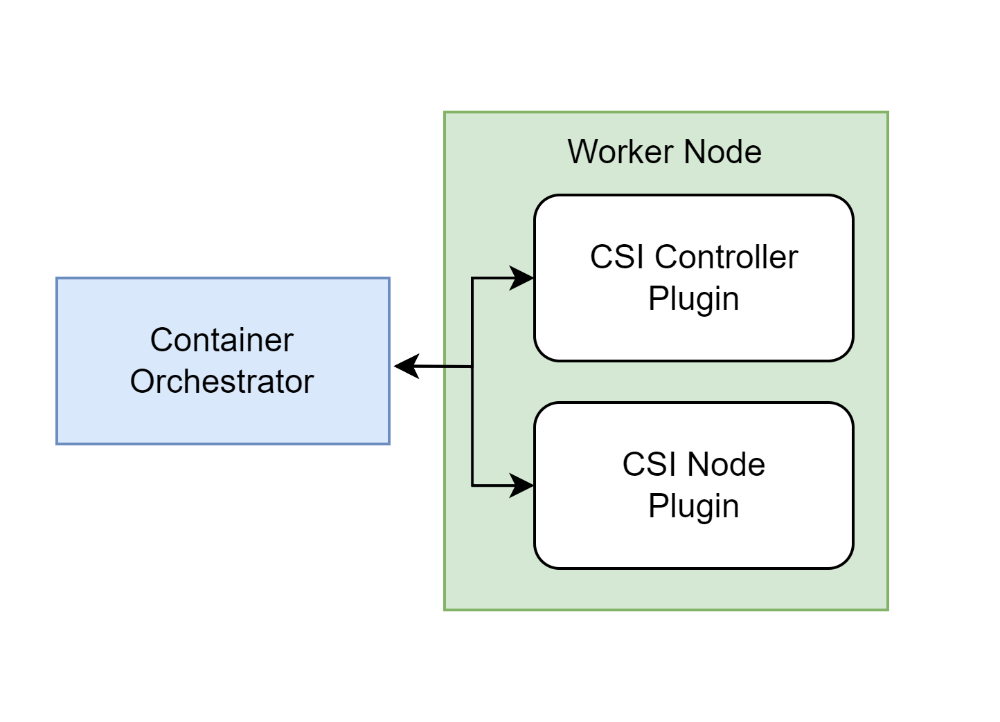
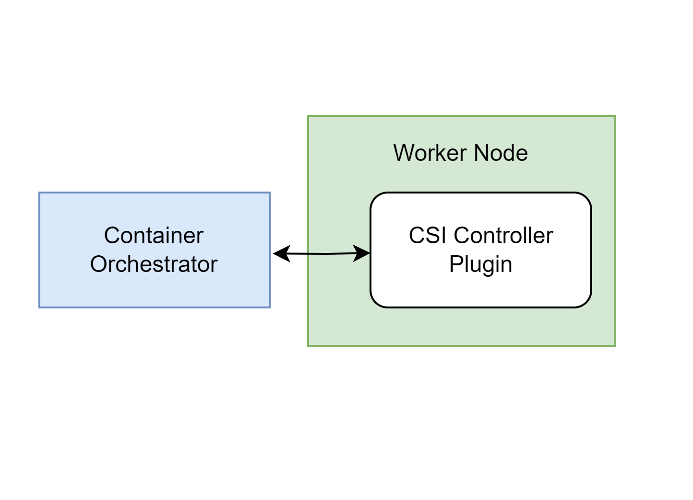
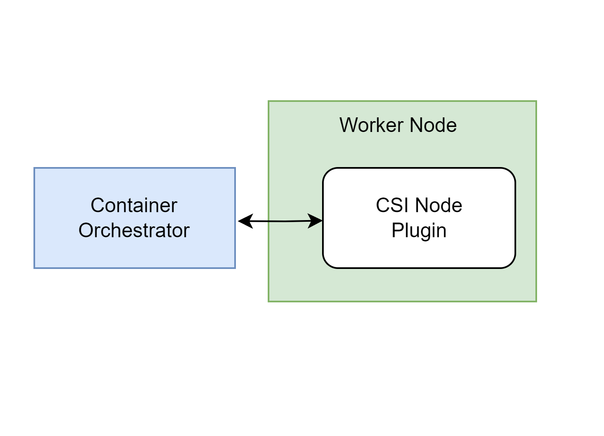
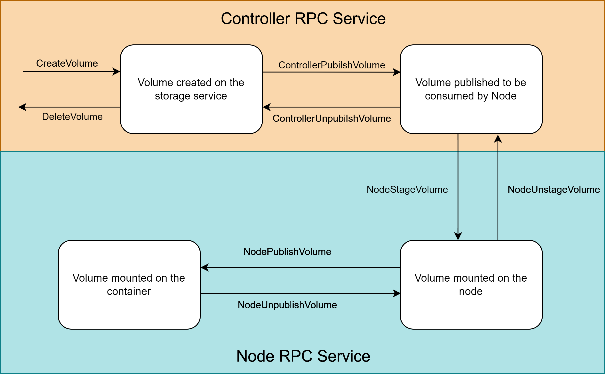

There is a multitude of choices for storage solutions (Amazon S3, Ceph, Google Cloud Storage, etc.) and combined with the choices of container orchestrators (Kubernetes, Apache Mesos, Docker Swarm, etc.) the permutations are endless.

A **Container Storage Interface (CSI)** plugin is implemented by the storage providers (Amazon, Google, IBM) as an interface to provision and mount volumes for workloads when requested by container orchestrators. The CSI plugin provisions the volume, procures it from the node hosting the container, and mounts it to the requesting container. It standardizes the process of allocating storage for containers between different orchestrators.

# Volume Plugin
Before CSIs, the **Volume Plugins** were used to link the storage solutions and container orchestrators. 

Limitations of Volume Plugins
- Volume Plugins were a part of Kubernetes core. Thus, their development and release were tightly coupled with Kubernetes.
- Instability and reliability issues with volume plugins could lead to the failure of core Kubernetes components.
- Every container orchestrator required a different implementation of the plugin.
- Orchestrators had to communicate with the storage solution throughout the lifecycle of the volume to avoid failures.
- Volume Plugins had to be open source.

## Lifecycle of a Volume with Volume Plugins

<small><i>Volume Plugins</i></small>

# CSI Specification
The CSI specification defines interfaces for implementing a plugin

* The plugin should work seamlessly across all container orchestrators.
* Ability to dynamically provision and unprovisioned volumes.
* Mounting, unmounting, attaching, and detaching volumes on the node.
* Ability to work with block and mountable volumes.
* Performing snapshots of volumes, that could be used for provisioning a new volume.

# Architecture of a CSI
The orchestrator interacts with the CSI plugin through gRPCs, a cross-platform Remote Procedure Call framework introduced by Google. 

**Remote Procedure Calls (RPCs)** are used in distributed systems to execute a procedure (subroutine) on a remote system. The CSI's RPCs are idempotent i.e. a call should not change the result beyond its initial application.

## RPC endpoints
There are three sets of gRPCs provided by the CSI Plugin: Identity, Controller, and Node service.

### Identity Service RPCs
The **Identity Service** provides gPRC endpoints that allow an orchestrator to query the capabilities of the plugin, its health, and the metadata associated with the plugin.

gRPC endpoints provided by the identity service:
- `GetPluginInfo`: Returns the plugin metadata
- `GetPluginCapabilities`: Returns the plugin capabilities (fetched from controller service)
- `Probe`: Returns the health of the plugin

### Controller Service RPCs
**Controller Service** groups all the gRPC endpoints responsible for
* Creating and deleting the volume
* Publishing and unpublishing the volume to the nodes
* Creating snapshots of the volumes

gRPC endpoints provided by the controller service:
* `CreateVolume`: Creates the volumes on the storage solution. The volume could be created as an empty new volume or from an existing snapshot or from an existing volume.
* `DeleteVolume`: Deletes a provisioned volume on the storage solution. Although the volume is deleted its snapshots are functional and available as sources for new volumes.
* `ControllerPublishVolume`: Performs the necessary operations to make the volume available to the requesting node. 
* `ControllerUnpublishVolume`: Reverts the operations performed in `ContainerPublishVolume`.
* `ValidateVolumeCapabilities`: Verifies the provisioned volume for capabilities requested by the orchestrator.
* `ListVolumes`: Returns information about all the volumes.
* `ControllerGetVolume`: Called by the orchestrator to fetch the current information associated with a specific volume.
* `GetCapacity`: Queries the storage pool for its current capacity.
* `ControllerGetCapabilities`: Returns the details of the capabilities of the controller service.
* `CreateSnapshot`: Creates a snapshot of an existing volume.
* `DeleteSnapshot`: Deletes the volume snapshot.
* `ListSnapshots`: Returns details of all snapshots.
* `ControllerExpandVolume`: Using this RPC the orchestrator can request for expansion in the size of a volume.

### Node Service RPCs
These RPCs are called from the node where the volume is requested. They are responsible for the actions performed on the volume after it is mounted on the node.

gRPC endpoints provided by the controller service:
- `NodeStageVolume`: After the workload (container) is scheduled on the orchestrator it calls `NodeStageVolume` on the volume provided by `ContainerPublishVolume`. The volume is mounted on the node on `stage_path` temporarily.
- `NodeUnstageVolume`: Reverts the actions performed by `NodeStageVolume`.
- `NodePublishVolume`: After `NodeStageVolume` is called the `NodePublishVolume` mounts the volume on `target_path` to be consumed by the workload.
- `NodeUnpublishVolume`: Reverts the actions performed by `NodeUnpublishVolume`.
- `NodeGetVolumeStats`: Returns the capacity statistics for a volume.
- `NodeGetCapabilities`: Called by the orchestrator to check the capabilities of the node services.
- `NodeGetInfo`: Returns the information for the node where the volume has to be mounted.
- `NodeExpandVolume`: Expands the volume mounted on the node. This call should be performed after `NodeStageVolume` and `NodePublishVolume`.

## Implementation of a CSI
CSI specification provides examples of different implementations for plugins.

### Centralized Controller Plugin

<small><i>Centralized Controller CSI Plugin</i></small>

The controller service RPCs could be packaged in a **Controller Plugin** located on the master node of the orchestrators. The node service RPCs are bundled as **Node Plugin** located on each worker node (or any node that could request volumes).

### Headless Plugin

<small><i>Headless CSI Plugin</i></small>

The Controller and Node Plugin could be placed together inside the worker node.

### Controller Plugin

<small><i>Controller CSI Plugin</i></small>

CSI could be deployed with just the Controller plugin on the worker node that provides both controller and node services.

### Node Plugin

<small><i>Node CSI Plugin</i></small>

CSI could also be deployed with just a Node plugin on the worker node providing just the node services.

## Volume lifecycle with CSI

<small><i>Lifecycle of a Volume managed by CSI Plugin</i></small>

### Mounting a Volume on a Container 
1. A Workload is scheduled by the container orchestrator.
2. The orchestrator calls `CreateVolume` RPC to provision a volume on the storage solution.
3. Once the volume is provisioned on the storage solution the orchestrator calls `ContainerPublishVolume` to make it available to the node.
4. After the volume is available to the node, the orchestrator calls `NodeStageVolume` to mount the volume on the node at `stage_path`.
5. Finally, the orchestrator calls `NodePublishVolume` to mount the volume on `target_path`. Thus making it available for the container.

### Deleting a Volume
1. The volume to be deleted is unpublished by the orchestrator by calling `NodeUnpublishVolume` RPC.
2. Once unpublished from the container the volume is unstaged by `NodeUnstageVolume`.
3. The unstaged volume is then unpublished from the node by `ContainerUnpublishVolume`.
4. Finally, the unpublished volume is deleted by `DeleteVolume` RPC.

# Example of a CSI: Intel Optane Persistent Memory PMEM-CSI Storage Driver
Intel Optane is a tiered persistent memory technology. It is used as a high-performance storage for desktop (improving system boot time) and enterprise (CAD, Modeling, Media editing) workloads.

The PMEM-CSI storage driver is provided by Intel to configure the Optane Persistent Memory as a storage solution for Kubernetes. The persistent volumes could be provisioned dynamically on the Optane memory and mounted on the containers present on the cluster.

Using this driver the developers can take advantage of Optane memory in their cache data store like <a href="/posts/kubernetes/operator-sdk/#creating-a-go-based-operator" target="_blank">Memcached Operator</a>.

<iframe src="https://bovem.substack.com/embed" width="100%" height="320" style="border:2px solid #EEE; background:white;" frameborder="0" scrolling="no"></iframe>

# Resources
<a href="https://www.computerweekly.com/feature/Container-storage-101-What-is-CSI-and-how-does-it-work" target="_blank">Container storage 101: What is CSI and how does it work? | Computer Weekly</a>   
<a href="https://medium.com/google-cloud/understanding-the-container-storage-interface-csi-ddbeb966a3b" target="_blank">Understanding the Container Storage Interface (CSI) | by anoop vijayan maniankara</a>   
<a href="https://www.youtube.com/watch?v=ktwY1anKN58" target="_blank">Container Storage Interface: Present and Future - Jie Yu, Mesosphere, Inc.</a>   
<a href="https://www.xenonstack.com/blog/container-storage-interface" target="_blank">Container Storage Interface (CSI) for Kubernetes</a>   
<a href="https://kubernetes-csi.github.io/docs/" target="_blank">Introduction - Kubernetes CSI Developer Documentation</a>   
<a href="https://kubernetes.io/blog/2019/01/15/container-storage-interface-ga/" target="_blank">Container Storage Interface (CSI) for Kubernetes GA</a>   
<a href="https://github.com/container-storage-interface/spec/blob/master/spec.md" target="_blank">container-storage-interface/spec</a>   
<a href="https://pmem.io/" target="_blank">Persistent Memory</a>   
<a href="https://github.com/intel/pmem-csi" target="_blank">intel/pmem-csi</a>   
<a href="https://www.intel.com/content/www/us/en/developer/articles/technical/persistent-memory-pmem-csi.html" target="_blank">Persistent Memory (PMEM) CSI</a>   
<a href="https://github.com/intel/pmem-csi/blob/devel/examples/redis-operator.md" target="_blank">Redis-pmem operator</a>   
<a href="https://github.com/intel/pmem-csi/blob/devel/examples/memcached.md" target="_blank">memcached with PMEM</a>   