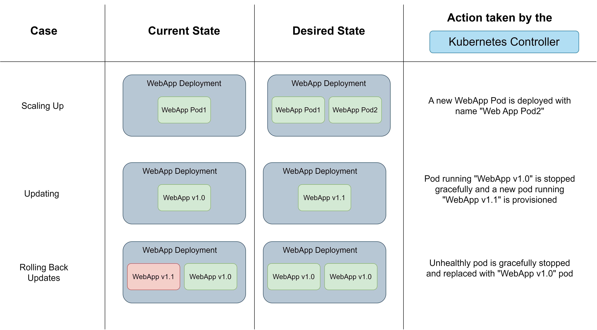
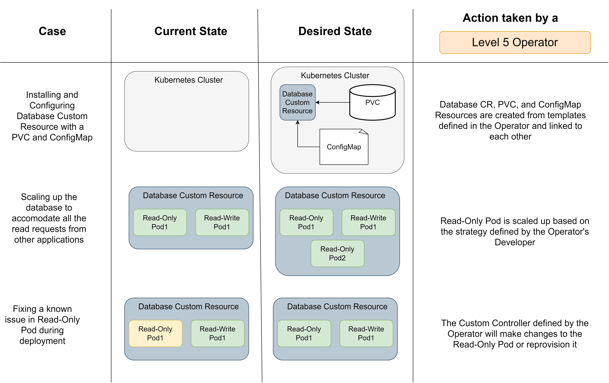

Applications built to be deployed on Kubernetes could be packaged as Operators. Operators automate the process of installation, updates, and management of the application. These automations are defined by developers based on the application's business logic.

An Operator consists of:
* Custom Resources (CRs) required by the application
* Custom controller for managing these CRs

# Control Loop
A **control loop** is an infinite loop for monitoring the state of a system. If the desired state of the system is different from its current state then the control loop makes changes to the system until it reaches its desired state.

An example of a control loop is a thermostat that monitors the current room temperature on frequent time intervals and if the desired temperature is different from the current temperature then it increases or decreases the cooling.

# Kubernetes Controller
The **Kubernetes controller** functions as a control loop for the resources on the cluster. It performs necessary changes to the resources using the Kubernetes API such that they reach their desired state.

* If a deployment needs to be scaled up or down (due to a manual instruction from the cluster administrator or an increase/decrease in its resource utilization) then the controller will deploy/destroy pods in the deployment.
* If an application has to be updated then the controller will make sure that eventually all the running containers are replaced with the latest version of the application (based on the rollout strategy defined in deployment).
* If updated pods aren't healthy then the controller will roll back the changes until the deployment is stable (based on deployment and rollback strategies).

<small><i>The Kubernetes Controller monitors and maintains the state of resources on the cluster</i></small>

## Reconcile Loop and Reconciliation
The loop that constantly monitors the state of resources on the cluster is called **reconcile loop** and the process of making changes to the cluster to match the desired state is called **reconciliation**.

# Human Operator
Applications using CRs with developer-defined strategies for scaling, updates, rollback, etc. like a database application that maintains two instances: read-only and read-write could not be managed by the default Kubernetes Controller. Such applications will require a **human operator** to administer their deployment on the cluster. They will be responsible for:
* Installation and configuration of the application based on the cluster's environment.
* Scaling strategies for the CRs based on current resource utilization, application's business logic, and other constraints.
* Rollout and rollback of updates to the application without affecting the end users.
* Fixing application issues during runtime.

# Kubernetes Operators
A **Kubernetes Operator** aims to automate the functions of a Human Operator automating processes like
* installation
* configuration and reconfiguration
* update
* backup
* recovery

By packaging an application as an Operator its developer could ensure that
* The deployment process is standardized in all environments.
* The application could be scaled up or down based on the logic defined by the developer.
* The application could fix itself upon encountering any known issues after deployment. Even rolling back to a previous state if required.
* New changes are rolled out strategically without breaking existing functionality.

## Capability Levels

Based on the level of maturity or capability of automation provided by an Operator it could be classified into 5 levels:

* LEVEL 1: Automated installation and initial configuration of the application.
* LEVEL 2: Patching and upgrading the application.
* LEVEL 3: Manage the complete application lifecycle i.e. backup, failure, and recovery.
* LEVEL 4: Provide application metrics, logs, and workload analysis
* LEVEL 5: Scaling (Horizontal and Vertical), reconfiguration of application, tuning, and abnormality detection.

A Level 3 operator could manage the whole application cycle while also performing Level 1 (installation & configuration) and Level 2 (patches & upgrades) automation.

<small><i>Just like the Kubernetes controller, a Kubernetes Operator monitors and maintains the state of Custom Resources of an applications</i></small>

## Custom Resources and Controller
A **Custom Controller** created by the Operator manages the state of the cluster's resources including Custom Resources (CRs) using Kubernetes API just like the default Kubernetes Controller.

It could be limited to a single namespace or deployed cluster-wide. It is recommended to have a single custom controller for a CR as multiple controllers can make changes simultaneously overwriting each other.

# Example of a Kubernetes Operator: MariaDB Operator
<a href="https://operatorhub.io/operator/mariadb-operator-app" target="_blank">MariaDB Operator</a> performs the following changes on the Kubernetes Cluster automates:
* Deployment of MariaDB server on Kubernetes with default/configured version.
* Creation of PersistentVolumeClaims (PVCs) and a custom database with a credential set.
* Future upgrades for MariaDB without affecting current services.
* Database backups
* Metrics for database

Thank you for taking the time to read this blog post! If you found this content valuable and would like to stay updated with my latest posts consider subscribing to my <a href="https://www.avni.sh/index.xml" target="_blank">RSS Feed</a>.

# Resources
<a href="https://kubernetes.io/docs/concepts/extend-kubernetes/operator/" target="_blank">Operator Pattern</a>  
<a href="https://www.cncf.io/blog/2022/06/15/kubernetes-operators-what-are-they-some-examples/" target="_blank">Kubernetes Operators</a>  
<a href="https://www.redhat.com/en/topics/containers/what-is-a-kubernetes-operator" target="_blank">What is a Kubernetes Operator</a>  
<a href="https://sdk.operatorframework.io/docs/overview/operator-capabilities/" target="_blank">Operator Capability Levels</a>  