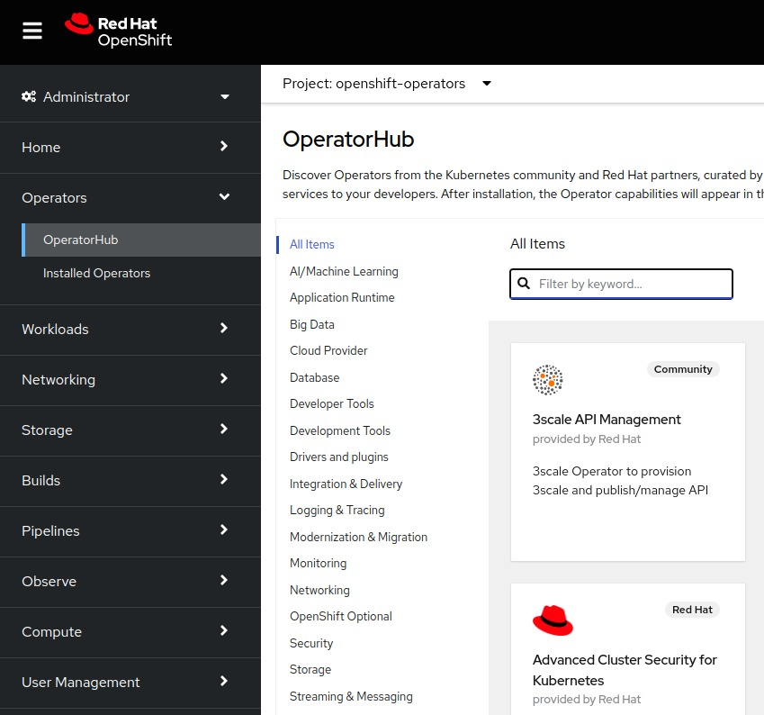
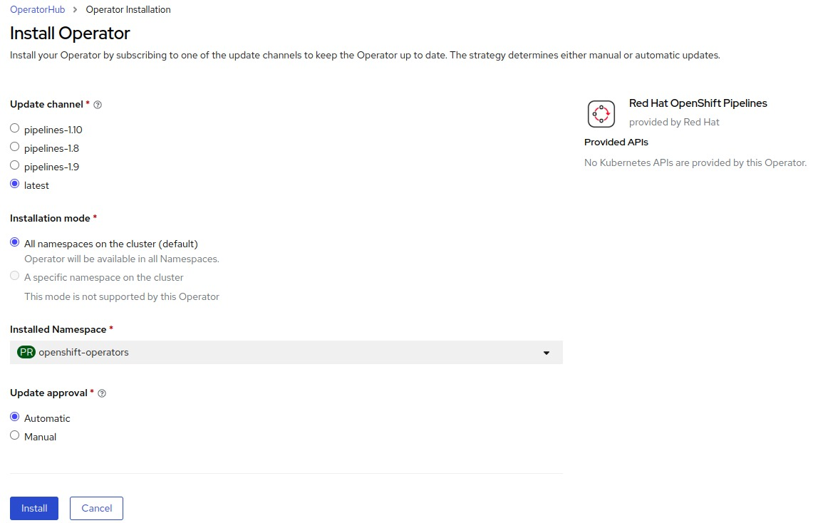
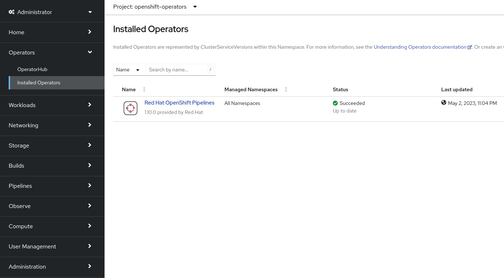

OpenShift provides an *Operators* section in its web console UI for the installation and management of <a href="/posts/kubernetes/kubernetes-operators/" target="_blank">operators</a> on the cluster.

# OperatorHub
The **OperatorHub** is an interface for searching and installing operators. It has the following categories of operators: 

* Red Hat Operators: Operators developed and supported by Red Hat. Example: [Red Hat Quay Operator](https://catalog.redhat.com/software/container-stacks/detail/5ec53f9d535cb70ab8c02991)
* Certified Operators: Operators listed by Red Hat's Independent Software Vendors (ISVs). Example: [CockroachDB Operator](https://catalog.redhat.com/software/container-stacks/detail/5e9872712989e6a90307acd6)
* Red Hat Marketplace Operators: Applications purchased from Red Hat Marketplace available as Operators. Example: [Dynatrace Operator](https://marketplace.redhat.com/en-us/products/dynatrace)
* Community Operators: Default catalog of Operators maintained by their communities. Example: [Infispan Operator](https://github.com/infinispan/infinispan-operator)

OperatorHub fetches the catalog data from an operator installed by default on all clusters called **Marketplace Operator**. 

The value of the field `disableAllDefaultSources` needs to be `false` in the CR called `cluster` to view the operator's catalog.

## Installing an Operator from OperatorHub
OperatorHub is accessible from **Operators -> OperatorHub** on the web UI of the OpenShift cluster.

<p align="center"></p>
<p align="center"><small><i>OperatorHub UI</i></small></p>

To install an operator you can just click the **Install** button and it will present options to select an update channel (version of the operator), installation mode (specific or all namespaces), and update approval (automatic or manual).

<p align="center"></p>
<p align="center"><small><i>Operator Installation</i></small></p>

Once installed the operator should be visible in **Operators -> Installed Operators**.
<p align="center"></p>
<p align="center"><small><i>Installed Operators</i></small></p>


# Operator Framework
**Operator Framework** is a set of developer tools for operators, it includes: 

- Operator Lifecycle Manager (OLM): Handles installation, update, and management of operators on the cluster.
- Operator SDK: SDK for building operators using Ansible, Helm Chart, or Go.
- Operator Registry:  Registry of operators that could be hosted on an OpenShift cluster.

To explore other projects under Operator Framework you can check their [GitHub](https://github.com/operator-framework).

# Operator Lifecycle Manager (OLM)
The **Operator Lifecycle Manager (OLM)** is installed by default on OpenShift clusters. It ensures:
* The dependencies of an operator (including other operators) are satisfied before its installation.
* Installed operators are up-to-date.
* Availability of the operators to the users of the cluster.
* There are no conflicts between multiple operator installations.
* Installed operators are accessible through UI, API, and CLI.

The OLM itself consists of two operators: OLM Operator and Catalog Operator.

## OLM Operator
The **OLM Operator** deploys the resources defined in `ClusterServiceVersion` present on the namespace.

### `ClusterServiceVersion`
The `ClusterServiceVersion` or `CSV` represents a specific version of an operator. It contains operator metadata such as its name, description, version, details of the maintainer, installation strategy, and APIs provided by the operator.

### `OperatorGroup`
OLM has cluster-admin privileges. Operators could request some of these cluster-admin permissions in their `CSV`. By creating an `OperatorGroup` the cluster administrator can take control of the permissions granted to the operators or limit them to one or more namespaces.

### `OperatorCondition`
Operators can modify the OLM's management strategy by stating their conditions in `OperatorCondition`. For example, an operator could set the `status` for the Upgradable property to `False` if its installation has to be frozen on a specific version.

## Catalog Operator
**Catalog Operator** installs the operator based on `InstallPlan`. It also updates the operator if a new version is available on its `Subscription`.

### `CatalogSource`
`CatalogSource` is a metadata store for discovering and installing operators.

### `Subscription`
`Subscription` specifies the `CatalogSource` to be referenced by OLM during installation and updates. The channel (alpha/beta/stable) of the operator could also be specified in the `Subscription`.

### `InstallPlan`
An `InstallPlan` defines the operator's custom resources to be installed.

# Installing a Specific Version of the Operator
By default, OpenShift installs the latest available version of an operator in the `CatalogSource`. If you want to change this behavior and install a specific version of the operator you have to edit its `Subscription` and specify the version to be installed in `startingCSV` and set `installPlanApproval` to `Manual`. 
Note that if the required version is not available on the default `channel` then you have to change it as well.

Example of a `Subscription` for installing v1.9.0 of OpenShift Pipelines Operator
```yaml
apiVersion: operators.coreos.com/v1alpha1
kind: Subscription
metadata:
  name: openshift-pipelines-operator-rh
  namespace: openshift-operators
spec:
  channel: pipelines-1.9
  installPlanApproval: Manual
  name: openshift-pipelines-operator-rh
  source: redhat-operators
  sourceNamespace: openshift-marketplace
  startingCSV: openshift-pipelines-operator-rh.v1.9.0
```

If an update is available in the future the operator's `InstallPlan` has to be approved manually, this will prevent automatic updates.

# Uninstalling an Operator
The option to uninstall an operator is present in its **Actions** on UI.

To uninstall an operator from CLI, you have to remove its `Subscription` as well as its `ClusterServiceVersion` using the `delete` subcommand on the specific resources.

```bash
# Listing available subscriptions
$ oc get subscriptions -n openshift-operators
NAME                              PACKAGE                           SOURCE
openshift-pipelines-operator-rh   openshift-pipelines-operator-rh   redhat-operators

# Deleting subscription for OpenShift Pipelines Operator
$ oc delete subscription/openshift-pipelines-operator-rh -n openshift-operators

# Listing available clusterserviceversions
$ oc get clusterserviceversions -n openshift-operators
NAME                                      DISPLAY                       VERSION
openshift-pipelines-operator-rh.v1.10.0   Red Hat OpenShift Pipelines   1.10.0

# Deleting clusterserviceversion for OpenShift Pipelines Operator
$ oc delete csv/openshift-pipelines-operator-rh.v1.10.0 -n openshift-operators
```

# Resources Referenced in this Article
<a href="https://docs.openshift.com/container-platform/4.12/operators/understanding/olm-understanding-operatorhub.html" target="_blank">OperatorHub</a>  
<a href="https://olm.operatorframework.io/" target="_blank">Operator Lifecycle Manager (OLM)</a>  
<a href="https://olm.operatorframework.io/docs/concepts/crds/clusterserviceversion/" target="_blank">ClusterServiceVersion</a>  
<a href="https://olm.operatorframework.io/docs/concepts/crds/catalogsource/" target="_blank">CatalogSource</a>  
<a href="https://olm.operatorframework.io/docs/concepts/crds/operatorcondition/" target="_blank">OperatorCondition</a>  
<a href="https://olm.operatorframework.io/docs/concepts/crds/subscription/" target="_blank">Subscription</a>  
<a href="https://olm.operatorframework.io/docs/concepts/crds/installplan/" target="_blank">InstallPlan</a>  
<a href="https://olm.operatorframework.io/docs/concepts/crds/operatorgroup/" target="_blank">OperatorGroup</a>  
<a href="https://olm.operatorframework.io/docs/concepts/olm-architecture/" target="_blank">OLM Architecture</a>  
<a href="https://docs.openshift.com/container-platform/4.12/operators/understanding/olm/olm-workflow.html#olm-upgrades_olm-workflow" target="_blank">OLM Workflow</a>  